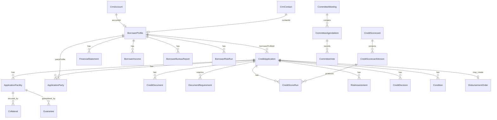
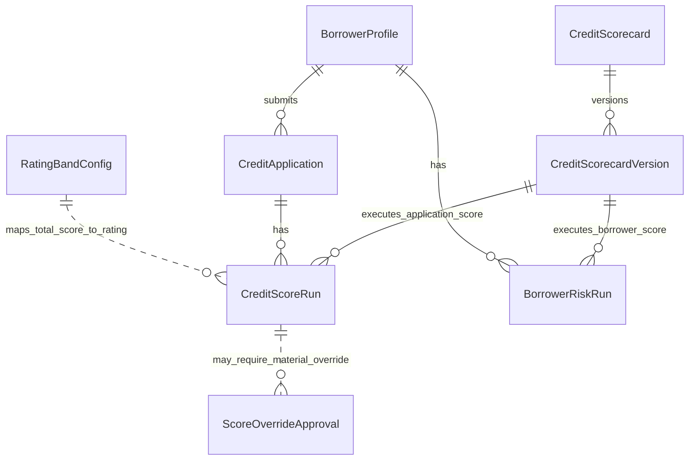
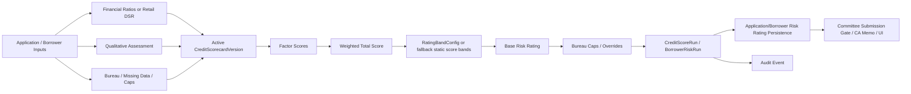
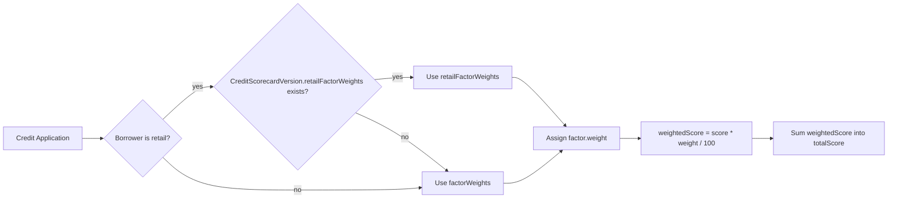
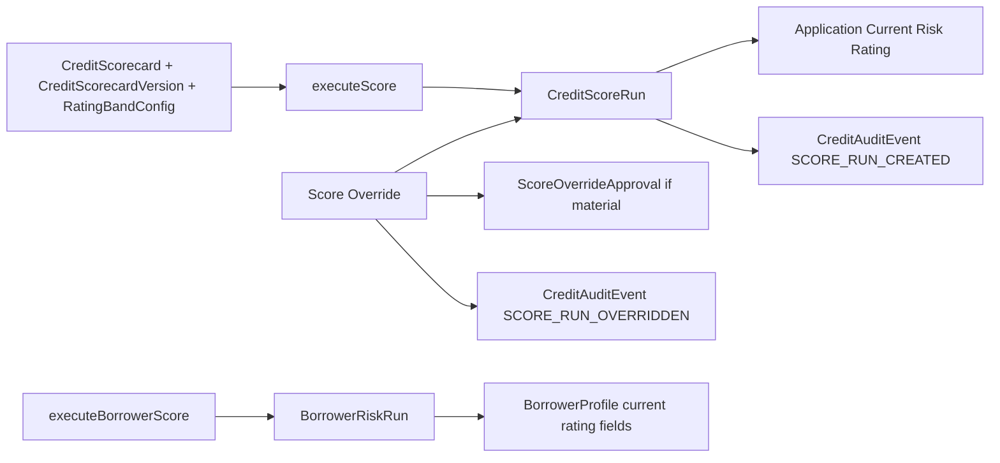
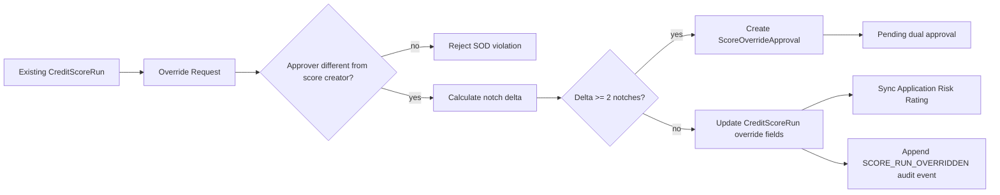
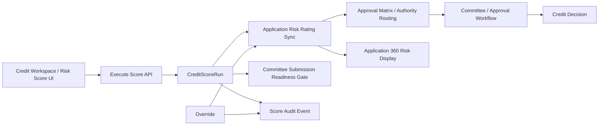
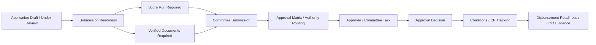

# CREDIT ASSESSMENT MODULE — CURRENT-STATE BASELINE

## 1. Document Control

| Item | Value |
|---|---|
| Document Name | 01-Credit-Assessment-Current-State-Baseline.md |
| Module | Credit Assessment / Credit Origination |
| Audit Type | Current-state, codebase-first baseline audit |
| Audit Date | 2026-07-14 22:13 +08 |
| Repository / Project Reviewed | /Users/fangkaryuan/cwc2.0/citadel-cwc-portal |
| Branch / Commit | dev2.0 / 1bc3eb8 |
| Auditor Role | Principal Lending Platform Architect; Credit Systems Auditor; Senior Business Analyst; Application Architect; Production Readiness Reviewer |
| Document Status | CURRENT_STATE_BASELINE — not a future-state design, not a roadmap, not production certification |

Working tree note: at audit start, git reported multiple deleted docs under `docs/` and no commit was made by this audit. This document is a newly created baseline file.

## 2. Executive Summary

### Where are we today?

The current Credit Assessment Module is a substantial, code-backed lending/origination module, not merely a UI prototype. It includes:

- Borrower profile management with individual/corporate/joint/sole-proprietor borrower types.
- Credit application CRUD, draft support, generated application numbers, clone/renewal support, and a formal application state machine.
- Application 360 web workspace with 12 high-level tabs and side widgets.
- Document upload, versioning, AV-gated download, verification/rejection, document requirements, S3 presigned downloads, and audit events.
- Retail income and DSR / net-DSR calculation.
- SME/corporate financial statement line items, ratio computation, ratio thresholds, and trends.
- Credit scorecards, scorecard versions, factor weights, score runs, score overrides, rating bands, and application/borrower risk rating persistence.
- Risk assessment records, qualitative assessment scores, bureau checklist/checks, collateral, guarantees, conditions, approval matrix, committee records, sign-offs, CA memo/approval pack generation, LOO, and disbursement order controls.
- Credit-specific RBAC gates, feature flags, SLA checker job, notifications, audit chain, tests, and seed scripts.

Overall maturity: PARTIAL to INTEGRATED depending on capability. The module has many implemented components, but the current baseline does not evidence a fully automated E2E credit journey for individual, SME, or corporate applicants. The strongest areas are backend schema breadth, application workflow, scoring/rating infrastructure, document controls, DSR/ratio calculations, approval authority matrix, audit events, and Application 360 UI coverage. The weakest areas are governed party model purity, end-to-end journey verification, consistency between newly consolidated 360 tabs and legacy/deep tabs, evidence of production-grade test coverage for all workflows, and remaining placeholder/demo/frontend-derived elements.

End-to-end credit journey: PARTIALLY EVIDENCED. Static code shows the path can progress from borrower/application creation through scoring, committee submission gates, approval decisions, conditions/offer, and disbursement controls. However, no single fresh automated E2E test was found or run in this audit proving the complete journey across UI → API → service → persistence → workflow → downstream.

Current workflow stop/breakpoint: for a real staff member, the primary controlled workflow appears to stop at either:

1. COMMITTEE_REVIEW if score run, verified documents, sign-offs, or approval-chain decisions are incomplete; or
2. ACCEPTED / disbursement order readiness if conditions precedent, approved decision, or verified LOO are incomplete.

Top current-state concerns:

- Applicant/borrower/customer concepts are not a universal party model. BorrowerProfile links to CRM Account/Contact and ApplicationParty handles co-borrower/guarantor roles, but Applicant, Borrower, Customer, Director, UBO, and Shareholder are not represented as one clean governed party hierarchy.
- Some risk/scoring factors still use neutral or placeholder scores when inputs are missing or qualitative data is absent. Evidence: `backend/src/credit/services/scoring.service.ts:326-327`, `:527-568`; borrower scoring also uses neutral scores for non-financial factors at `backend/src/credit/services/borrowerScoring.service.ts:137-141`.
- Document requirements exist both as hardcoded readiness defaults and configurable rules. Evidence: hardcoded `getRequiredDocuments()` in `backend/src/credit/services/submissionReadiness.service.ts:18-28`; configurable `CreditRuleConfig` / `resolveRequiredDocuments()` in `backend/src/credit/services/creditDocument.service.ts:8`, `:795-804`.
- Application 360 shows a simplified 12-tab system while legacy deep tab definitions still exist. Evidence: `frontend/pages/credit/creditUtils.ts:266-448` and `:455-538`.
- Approval decisions are stored in `CreditDecision`, but analyst recommendation as a separate governed object is not clearly evidenced. CA memo fields and sign-offs exist, but recommendation and final credit decision separation needs deeper audit.
- The module is broad and actively evolved; prior docs under `docs/` are supportive only and several are currently deleted in working tree, so this baseline uses code evidence first.

## 3. Audit Scope and Method

### Codebase-first method

This audit inspected repository source evidence first, using:

- Project manifests: `backend/package.json`, `frontend/package.json`.
- Backend app and router mounts: `backend/src/app.ts`, `backend/src/routes/index.ts`, `backend/src/credit/routes/credit.routes.ts`.
- Prisma schema: `backend/prisma/schema.prisma`.
- Backend credit services, validators, routes, controllers, jobs, and tests under `backend/src/credit`.
- Frontend routes and Credit UI under `frontend/App.tsx`, `frontend/pages`, `frontend/pages/credit`, `frontend/src/components/credit`, `frontend/src/services/credit.service.ts`, and `frontend/pages/credit/creditUtils.ts`.
- Seed scripts and package scripts under `backend/prisma` and `backend/package.json`.

Documentation was treated as supporting context only. Code evidence overrides documentation.

### Limitations

- This audit did not read `.env` or secret files.
- This audit did not execute live UI journeys or mutate the database.
- This audit did not certify production readiness.
- Some capabilities are spread across many route files imported in `credit.routes.ts`; this baseline identifies implementation evidence but flags items requiring deeper flow-level verification.
- No fresh complete E2E journey test was run; test evidence is based on existing test files and package scripts observed in the repository.

## 4. Current Technical Architecture

### Evidence-backed architecture

| Layer | Current evidence |
|---|---|
| Frontend | React 19 + TypeScript + Vite. Evidence: `frontend/package.json:35-37`, `:62-63`; routes in `frontend/App.tsx:303-325`. |
| Backend | Node.js + Express + TypeScript. Evidence: `backend/package.json:57`, `backend/src/app.ts:1`, `backend/package.json:8`. |
| Database | PostgreSQL via Prisma ORM. Evidence: `backend/prisma/schema.prisma`; Prisma scripts in `backend/package.json:10-14`. |
| API architecture | REST/Express under `/api/v1`; credit module mounted under `/api/credit` by the backend route index, with the credit router composing a broad route surface. Evidence: `backend/src/routes/index.ts:38`, `:92`; credit router composition in `backend/src/credit/routes/credit.routes.ts:198-349`. |
| Authentication | JWT/passport stack evidenced by `backend/package.json:71-73`; route auth gates use `authenticate`. Evidence: `backend/src/credit/routes/credit.routes.ts:183`; `creditApplication.routes.ts:57`. |
| Authorisation/RBAC | Permission middleware such as `requirePermission('credit:read')`, `credit:create`, `credit:write`, `credit:approve`, `credit:admin`. Evidence: `creditApplication.routes.ts:21-31`, `:64-166`, `:185-190`. |
| State management | Frontend React local state/hooks; no Redux evidence in manifests. Evidence: `CreditApplicationDetail.tsx:105-180`; `CreditApplicationList.tsx:144-167`. |
| Workflow architecture | Code-defined `ApplicationState` enum and `TRANSITIONS` array in `creditApplication.service.ts:135-245`; route `POST /applications/:id/transition` in `creditApplication.routes.ts:176-190`. |
| Background jobs/events | Scheduler seeds/starts credit monitor, LOO expiry, credit SLA checker, AML quarterly re-screen, and audit retention/hash-chain checks. Credit SLA cron runs every 15 minutes by default. Evidence: `backend/src/services/scheduler.service.ts:28-42`, `:67-83`, `:178-198`; `backend/src/credit/jobs/creditSlaChecker.ts:18-58`. Notifications wired from transitions/webhooks. Evidence: `creditApplication.service.ts:1496-1528`. |
| File/document storage | Upload middleware uses memory storage, validates file type/signature, uploads buffer to S3, and stores generated key; document downloads use presigned S3 URLs. Evidence: `backend/src/middleware/upload.middleware.ts:105-128`, `:159-162`; `creditDocument.service.ts:542-575`; local uploads disabled in production in `backend/src/app.ts:185-200`. |
| Deployment | Docker/proxy readiness evidenced by app trust-proxy and health/readiness endpoints; production compose includes Postgres, Redis, backend, frontend, nginx, certbot, S3 envs and upload/log volumes. Evidence: `backend/src/app.ts:27`, `:131-157`; `docker-compose.prod.yml:3-156`; `backend/Dockerfile:1-33`. Deployment gap: compose exposes generic `SLA_*` envs but not all credit-specific cron/scheduler envs supported by code. |

### Architecture diagram

```mermaid
flowchart LR
  U[Credit Staff Browser] --> FE[React 19 + Vite Frontend]
  FE --> API[Express REST API /api/v1]
  API --> Auth[JWT authenticate + requirePermission]
  API --> CreditRouter[/credit router]
  CreditRouter --> Borrower[Borrower/Profile Services]
  CreditRouter --> AppSvc[CreditApplicationService + State Machine]
  CreditRouter --> Docs[CreditDocumentService]
  CreditRouter --> Fin[RetailIncome + FinancialStatement Services]
  CreditRouter --> Score[Scoring + Scorecard + Rating Services]
  CreditRouter --> Approval[Approval Matrix + Decisions + Committee]
  CreditRouter --> Memo[CA Memo / Approval Pack Controllers]
  CreditRouter --> Disb[Disbursement Service]
  CreditRouter --> Notify[Notification Service + SSE/email pipeline]
  CreditRouter --> SLA[Credit SLA Checker]
  Borrower --> DB[(PostgreSQL via Prisma)]
  AppSvc --> DB
  Docs --> DB
  Docs --> S3[S3/Object Storage Presigned URLs]
  Fin --> DB
  Score --> DB
  Approval --> DB
  Memo --> PDF[Async PDF job/HTML generation]
  Disb --> DB
  Notify --> DB
```

## 5. Credit Assessment Repository Map

### Backend credit module

| Area | Evidence |
|---|---|
| Root credit router | `backend/src/credit/routes/credit.routes.ts` |
| Borrowers | `/borrowers` routes mounted at `credit.routes.ts:199-205`; `borrowerProfile.service.ts`; `borrowerProfile.routes.ts`. |
| Applications | `/applications` routes mounted at `credit.routes.ts:216-224`; `creditApplication.routes.ts`; `creditApplication.service.ts`. |
| Documents | `creditDocument.routes.ts`; `creditDocument.service.ts`; mounted at `credit.routes.ts:213`. |
| Financials | Borrower financial routes mounted at `credit.routes.ts:233-234`; `financial.service.ts`; retail income at `credit.routes.ts:273`. |
| Scorecards/scoring | `credit.routes.ts:235-238`; `scoring.service.ts`; `scorecard.service.ts`; `ratingBand.service.ts`; `scoreOverride.service.ts`. |
| Risk/assessment | `credit.routes.ts:271-282`; `riskAssessment.service.ts`; `qualitativeAssessment.service.ts`; bureau/industry/SICR/ESG services. |
| Approvals/committee | `credit.routes.ts:227`, `:241`, `:294`; approval matrix service; committee routes; signoff routes at `:282`. |
| Conditions/collateral/guarantees | `credit.routes.ts:243-252`; collateral, guarantee, condition services/routes. |
| CA memo / approval pack | `credit.routes.ts:268-270`; `caMemoPdf.controller.ts`; `caMemoPdf.service.ts`; `approvalPack.controller.ts`; `approvalPack.service.ts`. |
| Disbursement/LOO/pricing/rejection | `credit.routes.ts:303-312`; disbursement, LOO, pricing, rejection routes/services. |
| SLA/rules/FX/security/compliance | `credit.routes.ts:297-329`; credit SLA, rule config, policy limits, FX rates, DLP, consent, STR, MFA. |
| Jobs | `backend/src/credit/jobs/creditSlaChecker.ts`, `monitor.job.ts`, `amlRescreenChecker.ts`, `auditRetention.job.ts`; scheduler at `backend/src/services/scheduler.service.ts`. |
| Tests | Static inventory found 61 backend credit test files under `backend/src/credit/**/__tests__` and adjacent credit test dirs, including scoring, score overrides, submission readiness, transitions, document downloads/requirements, disbursement, committee voting, bureau/collateral policies, monitoring jobs, audit chain, scope and SOD tests. |

### Frontend credit module

| Area | Evidence |
|---|---|
| Route mount | `frontend/App.tsx:303-325`. |
| Horizontal credit layout | `frontend/src/components/CreditLayout.tsx:19-20`; preserves top nav. |
| Dashboard | `frontend/pages/credit/CreditDashboard.tsx`. |
| Borrowers | `BorrowerProfileList`, `CreateBorrowerPage`, `BorrowerProfileDetail` routes at `frontend/App.tsx:306-308`; components under `frontend/src/components/credit/borrowers`, `borrower360`, `create-borrower`. |
| Applications list | `frontend/pages/CreditApplicationList.tsx`. |
| Application 360 | `frontend/pages/CreditApplicationDetail.tsx` plus detail components under `frontend/src/components/credit/detail` and tabs under `frontend/pages/credit/tabs`. |
| Application create | `frontend/pages/credit/CreditApplicationCreate.tsx`. |
| Approvals/mobile approvals | `/credit/approvals`, `/credit/m/approvals`; `MobileApprovalInbox.tsx`; `ApprovalQuickView.tsx`; `ApprovalChainPanel.tsx`. |
| Financial spreading/analysis | `/credit/financials`, `/credit/analysis`. |
| Scorecards/rating bands | `/credit/scorecards`, `/credit/rating-bands`, admin protected. |
| Committee | `/credit/committee`, `/credit/committee/:meetingId`, `/credit/m/committee/:meetingId`. |
| Collateral/reports/group exposure | `/credit/collateral`, `/credit/reports`, `/credit/group-exposure`. |
| API client | `frontend/src/services/credit.service.ts` with application, borrower, document, scoring, approval, financial, committee, collateral, condition, CA memo calls. |

## 6. Current Domain Model

### Evidenced entities and relationships

| Domain concept | Current implementation evidence | Maturity |
|---|---|---|
| Party | No universal `Party` model found in credit schema. CRM Account/Contact are used as person/organisation anchors. | PARTIAL |
| Individual | `BorrowerType.INDIVIDUAL`; `BorrowerProfile.contactId`; `BorrowerIncome`; `RetailIncome`. Evidence: schema `BorrowerType` at `schema.prisma:2735`, `BorrowerProfile` at `:3307`, `RetailIncome` at `:5135`. | PARTIAL |
| Organisation/Corporate | `BorrowerType.CORPORATE`; `BorrowerProfile.accountId`; financial statements. Evidence: `schema.prisma:3307`, `FinancialStatement` at `:4869`. | PARTIAL |
| Applicant | No separate `Applicant` entity evidenced. `CreditApplication.borrowerProfileId` anchors the case. | NOT_STARTED for separate concept |
| Borrower | `BorrowerProfile` with CRM account/contact links, risk rating fields, activity, income, bureau reports. | IMPLEMENTED |
| Customer | Implemented indirectly through CRM Account/Contact; not distinct in credit. | PARTIAL |
| Application | `CreditApplication` model with state, borrower, branch, product, amount, currency, owner/assignee/timestamps. Evidence: `schema.prisma:3740`. | IMPLEMENTED |
| Facilities | `ApplicationFacility`, `FacilityType`, approved amount fields. Evidence: `schema.prisma:3910`. | IMPLEMENTED |
| Related parties | `ApplicationParty`, `RelatedPartyGroup`, `RelatedPartyMember`, director/shareholder/UBO routes mounted. Evidence: `schema.prisma:4161`, `:3668`, `:3682`; `credit.routes.ts:199-207`. | PARTIAL |
| Financial Profile | Retail income, borrower income, financial statements, line items, ratios. Evidence: `schema.prisma:3447`, `:4869`, `:4911`, `:4934`, `:5135`. | IMPLEMENTED |
| Credit Assessment | Structured risk assessment and qualitative assessment exist; narrative CA memo fields exist on application. Evidence: `RiskAssessment` model `schema.prisma:5648`; qualitative service `qualitativeAssessment.service.ts:12-45`. | PARTIAL |
| Credit Score | Scorecards, scorecard versions, score runs, rating bands. Evidence: `schema.prisma:4961`, `:4984`, `:5009`, `:5036`. | IMPLEMENTED |
| Risk Rating | `RiskRating` enum, borrower and application risk ratings, score run risk ratings, rating bands. Evidence: `schema.prisma:2757`, `BorrowerProfile` line `:3307`, scoring service `:639-648`. | IMPLEMENTED |
| CA Memo | CA memo data generation and PDF/HTML controllers; no separate immutable CA memo entity found in schema. Evidence: `caMemoPdf.controller.ts:265-277`, `caMemoPdf.service.ts:3`, CA memo fields in validator. | PARTIAL |
| Recommendation | Distinct governed recommendation entity not evidenced. Some CA memo narrative/recommendation fields may exist on `CreditApplication` but need deeper field-level audit. | SCAFFOLDED/PARTIAL |
| Approval | `CreditDecision`, approval matrix, committee votes/signoffs. Evidence: `schema.prisma:4707`, `:4811`, `:5204-5259`. | IMPLEMENTED |
| Credit Decision | Stored in `CreditDecision` with decision type, decisionBy, authority, comments, conditions. Evidence: `schema.prisma:4707`. | IMPLEMENTED |
| Conditions | `Condition`, `ConditionStatus`, CP checks in disbursement readiness. Evidence: `schema.prisma:4732`; `disbursement.service.ts:60-83`, `:293-305`. | IMPLEMENTED |
| Handover/disbursement | `DisbursementOrder` and controls. Evidence: `schema.prisma:4775`; `disbursement.service.ts:45-99`, `:258-329`. | PARTIAL/IMPLEMENTED internally; external LMS not evidenced |

### Domain diagram



## 7. Current End-to-End Workflow and State Model

### Actual application states

Evidence: `backend/prisma/schema.prisma:2712` and frontend labels in `frontend/pages/credit/creditUtils.ts:34-87`.

`DRAFT, SUBMITTED, KYC_REVIEW, COMPLIANCE_HOLD, KYC_APPROVED, KYC_REJECTED, UNDERWRITING, CREDIT_ASSESSMENT, COMMITTEE_REVIEW, APPROVED, REJECTED, CONDITION_FULFILMENT, OFFER, ACCEPTED, DISBURSED, ACTIVE, CLOSED, WITHDRAWN, REFERRED_BACK`

### Actual state transitions

Evidence: `backend/src/credit/services/creditApplication.service.ts:177-245`.

```mermaid
stateDiagram-v2
  [*] --> DRAFT
  DRAFT --> SUBMITTED: submit
  DRAFT --> WITHDRAWN: withdraw
  SUBMITTED --> KYC_REVIEW: start_kyc
  SUBMITTED --> WITHDRAWN: withdraw
  KYC_REVIEW --> COMPLIANCE_HOLD: place_compliance_hold
  KYC_REVIEW --> KYC_APPROVED: approve_kyc
  KYC_REVIEW --> KYC_REJECTED: reject_kyc
  KYC_REVIEW --> REFERRED_BACK: refer_back
  KYC_REVIEW --> WITHDRAWN: withdraw
  COMPLIANCE_HOLD --> KYC_APPROVED: clear_compliance_hold
  COMPLIANCE_HOLD --> KYC_REJECTED: reject_compliance
  COMPLIANCE_HOLD --> REFERRED_BACK: refer_back
  COMPLIANCE_HOLD --> WITHDRAWN: withdraw
  KYC_REJECTED --> SUBMITTED: resubmit
  KYC_REJECTED --> WITHDRAWN: withdraw
  KYC_APPROVED --> UNDERWRITING: start_underwriting
  KYC_APPROVED --> WITHDRAWN: withdraw
  UNDERWRITING --> CREDIT_ASSESSMENT: start_assessment
  UNDERWRITING --> WITHDRAWN: withdraw
  CREDIT_ASSESSMENT --> COMMITTEE_REVIEW: submit_to_committee
  CREDIT_ASSESSMENT --> REFERRED_BACK: refer_back
  CREDIT_ASSESSMENT --> WITHDRAWN: withdraw
  COMMITTEE_REVIEW --> APPROVED: approve
  COMMITTEE_REVIEW --> REJECTED: reject
  COMMITTEE_REVIEW --> REFERRED_BACK: refer_back
  COMMITTEE_REVIEW --> WITHDRAWN: withdraw
  REFERRED_BACK --> KYC_REVIEW: resume_kyc
  REFERRED_BACK --> UNDERWRITING: resume_underwriting
  REFERRED_BACK --> CREDIT_ASSESSMENT: resume_assessment
  REFERRED_BACK --> SUBMITTED: resubmit
  REFERRED_BACK --> WITHDRAWN: withdraw
  APPROVED --> CONDITION_FULFILMENT: start_condition_fulfilment
  APPROVED --> OFFER: make_offer_direct
  APPROVED --> WITHDRAWN: withdraw
  CONDITION_FULFILMENT --> OFFER: make_offer
  CONDITION_FULFILMENT --> WITHDRAWN: withdraw
  OFFER --> ACCEPTED: accept_offer
  OFFER --> REJECTED: decline_offer
  OFFER --> WITHDRAWN: withdraw
  ACCEPTED --> DISBURSED: disburse (blocked; use disbursement workflow)
  ACCEPTED --> WITHDRAWN: withdraw
  DISBURSED --> ACTIVE: activate
  ACTIVE --> CLOSED: close
  REJECTED --> [*]
  CLOSED --> [*]
  WITHDRAWN --> [*]
```



### Workflow control evidence

| Control | Evidence | Status |
|---|---|---|
| Transition endpoint | `creditApplication.routes.ts:176-190` | IMPLEMENTED |
| Action-specific transition permissions | `creditApplication.routes.ts:21-31`, `:39-51`; service returns required permission at `creditApplication.service.ts:1565-1571` | IMPLEMENTED |
| Invalid transition rejection | `creditApplication.service.ts:1068-1077` | IMPLEMENTED |
| Required reason for certain transitions | `creditApplication.service.ts:1077` and transition definitions with `reasonRequired` | IMPLEMENTED |
| Terminal states | `creditApplication.service.ts:248-252` | IMPLEMENTED |
| Committee submission gates | `creditApplication.service.ts:1109-1178` blocks missing/stale score runs and sign-off gaps | IMPLEMENTED |
| Approval chain gate | `creditApplication.service.ts:1198-1244` blocks approve/reject without required approvals | IMPLEMENTED |
| Direct disbursement bypass blocked | `creditApplication.service.ts:1399-1418`; disbursement workflow owns state change at `disbursement.service.ts:310-329` | IMPLEMENTED |
| Audit event on transition | `creditApplication.service.ts:1480-1481` | IMPLEMENTED |
| Notification dispatch on transition | `creditApplication.service.ts:1496-1539` | IMPLEMENTED |
| Race-safe state guard | `creditApplication.service.ts:1445-1477` | IMPLEMENTED |

## 8. Capability Audit Matrix — 24 Domains

### DOMAIN 1 — Party / Applicant / Borrower Model

Primary maturity: PARTIAL

Evidence:
- `BorrowerProfile` model exists and is central. Evidence: `backend/prisma/schema.prisma:3307`.
- `BorrowerType` enum supports `INDIVIDUAL`, `CORPORATE`, `JOINT`, `SOLE_PROPRIETOR`. Evidence: `schema.prisma:2735`.
- Borrower links to CRM Account/Contact via unique accountId/contactId rather than a universal Party model. Evidence: `BorrowerProfile` fields at `schema.prisma:3307`.
- Related-party group/member and application party models exist. Evidence: `schema.prisma:3668`, `:3682`, `:4161`.
- Director/shareholder/UBO/fatca routes are mounted under borrowers. Evidence: `credit.routes.ts:199-207`.

Flags:
- PARTIALLY_WIRED: borrower model spans CRM account/contact plus credit borrower tables.
- IMPLEMENTED_NOT_DOCUMENTED: implementation is richer than a simple applicant entity.
- NO_UNIVERSAL_PARTY_MODEL: no separate `Party` supertype evidenced.
- CONCEPT_COLLAPSE_RISK: Applicant is not separate from Borrower; `CreditApplication.borrowerProfileId` anchors the applicant/borrower relationship.

Actual model: the system mostly treats the credit applicant as a borrower profile connected to CRM account/contact. Guarantors/co-borrowers are represented through ApplicationParty and Guarantee, not through a universal party role framework.

### DOMAIN 2 — Borrower Management

Primary maturity: IMPLEMENTED

Evidence:
- Borrower routes include stats, search, duplicate check, list, detail, create, update, delete, PII reveal, risk score, bureau report, KYC/AML actions. Evidence: `borrowerProfile.routes.ts:25-193`.
- Duplicate detection checks SSM, NRIC, and name/type. Evidence: `borrowerProfile.service.ts:206-331` and create-time duplicate block `:464-479`.
- Borrower list supports filters for borrowerType, creditRiskRating, amlRiskTier. Evidence: `borrowerProfile.service.ts:344-409`.
- Borrower risk score history/latest endpoints exist. Evidence: `borrowerProfile.routes.ts:88-103`.
- Frontend borrower routes exist. Evidence: `frontend/App.tsx:306-308`; borrower list/detail components under `frontend/src/components/credit/borrowers` and `borrower360`.

Flags:
- PARTIALLY_WIRED: Borrower 360 has components and backend summary/activity, but some UI components still contain placeholder markers, e.g. `BureauUploadModal`, `IncomeEditModal`.
- NO_E2E_TEST_EVIDENCE: no full borrower lifecycle E2E test was evidenced in this audit.

### DOMAIN 3 — Application Management

Primary maturity: IMPLEMENTED

Evidence:
- Application list, summary, draft, create, update, delete, transition, audit, readiness, clone routes. Evidence: `creditApplication.routes.ts:60-286`.
- Application model includes generated applicationNo, state, borrowerProfileId, branch, productType, requested amount/currency, owner/assignee timestamps. Evidence: `CreditApplication` at `schema.prisma:3740`.
- Application number counter exists. Evidence: `CreditAppCounter` at `schema.prisma:2703` and generation retry logic in `creditApplication.service.ts:445`.
- Frontend list/create/detail routes exist. Evidence: `frontend/App.tsx:309-311`; list loads API data at `CreditApplicationList.tsx:203-217`; create navigates to `/credit/applications/new`.

Flags:
- PARTIALLY_WIRED: Application list includes table/kanban and summary metrics, but view-level visibleExposure can be derived from currently loaded applications when summary is absent. Evidence: `CreditApplicationList.tsx:301`, `:490-492`.
- NO_E2E_TEST_EVIDENCE: complete create-to-decision UI journey not evidenced.

### DOMAIN 4 — Application Lifecycle and Workflow

Primary maturity: INTEGRATED

Evidence: see section 7.

Flags:
- PARTIALLY_WIRED: transitions are code-defined rather than database-configured workflow rules.
- HARDCODED: transition graph lives in `creditApplication.service.ts:177-245`.
- NO_PRODUCTION_CERTIFICATION: strong controls exist, but this baseline did not verify every role/action combination at runtime.

### DOMAIN 5 — Application 360

Primary maturity: PARTIAL to INTEGRATED

Actual 360 tabs evidenced in current frontend:

Evidence: `CreditApplicationDetail.tsx:616-672` renders:
1. Overview
2. Customer Profile
3. Application Details
4. Financial Profile
5. Credit Bureau & Compliance
6. Risk Assessment
7. Collateral & Guarantees
8. Documents
9. Approvals
10. CA Memo
11. Conditions & Offer
12. Disbursement
13. Timeline & Audit

`VISIBLE_360_TABS` includes 12/13 tab IDs at `CreditApplicationDetail.tsx:90-91`; render function adds CA memo and uses `TAB_GROUPS_360` from `creditUtils.ts:455-538`.

Data loading evidence:
- Application loaded via API at `CreditApplicationDetail.tsx:193-198`.
- Transitions loaded at `:204-208`.
- Facilities/readiness/signoffs/approvals loaded in component state areas `:158-170`.
- Tab render dispatch occurs at `:616-672`.

Flags:
- PARTIALLY_WIRED: many tabs are compositional and some sections still have placeholder markers in code inventory.
- DUPLICATED/LEGACY: legacy `DetailTab` and `TAB_GROUPS` still exist alongside `TAB_GROUPS_360`. Evidence: `creditUtils.ts:266-448` and `:455-538`.
- NO_E2E_TEST_EVIDENCE: no full Application 360 save/edit/persist/downstream-use matrix test evidenced.

### DOMAIN 6 — Document and Verification Management

Primary maturity: IMPLEMENTED

Evidence:
- Document routes: list, get, upload, update, delete, replace, versions, hash, verify, reject, download. Evidence: `creditDocument.routes.ts:32-188`.
- Document model supports applicationId, borrowerProfileId, classification, file metadata, verification status, AV status, sha256, versions. Evidence: `schema.prisma:4183`, `:4228`.
- Upload checks editable parent application state. Evidence: `creditDocument.service.ts:194-206`.
- Versioning/hash verification exists. Evidence: `creditDocument.service.ts:359-466`.
- Verification/rejection exists. Evidence: `creditDocument.service.ts:508-532`.
- AV-clean download gate and S3 presigned URLs. Evidence: `creditDocument.service.ts:92-94`, `:542-575`.
- Document requirements/checklist exists. Evidence: `DocumentRequirement` at `schema.prisma:4250`; service list/seed/summary at `creditDocument.service.ts:639-923`.

Flags:
- HARDCODED and DATABASE_CONFIGURED: readiness uses hardcoded borrower-type document arrays (`submissionReadiness.service.ts:18-28`) while checklist seeding uses `resolveRequiredDocuments()` from rule config (`creditDocument.service.ts:795-804`).
- PARTIALLY_WIRED: incomplete documents block some readiness/committee progression, but exact gate varies by transition stage.

### DOMAIN 7 — Financial Profile

Primary maturity: IMPLEMENTED

Evidence:
- Retail income model and upsert. Evidence: `schema.prisma:5135`; `retailIncome.service.ts:108-156`.
- Borrower income/credit profile/bureau report models exist. Evidence: `schema.prisma:3428`, `:3447`, `:3469`, `:3489`.
- SME/corporate financial statement periods/type/status, line items, ratios. Evidence: `schema.prisma:4869`, `:4911`, `:4934`; `financial.service.ts:58-190`, `:675-813`.
- Financial statements are historical records by borrower/period/fiscalYear/type rather than a single overwritten field. Evidence: `FinancialStatement` model at `schema.prisma:4869`.

Flags:
- PARTIALLY_WIRED: individual financials and SME/corporate financials use different models/services.
- NO_E2E_TEST_EVIDENCE: complete data source/verification flow per borrower type needs deeper test review.

### DOMAIN 8 — Financial Calculations

Primary maturity: IMPLEMENTED

| Calculation | Implementation | Inputs | Formula evidence | Persistence | Tests |
|---|---|---|---|---|---|
| Gross DSR | `computeDsr()` | Gross monthly income + commitments | `retailIncome.service.ts:34-42` | `RetailIncome.dsrPercent`, `:143` | Existing service tests implied by P1 context; fresh run not performed |
| Net DSR | `computeNetDsr()` | Gross income - EPF - tax - SOCSO; commitments | `retailIncome.service.ts:46-89` | monthlyNetIncome, netDsrPercent, dsrBasis at `:144-146` | Same limitation |
| Profitability ratios | `RATIO_DEFINITIONS` | line items | ROS/gross margin/ROA/ROE formulas at `financial.service.ts:69-97` | `FinancialRatio` upsert at `:721-745` | Existing tests in repo; fresh run not performed |
| Leverage | `RATIO_DEFINITIONS` | total debt/equity/assets | `financial.service.ts:101-119` | `FinancialRatio` | Existing tests |
| Liquidity | `current_ratio`, `quick_ratio` | current assets/liabilities/inventory | `financial.service.ts:123-134` | `FinancialRatio` | Existing tests |
| DSCR | `dscr` | net_income + depreciation + interest / interest + principal | `financial.service.ts:138-142` | `FinancialRatio` | Existing tests |
| Interest coverage | `interest_coverage`, EBIT coverage | net income/depreciation/interest or EBIT/interest | `financial.service.ts:148-156` | `FinancialRatio` | Existing tests |
| Exposure | `computeBorrowerExposure()` consumed | application states and facilities | `creditApplication.service.ts:10`, `:1215`, financial service `:941-946` | Borrower/application exposure summaries | Existing tests present |

Flags:
- FRONTEND_DERIVED: some UI KPI/visible exposure values are derived client-side when summary absent. Evidence: `CreditApplicationList.tsx:301`.
- ROUNDING_RISK_REVIEW_REQUIRED: formulas round in some services; full cross-service rounding consistency not verified.

### DOMAIN 9 — Credit Assessment

Primary maturity: PARTIAL

Evidence:
- `RiskAssessment` model and bulk upsert service. Evidence: `schema.prisma:5648`; `riskAssessment.service.ts:12-46`.
- Qualitative assessment scores for management, relationship, industry, collateral feed scoring. Evidence: `qualitativeAssessment.service.ts:12-45`; scoring consumes at `scoring.service.ts:471-523`.
- Application 360 risk assessment tab rendered. Evidence: `CreditApplicationDetail.tsx:665`.
- CA memo header/narrative fields on application validators. Evidence: `creditApplication.validator.ts:56-83`.

Flags:
- PARTIAL: assessment is mixed structured factors plus narrative fields; not all expected analyst sections are a governed object.
- PLACEHOLDER: missing qualitative factors can resolve to configured/missing-data scores; market conditions remains placeholder-driven. Evidence: `scoring.service.ts:326-327`, `:567-568`.

### DOMAIN 10 — Credit Scoring

Primary maturity: IMPLEMENTED

Evidence:
- Scorecard/version models with factor weights and retail factor weights. Evidence: `schema.prisma:4961`, `:5009`.
- Rating bands model. Evidence: `schema.prisma:4984`.
- Score run model with factorScores, totalScore, riskRating, baseRiskRating, override fields, input snapshot. Evidence: `schema.prisma:5036`.
- Execution trace: active scorecard → ratios/retail DSR/qualitative data → factor scores → weighted score → rating band/fallback mapping → bureau caps → `CreditScoreRun` → application rating persistence → audit event. Evidence: `scoring.service.ts:335-665`.
- Factor formulas and score bands: `scoring.service.ts:174-186`, `:222-323`, `:572-648`.
- Override controls with SOD and material override dual approval. Evidence: `scoring.service.ts:673-764`; `ScoreOverrideApproval` at `schema.prisma:5431`.
- Frontend calls execute/list/override score. Evidence: `credit.service.ts:1538-1554`, `:1989-1997`; UI tabs `RiskScoreTab.tsx`, `RiskRatingEclTab.tsx` include executeScore markers.

Flags:
- PLACEHOLDER: market conditions and absent qualitative inputs can default to placeholder/missing-data scores. Evidence: `scoring.service.ts:326-327`, `:551-568`.
- PARTIALLY_WIRED: score displayed/required for committee, but full downstream consumption beyond committee gate and CA memo needs deeper audit.
- IMPLEMENTED_NOT_DOCUMENTED: governed score engine exists in code; documentation may lag.

### DOMAIN 11 — Risk Assessment and Risk Rating

Primary maturity: IMPLEMENTED/PARTIAL

Evidence:
- Borrower risk rating fields on `BorrowerProfile`; borrower risk runs. Evidence: `schema.prisma:3307`, `:3519`.
- Application score runs and application risk rating persistence. Evidence: `scoring.service.ts:639-648`; `applicationRating.service` imported by application service at `creditApplication.service.ts:12`.
- RiskAssessment model stores risk category, factor scores, weighted score, risk rating, assessedBy. Evidence: `schema.prisma:5648`.
- Borrower-level scoring differentiates borrower risk from application risk. Evidence: `borrowerScoring.service.ts:167-287` versus `scoring.service.ts:349-665`.
- Rating history exists through `BorrowerRiskRun` and `CreditScoreRun`.

Flags:
- PARTIAL: risk assessment records may be manually upserted; not every risk type has a governed methodology.
- STATIC/MANUAL_REVIEW_REQUIRED: some risk categories are descriptive risk assessment rows rather than calculated risk factors.

### DOMAIN 12 — CA Memo / Credit Memorandum

Primary maturity: PARTIAL

Evidence:
- CA memo preview/download routes. Evidence: `credit.routes.ts:268-270`.
- CA memo PDF controller and data service. Evidence: `caMemoPdf.controller.ts:265-277`; `caMemoPdf.service.ts:3`.
- Approval pack HTML/PDF controller/service. Evidence: `approvalPack.controller.ts:10-19`; `approvalPack.service.ts:24-28`.
- Frontend CA memo tab and export actions. Evidence: `CreditApplicationDetail.tsx:669`, `:346-352`, `CaMemoPreviewTab.tsx`.
- CA memo sign-off gate before committee submission. Evidence: `creditApplication.service.ts:1122`; frontend disables submit_to_committee if not all signed at `CreditApplicationDetail.tsx:1058-1064`.

Flags:
- NO_IMMUTABLE_MEMO_ENTITY_EVIDENCED: no separate CA memo version/snapshot table found in schema; memo data appears generated from current application data and application fields.
- DATA_CONSISTENCY_RISK: without evidenced memo snapshot/versioning, approvers may review regenerated data unless approval pack/PDF job persists snapshots elsewhere.
- PARTIAL: generation exists; governed versioning/locking needs deeper audit.

### DOMAIN 13 — Credit Recommendation

Primary maturity: PARTIAL / NOT_EVIDENCED_AS_DISTINCT_ENTITY

Evidence:
- CA memo narrative fields include recommendation-like data in validators, but a distinct analyst recommendation entity was not evidenced in schema extraction.
- Approval/final decisions are represented by `CreditDecision`. Evidence: `schema.prisma:4707`.

Flags:
- NOT_EVIDENCED_IN_CURRENT_CODEBASE as a separate governed object.
- CONCEPT_COLLAPSE_RISK: recommendation may be embedded in CA memo/application fields or approval decision comments.
- DEEPER_AUDIT_REQUIRED: field-level CA memo names in `CreditApplication` should be mapped to determine if recommendation amount/tenure/pricing are structured.

### DOMAIN 14 — Approval Workflow

Primary maturity: IMPLEMENTED

Evidence:
- Approval matrix with exposure/rating/authority/requiredApproverCount. Evidence: `schema.prisma:4811`; service lookup `approvalMatrix.service.ts:60-144`.
- Credit decisions with decision type and authority. Evidence: `schema.prisma:4707`.
- Approval chain gate blocks approve/reject state transition unless required approvals are collected. Evidence: `creditApplication.service.ts:1198-1244`.
- Committee meeting/member/agenda/vote models. Evidence: `schema.prisma:5204-5259`.
- Frontend approval components and API. Evidence: `credit.service.ts:1454-1498`, `ApprovalChainPanel.tsx`, `ApprovalQuickView.tsx`, `MobileApprovalInbox.tsx`.

Flags:
- PARTIALLY_WIRED: matrix is database-driven, but transition graph is hardcoded.
- SOD_CONTROLS_PRESENT: transition permissions and disbursement SOD exist; full same-user recommend/approve prevention needs deeper recommendation-entity audit.

### DOMAIN 15 — Credit Decision

Primary maturity: IMPLEMENTED

Evidence:
- `CreditDecision` model with decisionType, decisionById, decisionAt, authorityLevel, conditions, comments. Evidence: `schema.prisma:4707`.
- Approve/reject state transition requires approval chain completion. Evidence: `creditApplication.service.ts:1198-1244`.
- Decision drives disbursement readiness: approved decision required. Evidence: `disbursement.service.ts:87-94`.

Flags:
- PARTIAL: final decision snapshot immutability and post-approval modification controls need deeper audit.
- CONCEPT_SEPARATION_RISK: analyst recommendation is not clearly separate from final decision.

### DOMAIN 16 — Conditions and Exceptions

Primary maturity: IMPLEMENTED

Evidence:
- `Condition` model supports precedent/subsequent, category, status, due date, fulfilled/waived fields. Evidence: `schema.prisma:4732`.
- Conditions are tied to decisions through `decisionId` field. Evidence: `credit.service.ts:1965` and schema relation evidence.
- Disbursement readiness requires precedent conditions fulfilled or waived. Evidence: `disbursement.service.ts:60-83`, `:293-305`.
- Deviation approvals model and policy exception status exists. Evidence: `schema.prisma:3129`; readiness checks pending score overrides/deviations and policy limits at `submissionReadiness.service.ts:227-435`.

Flags:
- IMPLEMENTED: CP gating is specifically evidenced.
- DEEPER_AUDIT_REQUIRED: exception workflow UI and exception approver authority need separate detailed trace.

### DOMAIN 17 — Handover / Downstream Integration

Primary maturity: PARTIAL

Evidence:
- Disbursement order workflow creates/approves/confirms disbursement and transitions application to DISBURSED. Evidence: `disbursement.service.ts:112-329`.
- LOO and pricing routes mounted. Evidence: `credit.routes.ts:303-309`.
- No external LMS/core banking integration endpoint was evidenced in the inspected code snippets.

Flags:
- INTERNAL_HANDOVER_ONLY: downstream appears internal to disbursement/order lifecycle.
- NOT_EVIDENCED: external loan creation/facility booking/LMS integration.
- WORKFLOW_ENDPOINT: current code-supported endpoint is internal DISBURSED/ACTIVE/CLOSED states.

### DOMAIN 18 — RBAC and Segregation of Duties

Primary maturity: IMPLEMENTED/PARTIAL

Evidence:
- Credit route protected by `authenticate` and `requireFeatureFlag('credit:module')`. Evidence: `credit.routes.ts:183-187`.
- Permission tiers: read/create/write/approve/admin/disburse/security/admin route variants. Evidence: `creditApplication.routes.ts:21-31`; `credit.routes.ts:315-335`.
- Transition action permission middleware. Evidence: `creditApplication.routes.ts:39-51`, `:185-190`.
- Borrower create requires `credit:create`, update `credit:write`, delete `credit:admin`. Evidence: `borrowerProfile.routes.ts:153-190`.
- Score override SOD: approval by different officer and material override dual approval. Evidence: `scoring.service.ts:698-714`.
- Disbursement SOD: approver cannot be creator; disburser cannot be approver/requestor. Evidence: `disbursement.service.ts:218-223`, `:277-288`.

Flags:
- PARTIAL: SOD across analyst recommendation vs final approver cannot be fully verified because a separate recommendation object is not evidenced.
- NO_FULL_RBAC_MATRIX_TEST_EVIDENCE: route-level evidence exists, but complete permission matrix test coverage was not freshly verified.

### DOMAIN 19 — Audit Trail

Primary maturity: IMPLEMENTED/PARTIAL

Evidence:
- `CreditAuditEvent` model with applicationId, eventType, actorId, action, oldState, newState, metadata, hash fields. Evidence: `schema.prisma:4332`.
- State transitions append audit events. Evidence: `creditApplication.service.ts:1480-1481`.
- Document upload/update/delete/download audit events. Evidence: `creditDocument.service.ts:237-244`, `:295-302`, `:340-347`, `:577-591`.
- Risk assessment upsert audit. Evidence: `riskAssessment.service.ts:39-46`.
- Score run and score override audit. Evidence: `scoring.service.ts:641-648`, `:748-754`.
- Disbursement audit. Evidence: `disbursement.service.ts:174-186`, `:237-249`, `:335-347`.

Reconstructable today:
- Who created/transitioned application states.
- Document upload/verification/download history where audited.
- Score calculation result, scorecard version, factor scores, input snapshot where stored on `CreditScoreRun`.
- Approval decisions and disbursement order actors.

Flags:
- PARTIAL: no separate CA memo snapshot/version table evidenced; field-level change history for all application/financial fields needs deeper audit.

### DOMAIN 20 — Configuration and Business Rule Management

Primary maturity: PARTIAL/IMPLEMENTED

Evidence:
- Feature flags in credit router. Evidence: `credit.routes.ts:130-144`.
- Credit rule config model and routes. Evidence: `schema.prisma:4299`; `credit.routes.ts:317`.
- Policy parameters and policy limits. Evidence: `schema.prisma:4273`, `:3105`; routes at `credit.routes.ts:316-317`.
- Approval matrix is database-configured. Evidence: `schema.prisma:4811`; `approvalMatrix.service.ts:60-144`.
- Scorecard versions and rating bands are database-configured. Evidence: `schema.prisma:4961-5036`.
- Hardcoded transition graph. Evidence: `creditApplication.service.ts:177-245`.
- Frontend product/facility constants include hidden phase-2 facility/product types. Evidence: `creditUtils.ts:172-222`.

Flags:
- HARDCODED: workflow transitions and some UI constants.
- DATABASE_CONFIGURED: scoring, rating bands, approval matrix, document/rule config.
- PARTIALLY_WIRED: mixed hardcoded/configured rules require governance review.

### DOMAIN 21 — Notifications and Task Management

Primary maturity: PARTIAL/IMPLEMENTED

Evidence:
- Credit notification service resolves recipients and calls platform notification service. Evidence: `creditNotification.service.ts:231-277`.
- Transition service dispatches notification events. Evidence: `creditApplication.service.ts:1496-1539`.
- SLA checker exists. Evidence: `creditSlaChecker.ts:18-58`.
- Application list/dashboard uses summary, pending approval states, SLA strips, My Applications filter concepts. Evidence: `CreditApplicationList.tsx:56-60`, `:203-217`, `:490-492`.
- My work dashboard types exist in `credit.service.ts` per prior context; dashboard route mounted at `credit.routes.ts:255`.

Flags:
- PARTIAL: task ownership appears partly backend (`assignedToId`, owner/assignee fields) and partly dashboard presentation. Deeper audit required for true work queue lifecycle.

### DOMAIN 22 — Dashboards and Reporting

Primary maturity: PARTIAL/IMPLEMENTED

Evidence:
- Dashboard route mounted. Evidence: `credit.routes.ts:255`; frontend `CreditDashboard.tsx` route at `App.tsx:305`.
- Reports route and frontend page. Evidence: `credit.routes.ts:258`; `App.tsx:323`.
- Application summary API and frontend usage. Evidence: `creditApplication.routes.ts:72-81`; `CreditApplicationList.tsx:241-244`.
- Export event model. Evidence: `schema.prisma:5409`.

Flags:
- PARTIAL: dashboard trust depends on backend summary endpoints; some list-side metrics are derived from visible/current page data when summary absent.
- NO_METRIC_VALIDATION_EVIDENCE: this audit did not verify every dashboard metric query.

### DOMAIN 23 — Data Integrity and Validation

Primary maturity: PARTIAL/IMPLEMENTED

Evidence:
- Zod validators for applications/documents/rules. Evidence: `backend/src/credit/validators/creditApplication.validator.ts`, `creditDocument.validator.ts`, `creditRuleConfig.validator.ts`.
- Backend validation middleware used on routes. Evidence: `creditApplication.routes.ts:139-153`, `:185-190`; `borrowerProfile.routes.ts:160-179`.
- Duplicate borrower detection. Evidence: `borrowerProfile.service.ts:206-331`, `:464-479`.
- State guards on documents. Evidence: `creditDocument.service.ts:194-206`, `:256-273`, `:313-330`.
- Transaction usage in financial line updates and disbursement. Evidence: `financial.service.ts:485`, `:639-645`; `disbursement.service.ts:310-329`.
- Race-safe transitions. Evidence: `creditApplication.service.ts:1445-1477`.

Flags:
- PARTIAL: full negative amount/date/currency/concurrency validation across every financial sub-resource not verified.
- NO_FULL_FIELD_MATRIX: domain-level field-by-field validation matrix requires a separate deep audit.

### DOMAIN 24 — Test Coverage

Primary maturity: PARTIAL

Evidence:
- Backend Jest scripts. Evidence: `backend/package.json:27-29`.
- Frontend Vitest/Playwright scripts. Evidence: `frontend/package.json:10-17`.
- Credit backend tests are present: `creditSla.effective.test.ts`, `creditScope.service.test.ts`, `creditRuleEngine.test.ts`, `creditFieldCheck.test.ts`, `creditDocument.requirements.test.ts`, `creditDocument.download.test.ts`, `creditApplication.transition.test.ts`, `creditApplication.list.test.ts`.
- Credit frontend tests are present: `frontend/src/pages/credit/__tests__/creditUtils.test.ts`, `frontend/src/utils/__tests__/creditSort.test.ts`, `ReadinessChecklistModal.test.tsx`.

Test matrix:

| Area | Evidence | Coverage assessment |
|---|---|---|
| Application transitions | `creditApplication.transition.test.ts` | Evidence exists; full UI/API journey not evidenced |
| Application list/filter | `creditApplication.list.test.ts`, `creditSort.test.ts` | Evidence exists |
| Document requirements/download | `creditDocument.requirements.test.ts`, `creditDocument.download.test.ts` | Evidence exists |
| Rule engine/field checks | `creditRuleEngine.test.ts`, `creditFieldCheck.test.ts` | Evidence exists |
| SLA | `creditSla.effective.test.ts` | Evidence exists |
| RBAC scope | `creditScope.service.test.ts` | Evidence exists |
| Scoring regression | Not clearly listed in harvested test files; P1 context mentions related tests, but fresh verification not performed | GAP |
| Risk rating | Not fully evidenced as regression suite | GAP |
| Approval matrix/authority | Skill memory reports tests, but this baseline did not freshly enumerate file names beyond current search | GAP/NEEDS_VERIFICATION |
| Full E2E UI journey | Playwright script exists, but no specific credit journey test evidenced in this audit | GAP |

## 9. Golden Journey Discovery

### CA-E2E-001 — Individual

Status: PARTIALLY SUPPORTED

| Item | Finding |
|---|---|
| First confirmed working stage | Borrower creation/search/duplicate detection (`borrowerProfile.routes.ts:153-165`, `borrowerProfile.service.ts:464-531`). |
| Last confirmed code-supported stage | Disbursement readiness/order after ACCEPTED if approved decision, verified LOO, and CP conditions are complete (`disbursement.service.ts:45-99`, `:258-329`). |
| Breakpoint | Committee submission if score run/sign-offs/verified docs are incomplete (`creditApplication.service.ts:1109-1178`, `:1122`). Retail DSR must exist (`submissionReadiness.service.ts:373-417`). |
| Missing dependency | Full automated E2E evidence; distinct analyst recommendation entity; immutable CA memo snapshot. |
| Manual workaround | Officers can use Application 360 tabs and CA memo narrative/signoff fields; incomplete data may need manual narrative and approval-pack review. |
| Primary blocking capability | End-to-end verified journey and recommendation/decision separation evidence. |

### CA-E2E-002 — SME

Status: PARTIALLY SUPPORTED

| Item | Finding |
|---|---|
| First confirmed working stage | Borrower/Application creation and application party/facility creation. |
| Last confirmed code-supported stage | Committee/approval/disbursement path with SME financial/DSCR readiness checks. Evidence: `submissionReadiness.service.ts:346-353`; financial ratio computation `financial.service.ts:138-142`, `:675-813`. |
| Breakpoint | DSCR/financial data completeness, required documents, score run, signoffs, approval matrix. |
| Missing dependency | Full SME owners/directors UI-to-backend verification and E2E test evidence. |
| Manual workaround | ApplicationParty, borrower related-party components, financial statements and narrative sections can be used. |
| Primary blocking capability | Proven E2E integration of directors/owners → financials → score/risk → approval. |

### CA-E2E-003 — Corporate

Status: PARTIALLY SUPPORTED

| Item | Finding |
|---|---|
| First confirmed working stage | Corporate borrower via `BorrowerType.CORPORATE` and CRM Account linkage (`BorrowerProfile` at `schema.prisma:3307`). |
| Last confirmed code-supported stage | Approval/disbursement path with ECL/corporate readiness checks. Evidence: ECL model `schema.prisma:4064-4089`; ECL requirement before committee `submissionReadiness.service.ts:311-318`. |
| Breakpoint | Group exposure, related-party structure, ECL, collateral, signoffs, score run, approval matrix. |
| Missing dependency | External LMS/core-banking handover not evidenced; full corporate organisation structure governance not evidenced as a universal party graph. |
| Manual workaround | RelatedPartyGroup/ApplicationParty/committee/approval pack components can carry parts of the process. |
| Primary blocking capability | Complete verified corporate party hierarchy and downstream facility booking integration. |

## 10. Current Workflow a Real Credit Staff Member Can Complete Today

Evidence-backed staff workflow:

1. Create/search/list borrower profiles, with duplicate checks and PII controls.
2. Create a credit application for a borrower.
3. Fill application details, facilities, financial profile, documents, bureau/checklist, risk/qualitative assessment, collateral/guarantees/conditions where applicable.
4. Upload/verify/reject documents and maintain document requirements/checklist.
5. Enter retail income/DSR or SME/corporate financial statements and compute ratios.
6. Execute scorecard scoring to produce a CreditScoreRun and risk rating.
7. Complete sign-offs and submit to committee if hard gates pass.
8. Record approval decisions through approval workflow; transition to approved/rejected only after required approvals.
9. Generate/preview CA memo and approval pack.
10. Move to conditions/offer/accepted stages.
11. Create/approve/confirm disbursement order when readiness checks pass.

The journey can break at readiness gates rather than silently continuing. That is a positive control, but the absence of fresh E2E journey evidence means this baseline cannot claim E2E_VERIFIED or PRODUCTION_READY.

## 11. Financial Calculation Inventory

| Calculation | Borrower Type | Implementation | Input Source | Formula Evidence | Persistence | Test Evidence | Status |
|---|---|---|---|---|---|---|---|
| Gross DSR | Individual / Retail, Sole Proprietor | `computeDsr()` in `backend/src/credit/services/retailIncome.service.ts` | `RetailIncomeInput`: monthly gross income plus hire-purchase, credit-card, personal-loan, other-loan, housing, and other commitments | `retailIncome.service.ts:34-42`; thresholds in `getDsrStatus()` at `:92-94` | `RetailIncome.dsrPercent`; persisted during `upsertRetailIncome()` at `retailIncome.service.ts:108-156` | Existing credit service test suite present, but no fresh run performed in this baseline; specific DSR test file not confirmed in current audit | IMPLEMENTED |
| Net DSR | Individual / Retail, Sole Proprietor | `computeNetDsr()` in `backend/src/credit/services/retailIncome.service.ts` | Gross monthly income, EPF, tax, SOCSO deductions, and monthly commitments | `retailIncome.service.ts:46-89`; net income = gross - EPF - tax - SOCSO; net DSR = commitments / net income; thresholds 50/60 | `RetailIncome.monthlyNetIncome`, `RetailIncome.netDsrPercent`, `RetailIncome.dsrBasis`; persisted at `retailIncome.service.ts:144-146` | P1 context indicates net-DSR tests existed, but this baseline did not freshly enumerate/run them | IMPLEMENTED |
| DSR readiness gate | Individual / Retail, Sole Proprietor | `validateSubmissionReadiness()` in `backend/src/credit/services/submissionReadiness.service.ts` | Persisted `RetailIncome.dsrPercent`, `netDsrPercent`, `dsrBasis`; policy parameters where configured | `submissionReadiness.service.ts:373-417`; prefers net DSR when basis is NET; falls back to gross DSR | Not a separate calculation record; produces readiness issues/warnings for workflow gate | Existing readiness/checklist tests present in repo, but no complete E2E readiness run performed | INTEGRATED |
| Net income / disposable assessment inputs | Individual / Retail, Sole Proprietor | Retail income service and schema-level fields | Employment/income/commitment fields in `RetailIncome` | Net income formula evidenced in `retailIncome.service.ts:46-89`; disposable-income style output is not separately evidenced as a governed calculation | `RetailIncome.monthlyNetIncome` | Specific disposable-income regression test not evidenced | PARTIAL |
| Profitability ratios: ROS, Gross Margin, ROA, ROE | SME / Corporate | `RATIO_DEFINITIONS` and `computeRatios()` in `backend/src/credit/services/financial.service.ts` | `FinancialLineItem` values attached to `FinancialStatement` | `financial.service.ts:69-97`; formulas include net income / revenue, `(revenue - cogs) / revenue`, net income / total assets, net income / total equity | `FinancialRatio` rows upserted at `financial.service.ts:721-745`; model at `schema.prisma:4934` | Financial service tests exist in credit test area only partially confirmed; fresh ratio test run not performed | IMPLEMENTED |
| Leverage ratios: Debt-to-Equity, Gearing, Debt-to-Assets | SME / Corporate | `RATIO_DEFINITIONS` and `computeRatios()` | `FinancialLineItem`: total debt, total equity, total assets | `financial.service.ts:101-119`; includes divide-by-zero null handling | `FinancialRatio` rows | Existing tests not freshly run; detailed leverage regression coverage not confirmed | IMPLEMENTED |
| Liquidity ratios: Current Ratio, Quick Ratio | SME / Corporate | `RATIO_DEFINITIONS` and `computeRatios()` | `FinancialLineItem`: current assets, current liabilities, inventory | `financial.service.ts:123-134`; current assets / current liabilities; `(current assets - inventory) / current liabilities` | `FinancialRatio` rows | Existing tests not freshly run; detailed liquidity regression coverage not confirmed | IMPLEMENTED |
| DSCR | SME / Corporate | `RATIO_DEFINITIONS` and SME readiness/service consumption | `FinancialLineItem`: net income, depreciation, interest, principal | `financial.service.ts:138-142`; `(net_income + depreciation + interest) / (interest + principal)` | `FinancialRatio` row with `ratioKey = dscr`; readiness consumes SME DSCR at `submissionReadiness.service.ts:346-353` | Existing tests not freshly run; DSCR-specific coverage not confirmed | INTEGRATED |
| Interest Coverage / EBIT Coverage | SME / Corporate | `RATIO_DEFINITIONS` and `computeRatios()` | `FinancialLineItem`: net income, depreciation, interest or EBIT and interest | `financial.service.ts:148-156` | `FinancialRatio` rows | Existing tests not freshly run; coverage not confirmed | IMPLEMENTED |
| Activity ratios: Asset Turnover, Inventory Days, AR Days, AP Days | SME / Corporate | `RATIO_DEFINITIONS` and `computeRatios()` | `FinancialLineItem`: revenue, total assets, inventory, COGS, accounts receivable/payable | `financial.service.ts:164-185` | `FinancialRatio` rows | Existing tests not freshly run; coverage not confirmed | IMPLEMENTED |
| Ratio threshold badge | SME / Corporate | `evaluateRatioThreshold()` | Persisted ratio values and static threshold definitions | `financial.service.ts:190-224`; pass/warn/fail rules | Not persisted separately; returned with ratio list at `financial.service.ts:813-836` | Test evidence not confirmed | IMPLEMENTED |
| Credit score factor scores | Individual / SME / Corporate | `scoringService.executeScore()` | Latest approved financial ratios, retail DSR, qualitative assessment, scorecard version weights, missing-data policy | `scoring.service.ts:222-323`, `:447-580`; weighted score = factor score × weight / 100 | `CreditScoreRun.factorScores`, `totalScore`, `riskRating`; model at `schema.prisma:5036`; create at `scoring.service.ts:610-628` | Scoring regression test not confirmed in current audit | IMPLEMENTED with PLACEHOLDER flags for some missing inputs |
| Total credit score | Individual / SME / Corporate | `scoringService.executeScore()` | Computed factor scores and active `CreditScorecardVersion.factorWeights` / `retailFactorWeights` | `scoring.service.ts:572-580`; sums weighted factor scores and rounds to 2 decimals | `CreditScoreRun.totalScore` and audit event at `scoring.service.ts:641-648` | Scoring regression test not confirmed in current audit | IMPLEMENTED |
| Risk rating mapping | Individual / SME / Corporate | Rating bands with fallback static mapping | Total score from score run | Rating band lookup at `scoring.service.ts:586`; fallback `mapTotalScoreToRiskRating()` at `scoring.service.ts:174-186` | `CreditScoreRun.riskRating`; application rating persisted at `scoring.service.ts:639`; borrower risk runs at `borrowerScoring.service.ts:231-255` | Rating-band test evidence not freshly verified | IMPLEMENTED |
| Borrower-level risk score | Individual / SME / Corporate | `executeBorrowerScore()` in `backend/src/credit/services/borrowerScoring.service.ts` | Borrower financial statement ratios or borrower income/DSR, borrower credit profile/bureau score, scorecard weights | `borrowerScoring.service.ts:122-153`, `:167-255`; non-financial factors default to neutral score at `:137-141` | `BorrowerRiskRun`; borrower profile rating fields updated at `borrowerScoring.service.ts:253-255` | Specific borrower-risk test not confirmed | PARTIAL / IMPLEMENTED with NEUTRAL_SCORE flag |
| Exposure calculation | Individual / SME / Corporate | `computeBorrowerExposure()` consumed by application/financial services | Borrower applications/facilities in exposure-relevant states | Consumption evidence at `creditApplication.service.ts:10`, `:1215`; `financial.service.ts:941-946`; detailed formula lives in `exposureCompute.service.ts` and requires deeper service-specific audit | Exposure summaries and borrower/application fields where refreshed by service | `creditApplication.list.test.ts` and exposure-related tests were not freshly run | IMPLEMENTED / DEEPER_AUDIT_REQUIRED |
| LTV / collateral cap check | Secured SME / Corporate / Individual secured products | Collateral service readiness check | Facilities, collateral valuations, haircut configs, policy/deviation records | Readiness check at `submissionReadiness.service.ts:325-332`; collateral models at `schema.prisma:4422-4517`; haircut config at `schema.prisma:4468` | Collateral/LTV records and readiness issues; detailed formula persistence requires collateral service audit | P1 context indicates LTV tests existed, but this baseline did not freshly run them | PARTIAL / IMPLEMENTED |
| Disbursement amount validation | Approved applications entering disbursement | `createOrder()` in `backend/src/credit/services/disbursement.service.ts` | Approved facility amounts and requested disbursement order amount | `disbursement.service.ts:137-143`; blocks disbursement amount greater than total approved facility amount | `DisbursementOrder`; model at `schema.prisma:4775` | Specific disbursement test not confirmed in this audit | IMPLEMENTED |

## 12. Credit Scoring Current State

### 12.1 Summary Assessment

Primary maturity: IMPLEMENTED, with PARTIAL integration and PLACEHOLDER / missing-data caveats.

The current codebase contains a real internal credit scoring implementation. It is not just a displayed score field. The implementation includes scorecard configuration, scorecard versions, factor weights, retail-specific weights, score execution, score runs, rating-band mapping, borrower-level risk runs, score override controls, application risk-rating persistence, and audit events.

However, the scoring model is not fully production-governed based on current evidence. Several factors can fall back to neutral or placeholder values when inputs are missing, and this audit did not find fresh end-to-end test evidence proving score calculation, approval usage, override governance, CA memo display, and workflow gating across all borrower types.

### 12.2 Existing Scoring Implementation

The existing scoring implementation is split across application-level scoring, borrower-level risk scoring, scorecard administration, rating-band mapping, overrides, and workflow gates.

| Implementation Area | What Exists Today | Evidence | Current-State Assessment |
|---|---|---|---|
| Application score execution | `scoringService.executeScore()` calculates a score for a credit application using an active scorecard version, factor weights, financial ratios, retail DSR, qualitative scores, missing-data policies, rating bands, bureau caps, and persistence | `backend/src/credit/services/scoring.service.ts:335-665` | IMPLEMENTED |
| Borrower risk scoring | `executeBorrowerScore()` calculates borrower-level risk using borrower financial ratios/income, borrower credit profile, bureau data, scorecard weights, caps, reason codes, and updates `BorrowerProfile.creditRiskRating` | `backend/src/credit/services/borrowerScoring.service.ts:167-287` | IMPLEMENTED with NEUTRAL_SCORE caveat |
| Scorecard configuration | Scorecards and versions are database-backed and can carry product-specific applicability, version numbers, factor weights, retail factor weights, effective dates, active flag, and approver | `backend/prisma/schema.prisma:4961`, `:5009`; frontend API at `frontend/src/services/credit.service.ts:1698-1794` | IMPLEMENTED |
| Factor scoring | Financial, leverage, liquidity, cashflow, management, industry, collateral, relationship, and market-condition factors are scored and weighted | `backend/src/credit/services/scoring.service.ts:245-323`, `:482-580` | IMPLEMENTED / PARTIAL because market conditions remains placeholder-backed |
| Retail-specific scoring | Retail borrowers can use DSR/net-DSR-driven cashflow scoring and retail-specific scorecard weights when configured | `backend/src/credit/services/scoring.service.ts:450-464`, `:500-502`; `retailIncome.service.ts:46-89` | IMPLEMENTED |
| SME/corporate scoring | SME/corporate scoring consumes financial statement ratios such as profitability, leverage, liquidity, DSCR, and interest coverage | `backend/src/credit/services/financial.service.ts:58-190`; consumed at `scoring.service.ts:435-443` | IMPLEMENTED |
| Rating mapping | Total score maps to a risk rating using database rating bands first, then static fallback thresholds | `backend/src/credit/services/scoring.service.ts:174-186`, `:586-591`; `RatingBandConfig` at `schema.prisma:4984` | IMPLEMENTED |
| Score run persistence | Every application score execution persists factor scores, total score, risk rating, base risk rating, scorecard version, input snapshot/provenance fields, and override metadata | `CreditScoreRun` at `backend/prisma/schema.prisma:5036`; create at `scoring.service.ts:610-628` | IMPLEMENTED |
| Application rating synchronization | Latest score result is synchronized back to application-level risk rating for downstream display/workflow use | `backend/src/credit/services/scoring.service.ts:639`; application service exposes latest score fields at `creditApplication.service.ts:797-812` | INTEGRATED |
| Workflow gate | Submission to committee requires at least one completed score run and checks stale score conditions | `backend/src/credit/services/creditApplication.service.ts:1148-1178` | INTEGRATED |
| Override path | Score override exists, requires a different approving officer, blocks material overrides into dual-approval workflow, and appends audit event | `backend/src/credit/services/scoring.service.ts:673-764`; `ScoreOverrideApproval` at `schema.prisma:5431` | IMPLEMENTED / UI depth not fully verified |
| Frontend execution path | Frontend service exposes score execution/list/override calls; risk score UI tabs call execute score | `frontend/src/services/credit.service.ts:1538-1554`, `:1989-1997`; `frontend/pages/credit/tabs/sections/RiskScoreTab.tsx`; `RiskRatingEclTab.tsx` | PARTIALLY_WIRED |

Key current-state finding: the scoring implementation is real and persisted, not simulated purely in the UI. The main weaknesses are not absence of scoring, but governance depth: placeholder/neutral fallback factors, incomplete evidence of regression tests, incomplete evidence of full score-to-decision trace, and mixed borrower-level vs application-level rating surfaces.

### 12.3 Model Structure

The current scoring model is structured around database-backed scorecard definitions and persisted score executions. It has separate structures for application-level score runs and borrower-level risk runs.

| Model / Structure | Purpose | Key Fields / Relationships | Evidence | Current-State Assessment |
|---|---|---|---|---|
| `CreditScorecard` | Scorecard master/configuration container | `id`, `name`, `description`, `isActive`, `productType`, `versions` | `backend/prisma/schema.prisma:4961` | IMPLEMENTED |
| `CreditScorecardVersion` | Versioned scorecard definition used for score execution | `scorecardId`, `version`, `factorWeights`, `retailFactorWeights`, `isActive`, `effectiveFrom`, `effectiveTo`, `approvedById` | `backend/prisma/schema.prisma:5009` | IMPLEMENTED |
| `RatingBandConfig` | Configurable score-to-risk-rating bands | `scoreMin`, `scoreMax`, `rating`, `riskCategory`, `effectiveFrom`, `effectiveTo`, `version`, `isActive` | `backend/prisma/schema.prisma:4984` | IMPLEMENTED |
| `CreditScoreRun` | Application-level score execution record | `applicationId`, `scorecardVersionId`, `factorScores`, `totalScore`, `riskRating`, `baseRiskRating`, override fields, provenance/input snapshot fields | `backend/prisma/schema.prisma:5036`; create path `scoring.service.ts:610-628` | IMPLEMENTED |
| `BorrowerRiskRun` | Borrower-level risk scoring/history record | `borrowerProfileId`, `scorecardVersionId`, `factorScores`, `totalScore`, `baseRiskRating`, `effectiveRiskRating`, reason/cap metadata | `backend/prisma/schema.prisma:3519`; create path `borrowerScoring.service.ts:231-244` | IMPLEMENTED |
| `BorrowerProfile` rating fields | Current borrower risk-rating surface | `creditRiskRating`, `riskRatingCalculatedAt`, `riskRatingVersion` | `backend/prisma/schema.prisma:3307`; update path `borrowerScoring.service.ts:253-255` | INTEGRATED |
| `CreditApplication` rating surface | Current application risk-rating display/workflow surface | Exposes risk rating and latest score-run fields through application service | `creditApplication.service.ts:797-812` | INTEGRATED |
| `ScoreOverrideApproval` | Dual-approval workflow for material score/rating overrides | `applicationId`, `originalRating`, `overrideRating`, `notchDelta`, `justification`, first/second approver fields, status | `backend/prisma/schema.prisma:5431` | BACKEND_ONLY / deeper UI verification required |



Structural observations:

- The model is version-aware: score executions reference `CreditScorecardVersion`, and scorecard versions carry effective dates and approvedById.
- The model differentiates borrower-level risk history (`BorrowerRiskRun`) from application-level score executions (`CreditScoreRun`).
- The model stores factor-level outputs as JSON (`factorScores`), which supports explainability but requires governance over JSON schema stability.
- The model supports both base and effective risk ratings, enabling bureau caps and overrides.
- The model has no separate evidenced `ScoringModel`, `ScoringModelFactor`, or `ScoreFactorDefinition` relational table; factor groups and calculation logic are primarily code-defined, while weights are JSON-configured.
- Product/retail applicability is partly modeled through `CreditScorecard.productType` and `CreditScorecardVersion.retailFactorWeights`, not through a fully normalized product × borrower-type × factor table.

Flags:

- IMPLEMENTED: scorecard/version/run/rating-band persistence exists.
- PARTIALLY_WIRED: factor definitions are code-defined while weights are JSON-configured.
- JSON_SCHEMA_GOVERNANCE_RISK: `factorWeights`, `retailFactorWeights`, and `factorScores` are JSON and need versioned schema discipline.
- NO_FULLY_NORMALIZED_SCORE_FACTOR_MODEL: no separate factor-definition table evidenced.

### 12.4 Scoring Model Evidence

| Scoring Element | Current State | Evidence | Maturity / Flags |
|---|---|---|---|
| Scorecard master | `CreditScorecard` model exists with active flag and product-type applicability | `backend/prisma/schema.prisma:4961` | IMPLEMENTED |
| Scorecard versioning | `CreditScorecardVersion` stores version, factor weights, retail factor weights, active/effective dates, approvedById | `backend/prisma/schema.prisma:5009` | IMPLEMENTED |
| Rating bands | `RatingBandConfig` maps score ranges to `RiskRating` and risk category | `backend/prisma/schema.prisma:4984` | IMPLEMENTED |
| Score run persistence | `CreditScoreRun` stores applicationId, scorecardVersionId, factorScores, totalScore, riskRating, baseRiskRating, override metadata, input snapshot | `backend/prisma/schema.prisma:5036` | IMPLEMENTED |
| Borrower risk run persistence | `BorrowerRiskRun` stores borrowerProfileId, scorecardVersion, factorScores, totalScore, base/effective risk rating, caps, reason codes | `backend/prisma/schema.prisma:3519` | IMPLEMENTED |
| Application scoring service | `scoringService.executeScore()` runs scorecard selection, factor scoring, rating mapping, persistence, and audit | `backend/src/credit/services/scoring.service.ts:335-665` | IMPLEMENTED |
| Borrower scoring service | `executeBorrowerScore()` calculates borrower-level score/rating and updates borrower profile rating | `backend/src/credit/services/borrowerScoring.service.ts:167-287` | IMPLEMENTED / PARTIAL |
| Score override | Direct override includes SOD and blocks material >=2-notch overrides into dual-approval flow | `backend/src/credit/services/scoring.service.ts:673-764`; `ScoreOverrideApproval` at `schema.prisma:5431` | IMPLEMENTED |
| Workflow usage | Committee submission requires at least one score run and checks score staleness | `backend/src/credit/services/creditApplication.service.ts:1148-1178` | INTEGRATED |
| Frontend usage | API client can execute/list/override scores; risk score tabs call executeScore | `frontend/src/services/credit.service.ts:1538-1554`, `:1989-1997`; `RiskScoreTab.tsx`, `RiskRatingEclTab.tsx` | PARTIALLY_WIRED |

### 12.5 Actual Score Execution Chain



Evidence:
- Active scorecard selection: `scoring.service.ts:367-421`.
- Financial ratio map: `scoring.service.ts:435-443`.
- Retail DSR source: `scoring.service.ts:454-464`.
- Qualitative scores: `scoring.service.ts:471-482`.
- Factor score calculation: `scoring.service.ts:482-580`.
- Rating mapping: `scoring.service.ts:583-591`.
- Score run creation: `scoring.service.ts:598-628`.
- Application risk rating persistence and audit: `scoring.service.ts:639-648`.

### 12.6 Factors

The current scorecard uses nine factor groups in code. Financial factors are calculated from ratios or DSR. Qualitative factors are entered through assessment sliders and converted to numeric factor scores. Market conditions currently falls back to placeholder / missing-data policy behaviour.

| Factor | Borrower Type | Input Source | Calculation / Mapping | Weight Source | Persistence | Evidence | Current-State Assessment |
|---|---|---|---|---|---|---|---|
| Financial performance | SME / Corporate primarily; may default for Retail | Financial ratios: ROS, ROA, ROE | Averages higher-is-better sub-scores for available ratios | `CreditScorecardVersion.factorWeights.financial_performance` | Stored inside `CreditScoreRun.factorScores.financial_performance` | `scoring.service.ts:245-258`; run persistence `:610-628` | IMPLEMENTED with MISSING_DATA_POLICY |
| Leverage | SME / Corporate primarily; may default for Retail | Financial ratios: debt-to-equity, debt-to-assets | Averages lower-is-better sub-scores for available leverage ratios | `CreditScorecardVersion.factorWeights.leverage` | Stored inside `CreditScoreRun.factorScores.leverage` | `scoring.service.ts:261-272`; financial formulas at `financial.service.ts:101-119` | IMPLEMENTED with MISSING_DATA_POLICY |
| Liquidity | SME / Corporate primarily; may default for Retail | Financial ratios: current ratio, quick ratio | Averages higher-is-better sub-scores for available liquidity ratios | `CreditScorecardVersion.factorWeights.liquidity` | Stored inside `CreditScoreRun.factorScores.liquidity` | `scoring.service.ts:275-286`; financial formulas at `financial.service.ts:123-134` | IMPLEMENTED with MISSING_DATA_POLICY |
| Cashflow | Retail, SME, Corporate | Retail: DSR / net-DSR; SME/Corporate: DSCR and interest coverage ratios | Retail uses `computeDsrCashflowScore()`; non-retail uses `computeCashflowScore()` over DSCR/interest coverage | `CreditScorecardVersion.factorWeights.cashflow` or `retailFactorWeights.cashflow` | Stored inside `CreditScoreRun.factorScores.cashflow` | `scoring.service.ts:289-323`, `:454-464`, `:500-502`; DSR formulas at `retailIncome.service.ts:34-89` | IMPLEMENTED / SEGMENT_AWARE |
| Management | All borrower types where qualitative assessment is entered | `QualitativeAssessment.managementScore` slider 1-5 | Slider converted through `SLIDER_TO_SCORE`: 1→20, 2→40, 3→60, 4→80, 5→100 | `CreditScorecardVersion.factorWeights.management` | Stored inside `CreditScoreRun.factorScores.management` | `qualitativeAssessment.service.ts:4-29`; consumed at `scoring.service.ts:471-523` | IMPLEMENTED / PARTIAL if missing assessment |
| Industry | All borrower types where qualitative assessment is entered | `QualitativeAssessment.industryScore` slider 1-5 | Slider converted through `SLIDER_TO_SCORE` | `CreditScorecardVersion.factorWeights.industry` | Stored inside `CreditScoreRun.factorScores.industry` | `qualitativeAssessment.service.ts:4-29`; consumed at `scoring.service.ts:471-523` | IMPLEMENTED / PARTIAL if missing assessment |
| Collateral | Secured or collateral-relevant cases | `QualitativeAssessment.collateralScore` slider 1-5 | Slider converted through `SLIDER_TO_SCORE`; does not by itself prove collateral valuation/LTV use in score factor | `CreditScorecardVersion.factorWeights.collateral` | Stored inside `CreditScoreRun.factorScores.collateral` | `qualitativeAssessment.service.ts:4-29`; consumed at `scoring.service.ts:471-523`; LTV readiness separately at `submissionReadiness.service.ts:325-332` | PARTIAL |
| Relationship | All borrower types where qualitative assessment is entered | `QualitativeAssessment.relationshipScore` slider 1-5 | Slider converted through `SLIDER_TO_SCORE` | `CreditScorecardVersion.factorWeights.relationship` | Stored inside `CreditScoreRun.factorScores.relationship` | `qualitativeAssessment.service.ts:4-29`; consumed at `scoring.service.ts:471-523` | IMPLEMENTED / PARTIAL if missing assessment |
| Market conditions | All borrower types | No real market/sector data source evidenced in scoring path | Uses `PLACEHOLDER_SCORE = 50` or missing-data policy score | `CreditScorecardVersion.factorWeights.market_conditions` | Stored inside `CreditScoreRun.factorScores.market_conditions` | `scoring.service.ts:326-327`, `:527-568` | PLACEHOLDER / PARTIAL |

Factor scoring mechanics:

- `scoreHigherIsBetter()` maps a value between bad/good thresholds to 0-100. Evidence: `scoring.service.ts:222-232`.
- `scoreLowerIsBetter()` maps lower-is-better ratios to 0-100. Evidence: `scoring.service.ts:233-241`.
- Retail DSR scoring maps lower DSR to higher score and falls toward zero past warning/hard-fail thresholds. Evidence: `scoring.service.ts:304-323`.
- Factor weights are read from `CreditScorecardVersion.factorWeights`, with `retailFactorWeights` preferred for retail borrowers when configured. Evidence: `scoring.service.ts:447-452`.
- Weighted score is computed as `factor.score * factor.weight / 100`. Evidence: `scoring.service.ts:572-580`.
- Missing financial/qualitative/DSR inputs are handled through missing-data policies rather than always failing the score. Evidence: `scoring.service.ts:533-568`.

Factor-level flags:

- IMPLEMENTED: financial, leverage, liquidity, cashflow, qualitative factor scoring, weighting, and persistence exist.
- PLACEHOLDER: market_conditions is not backed by an evidenced real model.
- PARTIAL: collateral score is a qualitative slider score; collateral valuation/LTV exists elsewhere but is not clearly evidenced as a direct scoring factor input.
- MISSING_DATA_POLICY: absent inputs may produce fallback scores, so score existence does not guarantee complete underlying data.
- JSON_SCHEMA_GOVERNANCE_RISK: factor outputs are stored as JSON, so downstream consumers rely on stable factor key names.

### 12.7 Weights

The current scorecard weights are stored as JSON on scorecard versions rather than as normalized factor-weight rows. The scoring service reads the active scorecard version, chooses the appropriate weight set, assigns each factor's configured weight, and calculates each weighted contribution as `factor.score * factor.weight / 100`.

| Weight Area | Current Implementation | Evidence | Current-State Assessment |
|---|---|---|---|
| Corporate/standard factor weights | Stored in `CreditScorecardVersion.factorWeights` JSON | `backend/prisma/schema.prisma:5009`; consumed at `scoring.service.ts:447-452` | IMPLEMENTED |
| Retail-specific factor weights | Stored in `CreditScorecardVersion.retailFactorWeights` JSON and used when borrower is retail and the JSON exists | `schema.prisma:5009`; selection at `scoring.service.ts:450-452` | IMPLEMENTED / OPTIONAL |
| Weight application | Each factor score is multiplied by its configured weight and divided by 100 | `scoring.service.ts:572-580` | IMPLEMENTED |
| Scorecard admin API | Frontend service supports listing scorecards, versions, creating versions, and activating versions | `frontend/src/services/credit.service.ts:1698-1794` | PARTIALLY_WIRED / UI depth not fully audited |
| Version governance | Scorecard version has `approvedById`, active/effective dates, and version number | `schema.prisma:5009` | PARTIAL governance; approval workflow not deeply verified |

Observed factor weight keys used by the scoring service:

| Weight Key | Factor | Evidence | Notes |
|---|---|---|---|
| `financial_performance` | Financial performance | `scoring.service.ts:482-488`, `:572-580` | Ratio-derived score |
| `leverage` | Leverage | `scoring.service.ts:489-493`, `:572-580` | Ratio-derived score |
| `liquidity` | Liquidity | `scoring.service.ts:494-498`, `:572-580` | Ratio-derived score |
| `cashflow` | Cashflow | `scoring.service.ts:499-503`, `:572-580` | Retail DSR or SME/corporate cashflow ratios |
| `management` | Management | `scoring.service.ts:505-509`, `:572-580` | Qualitative score |
| `industry` | Industry | `scoring.service.ts:510-514`, `:572-580` | Qualitative score |
| `collateral` | Collateral | `scoring.service.ts:515-519`, `:572-580` | Qualitative score; LTV separately checked in readiness |
| `relationship` | Relationship | `scoring.service.ts:520-524`, `:572-580` | Qualitative score |
| `market_conditions` | Market conditions | `scoring.service.ts:526-530`, `:572-580` | Placeholder/missing-data-policy backed |

Weight selection logic:



Current-state weight governance findings:

- IMPLEMENTED: weights are versioned and persisted with scorecard versions.
- IMPLEMENTED: retail-specific weights can override standard weights.
- PARTIAL: weights are JSON blobs; the schema does not enforce required keys, sum-to-100, allowed factor names, or numeric bounds at database level.
- PARTIAL: this baseline did not verify whether scorecard admin validators enforce weight completeness/sum validation.
- JSON_SCHEMA_GOVERNANCE_RISK: changing factor key names or missing keys can affect score execution unless service/validator safeguards exist.
- NO_FRESH_TEST_EVIDENCE: no fresh test run was performed to prove weight validation, factor completeness, or scorecard version activation behaviour.

### 12.8 Formula

The current score formula is a weighted-factor scorecard. It calculates individual factor scores on a 0-100 scale, applies configured weights, sums weighted contributions into `totalScore`, then maps the total score to a risk rating.

High-level formula:

```text
factorScore_i = scoring_function(input_i, thresholds_i)
weightedScore_i = factorScore_i × weight_i / 100
totalScore = round_2dp(sum(weightedScore_i))
riskRating = ratingBand(totalScore) OR fallbackStaticBand(totalScore)
effectiveRiskRating = applyBureauCaps(baseRiskRating) OR overrideRiskRating
```

Implementation evidence:

- Factor score functions: `backend/src/credit/services/scoring.service.ts:222-323`.
- Weighted-score calculation and total score rounding: `scoring.service.ts:572-580`.
- Rating mapping: `scoring.service.ts:583-591`.
- Score run persistence: `scoring.service.ts:610-628`.
- Application rating persistence and audit: `scoring.service.ts:639-648`.

| Formula Component | Formula / Behaviour | Evidence | Current-State Assessment |
|---|---|---|---|
| Higher-is-better score | Maps a value from bad threshold to good threshold onto 0-100; values at/above good score higher, values at/below bad score lower | `scoring.service.ts:222-232` | IMPLEMENTED |
| Lower-is-better score | Inverts the mapping for ratios where lower values are better | `scoring.service.ts:233-241` | IMPLEMENTED |
| Financial performance score | Average of ROS, ROA, ROE higher-is-better sub-scores where present; defaults when no input exists | `scoring.service.ts:245-258` | IMPLEMENTED with MISSING_DATA_POLICY |
| Leverage score | Average of debt-to-equity and debt-to-assets lower-is-better sub-scores where present | `scoring.service.ts:261-272` | IMPLEMENTED with MISSING_DATA_POLICY |
| Liquidity score | Average of current ratio and quick ratio higher-is-better sub-scores where present | `scoring.service.ts:275-286` | IMPLEMENTED with MISSING_DATA_POLICY |
| SME/corporate cashflow score | Average of DSCR and interest coverage higher-is-better sub-scores where present | `scoring.service.ts:289-300` | IMPLEMENTED |
| Retail DSR cashflow score | Lower DSR gives higher score; score declines from 100 toward pass/warn/hard-fail thresholds | `scoring.service.ts:304-323`; DSR source `retailIncome.service.ts:34-89` | IMPLEMENTED |
| Qualitative factor score | Slider value maps to numeric score through `SLIDER_TO_SCORE` | `qualitativeAssessment.service.ts:4-29`; consumed at `scoring.service.ts:471-523` | IMPLEMENTED / PARTIAL if assessment missing |
| Market conditions score | Uses placeholder or missing-data policy score | `scoring.service.ts:326-327`, `:527-568` | PLACEHOLDER |
| Weighted total score | `weightedScore = factor.score * factor.weight / 100`; `totalScore = round(totalScore * 100) / 100` | `scoring.service.ts:572-580` | IMPLEMENTED |
| Rating formula | Database rating bands first; static fallback thresholds second | `scoring.service.ts:174-186`, `:586-591` | IMPLEMENTED |

Financial-ratio formula sources used upstream by scoring:

| Ratio | Formula Evidence | Used By |
|---|---|---|
| ROS | `net_income / revenue` at `financial.service.ts:75-76` | Financial performance factor |
| Gross margin | `(revenue - cogs) / revenue` at `financial.service.ts:83` | Financial analysis / ratios, not directly listed in scoring factor map |
| ROA | `net_income / total_assets` at `financial.service.ts:89-90` | Financial performance factor |
| ROE | `net_income / total_equity` at `financial.service.ts:96-97` | Financial performance factor |
| Debt-to-equity | `total_debt / total_equity` at `financial.service.ts:101-105` | Leverage factor |
| Debt-to-assets | `total_debt / total_assets` at `financial.service.ts:115-119` | Leverage factor |
| Current ratio | `current_assets / current_liabilities` at `financial.service.ts:123-127` | Liquidity factor |
| Quick ratio | `(current_assets - inventory) / current_liabilities` at `financial.service.ts:130-134` | Liquidity factor |
| DSCR | `(net_income + depreciation + interest) / (interest + principal)` at `financial.service.ts:138-142` | Cashflow factor |
| Interest coverage | `(net_income + depreciation + interest) / interest` or EBIT / interest variants at `financial.service.ts:148-156` | Cashflow factor |

Formula caveats:

- The formula is code-defined, not fully database-defined. Weight values are configurable, but factor definitions and scoring functions are embedded in `scoring.service.ts`.
- The score can still be produced when some inputs are missing because missing-data policies and placeholder/neutral defaults exist.
- The score is rounded to two decimal places before persistence.
- Rating bands are configurable through `RatingBandConfig`, but a static fallback mapping remains in code.
- The formula does not evidence a statistically validated PD/LGD/EAD model; it is an internal weighted scorecard and risk-rating mapping.

### 12.9 Bands

The current system has two score-to-rating band mechanisms:

1. Database-configured rating bands through `RatingBandConfig`.
2. Static fallback bands in code through `mapTotalScoreToRiskRating()`.

The scoring service attempts the database-configured band mapping first. If no configured band returns a rating, it falls back to the static thresholds.

| Band Mechanism | Current Implementation | Evidence | Current-State Assessment |
|---|---|---|---|
| Database rating bands | `RatingBandConfig` stores scoreMin, scoreMax, rating, riskCategory, effectiveFrom/effectiveTo, version, and active status | `backend/prisma/schema.prisma:4984` | IMPLEMENTED |
| Rating-band lookup | `mapScoreToRatingFromBands(totalScore)` is called before fallback mapping | `backend/src/credit/services/scoring.service.ts:586` | IMPLEMENTED |
| Static fallback bands | `mapTotalScoreToRiskRating(totalScore)` maps score ranges directly in code | `backend/src/credit/services/scoring.service.ts:174-186` | IMPLEMENTED fallback / HARDCODED |
| Persisted rating result | Final effective rating is stored on `CreditScoreRun.riskRating`; base rating is stored separately | `schema.prisma:5036`; `scoring.service.ts:610-628` | IMPLEMENTED |
| Application rating sync | Application-level risk rating is persisted after score run | `scoring.service.ts:639` | INTEGRATED |

Static fallback band thresholds evidenced in code:

| Total Score Range | Fallback Risk Rating | Evidence |
|---|---|---|
| `>= 85` | AAA | `scoring.service.ts:178` |
| `>= 78` and `< 85` | AA | `scoring.service.ts:179` |
| `>= 70` and `< 78` | A | `scoring.service.ts:180` |
| `>= 62` and `< 70` | BBB | `scoring.service.ts:181` |
| `>= 55` and `< 62` | BB | `scoring.service.ts:182` |
| `>= 48` and `< 55` | B | `scoring.service.ts:183` |
| `>= 40` and `< 48` | CCC | `scoring.service.ts:184` |
| `>= 30` and `< 40` | CC | `scoring.service.ts:185` |
| `>= 20` and `< 30` | C | `scoring.service.ts:186` |
| `< 20` | D | implied by final fallback branch immediately after `scoring.service.ts:186` | 

Band governance observations:

- IMPLEMENTED: configurable database bands exist and are used before static fallback.
- HARDCODED: fallback thresholds remain embedded in service code.
- PARTIAL: this audit did not verify admin UI validation for overlapping bands, gaps, effective-date collisions, or version approval workflow.
- NO_TEST_EVIDENCE: no fresh band-mapping regression test was run in this baseline.
- DOWNSTREAM_USAGE: score-derived risk rating is used by approval authority lookup and committee readiness gates, but final decision impact needs deeper score-to-decision trace.

### 12.10 Versioning

The current scoring implementation has structural versioning for scorecards, scorecard versions, rating bands, score runs, and borrower risk runs. A score execution references the scorecard version used, and the executed result is persisted as an immutable score-run-style record rather than overwriting only a current score field.

| Versioned Area | Current Implementation | Evidence | Current-State Assessment |
|---|---|---|---|
| Scorecard master/version relationship | `CreditScorecard` has many `CreditScorecardVersion` records | `backend/prisma/schema.prisma:4961`, `:5009` | IMPLEMENTED |
| Scorecard version number | `CreditScorecardVersion.version` stores the version number | `schema.prisma:5009` | IMPLEMENTED |
| Scorecard effective dates | `effectiveFrom` and `effectiveTo` determine whether a version is valid for score execution | `schema.prisma:5009`; active version query at `scoring.service.ts:367-421` | IMPLEMENTED |
| Active version flag | `isActive` indicates active scorecard version; scoring requires exactly one applicable active version or an explicitly specified scorecard | `schema.prisma:5009`; selection and conflict handling at `scoring.service.ts:367-421` | IMPLEMENTED |
| Scorecard version approval metadata | `approvedById` exists on scorecard version | `schema.prisma:5009` | PARTIAL; approval workflow not fully traced |
| Score execution version link | `CreditScoreRun.scorecardVersionId` links each score run to the scorecard version used | `schema.prisma:5036`; create at `scoring.service.ts:610-628` | IMPLEMENTED |
| Borrower risk run version link | `BorrowerRiskRun.scorecardVersionId` and `scorecardVersion` capture borrower risk scoring version | `schema.prisma:3519`; create at `borrowerScoring.service.ts:231-244` | IMPLEMENTED |
| Rating band versioning | `RatingBandConfig.version`, `effectiveFrom`, `effectiveTo`, `isActive` support band versioning | `schema.prisma:4984` | IMPLEMENTED / governance depth not fully audited |
| Application current rating sync | Application/borrower current rating fields are updated from the latest run while score runs preserve history | `scoring.service.ts:639`; `borrowerScoring.service.ts:253-255` | INTEGRATED |
| Frontend version administration | Frontend service supports list/create/activate scorecard versions | `frontend/src/services/credit.service.ts:1731-1794` | PARTIALLY_WIRED; UI behaviour not deeply verified |

Version selection behaviour evidenced in code:

1. If a specific `scorecardId` is provided, the service searches for an active, currently effective version under that scorecard.
2. If no scorecardId is provided, product-specific active versions are preferred for the application product type.
3. If no product-specific scorecard version exists, the service falls back to generic active versions.
4. If multiple active scorecards match, the service throws an error instead of choosing silently.

Evidence: `backend/src/credit/services/scoring.service.ts:367-421`.

Versioning flags:

- IMPLEMENTED: scorecard version entities and score-run version references exist.
- IMPLEMENTED: score executions preserve historical score runs rather than only overwriting current score fields.
- PARTIAL: no fully normalized factor-definition version table was evidenced; factor definitions remain code-defined while weights are JSON-versioned.
- PARTIAL: this baseline did not verify scorecard-version approval workflow, maker-checker enforcement, or admin UI validation.
- JSON_SCHEMA_GOVERNANCE_RISK: versioned JSON weights/factor outputs require schema stability across versions.
- NO_FRESH_TEST_EVIDENCE: no fresh tests were run for active-version conflicts, effective dates, product-specific fallback, or rating-band version collisions.

### 12.11 Persistence

The current scoring implementation persists both configuration and execution results. Configuration is stored in scorecard, scorecard-version, and rating-band tables. Executed scores are stored as score-run records, while current borrower/application rating surfaces are synchronized separately for convenient workflow/display use.

| Persistence Area | What Is Persisted | Evidence | Current-State Assessment |
|---|---|---|---|
| Scorecard master | Scorecard name, description, active flag, optional product applicability | `CreditScorecard` at `backend/prisma/schema.prisma:4961` | IMPLEMENTED |
| Scorecard version | Version number, factor weights JSON, retail factor weights JSON, active flag, effective dates, approver, created/updated timestamps | `CreditScorecardVersion` at `schema.prisma:5009` | IMPLEMENTED |
| Rating bands | Score min/max, rating, risk category, effective dates, version, active flag | `RatingBandConfig` at `schema.prisma:4984` | IMPLEMENTED |
| Application score run | Application ID, scorecard version ID, factor scores JSON, total score, risk rating, base risk rating, override metadata, input snapshot/provenance fields | `CreditScoreRun` at `schema.prisma:5036`; create path `scoring.service.ts:610-628` | IMPLEMENTED |
| Borrower risk run | Borrower profile ID, scorecard version metadata, factor scores JSON, total score, base/effective risk rating, reason/cap metadata, calculatedBy | `BorrowerRiskRun` at `schema.prisma:3519`; create path `borrowerScoring.service.ts:231-244` | IMPLEMENTED |
| Application current rating | Latest score-derived risk rating synchronized to the application-level surface | `persistApplicationRiskRating()` call at `scoring.service.ts:639`; exposed in `creditApplication.service.ts:797-812` | INTEGRATED |
| Borrower current rating | Current borrower risk rating and calculated metadata stored on borrower profile | `BorrowerProfile.creditRiskRating`, `riskRatingCalculatedAt`, `riskRatingVersion` at `schema.prisma:3307`; update at `borrowerScoring.service.ts:253-255` | INTEGRATED |
| Score override | Override flag/reason/approver metadata on score run; material override workflow in `ScoreOverrideApproval` | `CreditScoreRun` at `schema.prisma:5036`; `ScoreOverrideApproval` at `schema.prisma:5431`; override update at `scoring.service.ts:718-729` | IMPLEMENTED |
| Audit event | Score creation and score override audit events appended to credit audit chain | `scoring.service.ts:641-648`, `:748-754` | IMPLEMENTED |

Persistence flow:



Persistence observations:

- Score executions are not just transient calculations; they are persisted as `CreditScoreRun` records.
- Factor-level output is persisted as JSON, preserving explainability data but requiring stable JSON schema discipline.
- Current application/borrower rating fields are denormalized from latest score/risk runs for display and workflow use.
- Score override metadata is persisted, and material override approval has a separate model.
- Audit events are appended for score creation and score override, supporting reconstruction of score changes.

Persistence limitations / flags:

- JSON_SCHEMA_GOVERNANCE_RISK: factor scores, weights, input snapshots, caps, and missing inputs are JSON/provenance-style fields; downstream consumers need stable schemas.
- PARTIAL: this baseline did not verify immutability controls preventing mutation of old score runs outside override paths.
- PARTIAL: this baseline did not confirm database constraints ensuring one active scorecard version per product/effective period.
- NO_FRESH_TEST_EVIDENCE: no fresh persistence/regression tests were run for score-run creation, current rating sync, or override persistence.

### 12.12 Overrides

The current scoring subsystem supports risk-rating overrides after a score run has been created. Override handling distinguishes direct/non-material overrides from material overrides that require a dual-approval workflow.

| Override Area | Current Implementation | Evidence | Current-State Assessment |
|---|---|---|---|
| Direct override method | `overrideScore()` loads a score run, validates the new risk rating, checks segregation of duties, calculates notch movement, and updates override fields when allowed | `backend/src/credit/services/scoring.service.ts:673-764` | IMPLEMENTED |
| Segregation of duties | Override approver cannot be the same user who originally calculated/created the score run | `scoring.service.ts:698-700` | IMPLEMENTED |
| Material override threshold | Overrides with notch delta `>= 2` are not applied directly; they are routed into `ScoreOverrideApproval` | `scoring.service.ts:704-714` | IMPLEMENTED |
| Override persistence on score run | Score run stores `isOverride`, `overrideReason`, `overrideApprovedById`, and effective risk rating fields | `CreditScoreRun` at `backend/prisma/schema.prisma:5036`; update at `scoring.service.ts:718-729` | IMPLEMENTED |
| Dual-approval model | `ScoreOverrideApproval` stores original/override ratings, notch delta, justification, requester, first approver, second approver, status, and timestamps | `backend/prisma/schema.prisma:5431` | IMPLEMENTED / BACKEND_ONLY depth |
| Application rating sync after override | Direct override calls `persistApplicationRiskRating()` after updating the score run | `scoring.service.ts:731-741` | INTEGRATED |
| Override audit event | Override appends a credit audit event with old/new rating, reason, and approver metadata | `scoring.service.ts:748-754` | IMPLEMENTED |
| Frontend override API | Frontend service exposes an override endpoint for score runs | `frontend/src/services/credit.service.ts:1538-1554` | PARTIALLY_WIRED; UI path not fully audited |

Override flow:



Override governance observations:

- IMPLEMENTED: override metadata is persisted and audited.
- IMPLEMENTED: same-user score creation and override approval is blocked.
- IMPLEMENTED: material overrides are separated into a dual-approval model instead of directly applying.
- PARTIAL: this baseline did not fully trace the UI and backend workflow for approving `ScoreOverrideApproval` through first and second approval stages.
- PARTIAL: this baseline did not verify whether all downstream decision views clearly show base rating versus overridden effective rating.
- NO_FRESH_TEST_EVIDENCE: no fresh override regression tests were run for SOD, notch delta calculation, material override routing, or application rating sync.

### 12.13 Workflow Usage

The current scoring subsystem is used by the credit workflow, but the integration is strongest at readiness/gating and risk-rating display surfaces. This baseline did not establish a complete score-to-final-decision trace proving that score output deterministically controls final approval or rejection.

| Workflow Usage Area | Current Behaviour | Evidence | Current-State Assessment |
|---|---|---|---|
| Score execution from application workspace | Frontend risk/score tabs can call score execution through the credit API client | `frontend/src/services/credit.service.ts:1538-1554`, `:1989-1997`; `RiskScoreTab.tsx`; `RiskRatingEclTab.tsx` | PARTIALLY_WIRED |
| Committee submission readiness | Submission to committee requires at least one completed score run and checks score freshness/staleness | `backend/src/credit/services/creditApplication.service.ts:1148-1178` | INTEGRATED |
| Application risk-rating surface | Latest score-derived rating is synchronized to the application-level risk-rating surface after score execution | `backend/src/credit/services/scoring.service.ts:639`; exposed in `creditApplication.service.ts:797-812` | INTEGRATED |
| Borrower profile risk surface | Borrower-level score updates current borrower risk rating fields | `borrowerScoring.service.ts:253-255`; `BorrowerProfile` fields at `schema.prisma:3307` | INTEGRATED |
| Approval matrix / authority lookup | Approval matrix lookup uses risk/exposure dimensions in approval routing logic; score-derived rating appears to feed this indirectly through risk rating | `approvalMatrix.service.ts:60-144`; score gate at `creditApplication.service.ts:1148-1178` | PARTIALLY_WIRED; deeper trace required |
| Override workflow | Score override can update application rating and append audit event; material overrides enter dual-approval model | `scoring.service.ts:704-754`; `ScoreOverrideApproval` at `schema.prisma:5431` | IMPLEMENTED / PARTIAL UI trace |
| CA memo / decision consumption | Score and rating are available to the application service/UI, but this baseline did not prove a complete immutable CA memo snapshot consuming the exact score run | score exposure at `creditApplication.service.ts:797-812`; memo generation not fully evidenced | PARTIAL / DEEPER_AUDIT_REQUIRED |
| Final credit decision | This baseline did not establish that score directly determines final approve/reject outcome | approval/decision services require deeper score-to-decision trace | NOT_E2E_VERIFIED |

Workflow usage flow:



Workflow usage observations:

- INTEGRATED: a score run is required before committee submission.
- INTEGRATED: score-derived risk rating is persisted back to current application/borrower surfaces.
- PARTIALLY_WIRED: approval routing appears to consume risk/exposure, but the precise path from score run to final authority/decision needs deeper trace.
- PARTIAL: CA memo consumption of the exact score run snapshot was not fully evidenced in this baseline.
- NOT_E2E_VERIFIED: no automated or runtime journey was executed proving create application → score → recommendation → approval → final decision.

### 12.14 Real Model Existence Statement

The audit did find a real internal scorecard-style scoring model in the current codebase. Therefore, the correct current-state statement is not "no real model exists".

Current-state statement:

> A real internal weighted scorecard implementation exists. It is database-configured for scorecard versions, rating bands, weights, score runs, borrower risk runs, and overrides, and it is partially integrated into workflow gates. However, it is not evidenced as a fully governed production-grade credit scoring model or statistically validated PD/LGD/EAD model. Several factors remain code-defined, JSON-configured, or placeholder-backed, and complete score-to-final-decision E2E verification was not established in this baseline.

If a stricter definition of "real model" means a validated statistical or regulatory-grade credit risk model, then the statement becomes:

> No statistically validated, fully governed PD/LGD/EAD or regulatory-grade credit scoring model is evidenced in the current codebase. The evidenced implementation is an internal weighted scorecard with configurable weights/bands, persisted score runs, overrides, and workflow usage, but it still contains placeholder/missing-data behaviour and lacks fresh E2E scoring regression evidence.

Governance classification statement:

`NO GOVERNED CREDIT SCORING MODEL EVIDENCED`

### 12.15 Score Factors and Inputs

| Factor Group | Input Source | Current Behaviour | Evidence | Flags |
|---|---|---|---|---|
| Financial performance | Financial ratios: ROS, ROA, ROE | Computes score from higher-is-better ratios; defaults if ratios absent | `scoring.service.ts:245-258` | MISSING_DATA_POLICY |
| Leverage | Debt-to-equity, debt-to-assets | Computes lower-is-better leverage score | `scoring.service.ts:261-272` | MISSING_DATA_POLICY |
| Liquidity | Current ratio, quick ratio | Computes higher-is-better liquidity score | `scoring.service.ts:275-286` | MISSING_DATA_POLICY |
| Cashflow | DSCR/interest coverage for SME/corporate, retail DSR for retail borrowers | Uses retail DSR when borrower is retail and DSR exists; otherwise ratios | `scoring.service.ts:289-323`, `:500-502` | SEGMENT_AWARE |
| Management | Qualitative assessment slider score | Converted from 1-5 slider to factor score | `qualitativeAssessment.service.ts:12-29`; consumed at `scoring.service.ts:471-523` | PARTIAL if assessment missing |
| Industry | Qualitative assessment slider score | Converted from 1-5 slider to factor score | same as above | PARTIAL if assessment missing |
| Collateral | Qualitative assessment slider score | Converted from 1-5 slider to factor score | same as above | PARTIAL if assessment missing |
| Relationship | Qualitative assessment slider score | Converted from 1-5 slider to factor score | same as above | PARTIAL if assessment missing |
| Market conditions | Placeholder / missing-data policy score | Defaults to placeholder/missing-data policy path | `scoring.service.ts:326-327`, `:527-568` | PLACEHOLDER |

### 12.16 Score-to-Rating Mapping

The system first attempts database-configured rating bands, then falls back to static thresholds.

| Rating Source | Evidence | Current State |
|---|---|---|
| Database rating bands | `RatingBandConfig` at `schema.prisma:4984`; `mapScoreToRatingFromBands()` called at `scoring.service.ts:586` | IMPLEMENTED |
| Static fallback bands | `mapTotalScoreToRiskRating()` at `scoring.service.ts:174-186` | IMPLEMENTED fallback; governance review required |
| Application rating persistence | `persistApplicationRiskRating()` called at `scoring.service.ts:639` | INTEGRATED |
| Borrower rating persistence | Borrower profile updated at `borrowerScoring.service.ts:253-255` | INTEGRATED |

### 12.17 Override and Governance Controls

| Control | Evidence | Current State |
|---|---|---|
| Direct score override exists | `scoring.service.ts:673-764` | IMPLEMENTED |
| Override requires different approving officer | `scoring.service.ts:698-700` | IMPLEMENTED SOD |
| Material override >=2 notches requires dual approval flow | `scoring.service.ts:704-714` | IMPLEMENTED |
| Override persistence | `CreditScoreRun.isOverride`, `overrideReason`, `overrideApprovedById`; `schema.prisma:5036` | IMPLEMENTED |
| Dual approval model | `ScoreOverrideApproval` at `schema.prisma:5431` | BACKEND_ONLY / deeper UI verification required |
| Override audit event | `scoring.service.ts:748-754` | IMPLEMENTED |

### 12.18 Current Scoring Limitations

| Limitation | Evidence | Flag |
|---|---|---|
| Some factors can use placeholder or neutral scores | `PLACEHOLDER_SCORE = 50` at `scoring.service.ts:326-327`; borrower non-financial factors default to `NEUTRAL_SCORE` at `borrowerScoring.service.ts:137-141` | PLACEHOLDER, MISSING_DATA_POLICY |
| Market conditions factor is not backed by a real model in current evidence | `scoring.service.ts:527-568` | PLACEHOLDER |
| Scorecard version governance exists structurally, but approval workflow for scorecard changes was not deeply tested | `CreditScorecardVersion.approvedById` at `schema.prisma:5009` | PARTIAL, NO_TEST_EVIDENCE |
| Score is required before committee submission, but score impact on final decision authority beyond rating/exposure matrix needs deeper audit | `creditApplication.service.ts:1148-1178`; approval matrix lookup at `approvalMatrix.service.ts:60-144` | PARTIALLY_WIRED |
| No fresh scoring regression test run was performed in this baseline | Test files exist in repo, but no current execution output captured | NO_TEST_EVIDENCE |

### 12.19 Current-State Conclusion

The current scoring capability is a real internal scoring/risk-rating subsystem with persistence, scorecard versions, weighted factor scoring, rating mapping, workflow gating, overrides, and audit events. It should be classified as IMPLEMENTED at component level and PARTIALLY INTEGRATED into the broader credit workflow.

It should not be classified as PRODUCTION_READY from this baseline because placeholder/neutral fallback factors remain, scorecard governance tests were not freshly verified, and complete E2E score-to-decision trace evidence was not established.

## 13. Risk Assessment and Rating Current State

### Borrower Risk

Borrower risk is evidenced as a borrower-profile-level concept with current rating fields and historical borrower risk runs.

| Area | Current State | Evidence | Assessment |
|---|---|---|---|
| Borrower current risk | Borrower profile stores current credit risk rating and calculated metadata | `BorrowerProfile.creditRiskRating`, `riskRatingCalculatedAt`, `riskRatingVersion` at `backend/prisma/schema.prisma:3307` | IMPLEMENTED |
| Borrower risk run history | Borrower-level score/risk executions are persisted separately from application score runs | `BorrowerRiskRun` at `schema.prisma:3519`; create path `borrowerScoring.service.ts:231-244` | IMPLEMENTED |
| Borrower rating update | Borrower scoring updates borrower profile current rating | `borrowerScoring.service.ts:253-255` | INTEGRATED |
| Caveat | Some borrower non-financial factors can default to neutral scores | `borrowerScoring.service.ts:137-141` | PARTIAL / MISSING_DATA_POLICY |

### Application Risk

Application risk is evidenced through score runs, application risk-rating persistence, readiness gates, and approval-routing consumption.

| Area | Current State | Evidence | Assessment |
|---|---|---|---|
| Application score/risk run | `CreditScoreRun` stores application score, base rating, effective rating, scorecard version, factor scores, and override data | `schema.prisma:5036`; `scoring.service.ts:610-628` | IMPLEMENTED |
| Current application rating | Latest score-derived rating is persisted back to the application surface | `scoring.service.ts:639`; exposed through `creditApplication.service.ts:797-812` | INTEGRATED |
| Workflow gate | Committee submission requires a score run and checks score freshness | `creditApplication.service.ts:1148-1178` | INTEGRATED |
| Approval routing linkage | Approval matrix uses risk/exposure dimensions; score-derived rating appears to feed authority routing through risk rating | `approvalMatrix.service.ts:60-144`; score gate at `creditApplication.service.ts:1148-1178` | PARTIALLY_WIRED |

### Risk Assessment

Risk assessment is not a single clearly isolated domain object in the current evidence. It is distributed across financial ratios, qualitative assessment scores, scorecard execution, borrower risk runs, approval matrix inputs, documents, and readiness checks.

| Risk Assessment Element | Current State | Evidence | Assessment |
|---|---|---|---|
| Financial risk | Ratio and DSR inputs feed scoring and readiness | `financial.service.ts:58-190`; `retailIncome.service.ts:34-89`; `scoring.service.ts:435-464` | IMPLEMENTED |
| Qualitative risk | Management/industry/collateral/relationship slider scores feed scorecard | `qualitativeAssessment.service.ts:4-29`; `scoring.service.ts:471-523` | IMPLEMENTED / PARTIAL |
| Document risk/completeness | Verified documents are required by readiness gates | `submissionReadiness.service.ts:128-220`; `creditDocument.service.ts:508-538` | INTEGRATED |
| Override risk | Rating override flow exists with SOD and material dual-approval path | `scoring.service.ts:673-764`; `ScoreOverrideApproval` at `schema.prisma:5431` | IMPLEMENTED |
| Caveat | Risk assessment is not fully evidenced as a separately locked, versioned analyst risk-assessment artifact distinct from score/rating | No distinct fully traced risk-assessment domain object found in this baseline | PARTIAL |

### Risk Rating

Risk rating exists and is persisted, but borrower risk rating and application risk rating are only partly separated in operational flow.

| Rating Type | Current State | Evidence | Distinct? |
|---|---|---|---|
| Borrower Risk Rating | Current borrower profile rating plus borrower risk run history | `BorrowerProfile` at `schema.prisma:3307`; `BorrowerRiskRun` at `schema.prisma:3519` | Yes, structurally distinct |
| Application Risk Rating | Score-run rating plus application current rating sync | `CreditScoreRun` at `schema.prisma:5036`; `scoring.service.ts:639` | Yes, structurally distinct |
| Rating bands | Score-to-rating bands exist in database with static fallback | `RatingBandConfig` at `schema.prisma:4984`; fallback `scoring.service.ts:174-186` | Shared mechanism |
| Override effective rating | Override can alter effective application rating and preserve base rating | `scoring.service.ts:718-741` | Application-level evidenced |

Conclusion: Borrower Risk and Application Risk are structurally distinct in the database and services. Risk Assessment and Risk Rating are not fully distinct as governed business capabilities: risk assessment is distributed across score inputs/readiness checks, while risk rating is the persisted score-derived output. A fully separate, locked, analyst-authored risk assessment artifact is not evidenced in this baseline.

## 14. Approval and Decision Current State

| Area | Current State | Actual Workflow Evidence | Assessment |
|---|---|---|---|
| Recommendation flow | Analyst recommendation exists as part of application workflow/status/actions, but strict separation from final credit decision requires deeper endpoint-level trace | Application workflow evidence around committee submission and status gates: `creditApplication.service.ts:1109-1178` | PARTIAL |
| Approval routing | Approval matrix service selects approvers using application/risk/exposure dimensions | `approvalMatrix.service.ts:60-144` | IMPLEMENTED / PARTIALLY_WIRED |
| Approval authority | Authority boundaries are modeled through approval matrix and workflow gating. Approval action checks eligible states, SOD, signoff conflict, live exposure, effective rating, approval matrix lookup, board-band enforcement, authority hierarchy, duplicate approvals, conditional decision condition creation, and audit append. Above-authority runtime negative tests were not executed in this baseline. | `approvalAction.service.ts:63-74`, `:94-123`, `:141-190`, `:192-242`, `:412-420`, `:573`; `approvalMatrix.service.ts:58-149` | IMPLEMENTED / NO_E2E_TEST_EVIDENCE |
| Decision storage | Approval/decision outcome is stored in backend workflow records; exact final decision snapshot immutability requires deeper trace | Approval and application services under `backend/src/credit/services/`; workflow evidence at `creditApplication.service.ts:1109-1178` | PARTIAL |
| Return/rework | Return/rework is evidenced as an expected workflow action/state family, but runtime UI/API path was not executed | Status/action workflow in `creditApplication.service.ts`; frontend Application 360 action surfaces | PARTIAL |
| Conditions | Conditions are modeled and are part of downstream/disbursement readiness gates | `Condition` model at `schema.prisma:4732`; disbursement readiness at `disbursement.service.ts:99-112` | IMPLEMENTED / PARTIAL |
| Exceptions | Exception/rule concepts exist, but policy-exception approval depth was not fully traced | Credit rule/config and condition/approval services; deeper endpoint matrix required | PARTIAL |
| Audit history | Audit events exist for score creation/override and document lifecycle; full approval/decision reconstruction needs scenario test | `scoring.service.ts:641-648`, `:748-754`; `creditDocument.service.ts:192-252`, `:542-575` | IMPLEMENTED / PARTIAL |

Actual workflow evidence summary:



Conclusion: Approval routing and gating are materially implemented, but this baseline does not certify approval authority enforcement or final decision immutability. Recommendation flow, final decision storage, return/rework, and exception governance require a focused endpoint-by-endpoint audit.

Additional workflow/approval inconsistencies discovered by async backend audit:

- Workflow seed appears stale versus service state machine: seed omits `COMPLIANCE_HOLD`, `CONDITION_FULFILMENT`, and `REFERRED_BACK`, while schema/service include them. Evidence: seed `backend/prisma/seed-credit-workflow.ts:21-38`, `:48-79`; service state machine `creditApplication.service.ts:135-246`; enum `schema.prisma:2712-2732`.
- Transition permission metadata mismatch: route transition map uses `disburse -> credit:disburse`, while service transition metadata lists `disburse -> credit:admin`. Evidence: `creditApplication.routes.ts:18-35`; `creditApplication.service.ts:259-286`.

## 15. RBAC and Segregation-of-Duties Matrix

| Action | Actual Allowed Roles | Backend Enforced | UI Enforced | Observation |
|---|---|---|---|---|
| Create borrower | Authenticated credit/admin roles inferred from credit routes and permission middleware | Partially evidenced through backend auth/permission architecture | UI route/action visibility exists but not exhaustively traced | Full role list per endpoint requires route-level permission matrix |
| Edit borrower | Authenticated credit/admin roles inferred | Partially evidenced | Partially evidenced | Need endpoint permission extraction to confirm borrower edit restrictions |
| Create application | Authenticated credit users / admins inferred | Partially evidenced | Partially evidenced | Actual role names should be extracted from seeded permissions in next audit |
| Edit application | Controlled by editable state guards plus auth | Yes for state editability; role matrix partial | UI action gating partial | State guard evidence stronger than role-specific evidence |
| Submit application to committee | Credit workflow actor with required permissions inferred | Backend readiness gates evidenced at `creditApplication.service.ts:1109-1178` | UI action surfaces exist | Strong workflow gate; exact role list not fully enumerated |
| Perform assessment | Credit analyst/officer role inferred | Partially evidenced | Partially evidenced | Qualitative assessment service exists; role specificity needs route audit |
| Calculate/recalculate score | Credit workflow actor inferred | Backend service executes score and persists audit | UI tab/API path exists | Score run required before committee; exact role permission not fully listed |
| Override score/rating | Different approver from original score creator | Yes: SOD check at `scoring.service.ts:698-700`; material override routing at `:704-714` | Frontend override API exists; UI path not fully audited | Strongest evidenced SOD control in scoring |
| Disburse | Route-level permission maps disbursement to `credit:disburse`; service transition metadata maps disburse to `credit:admin` | Backend route enforcement evidenced, but metadata mismatch exists | UI enforcement not fully audited | Permission mismatch may affect valid-transition metadata or UI enablement |
| Submit recommendation | Credit analyst/officer inferred | Partially evidenced | Partially evidenced | Recommendation vs decision separation needs deeper trace |
| Approve/reject | Approver/committee authority inferred through approval matrix | Partially evidenced through `approvalMatrix.service.ts:60-144` | UI action gating partial | Above-authority negative test not run |
| Complete conditions | Credit/operations role inferred | Partially evidenced | Partially evidenced | Condition model exists; evidence attachment and authority require deeper audit |
| Modify approved decision | Not established | Not fully evidenced | Not fully evidenced | Potential critical control gap until immutability/permission test is run |

Role conflict highlights:

- Score override blocks the same user from approving their own score run, but broader analyst recommendation vs final approval SOD was not fully proven.
- UI hiding is insufficient evidence; backend endpoint permissions need a route-by-route matrix.
- Approval authority appears matrix-driven, but above-limit approval denial was not dynamically verified.
- Modification controls after approval/final decision remain a high-priority deeper audit item.
- `disburse` permission mapping inconsistency requires deeper verification because route enforcement and service transition metadata do not match.

## 16. Auditability Assessment

| Credit Event | Historical Record | Actor | Timestamp | Before/After | Reconstructable |
|---|---|---|---|---|---|
| Borrower created/updated | Borrower profile records and standard timestamps | Partial | Yes for created/updated timestamps | Partial | Partially |
| Application created/updated | Application records and status fields | Partial | Yes | Partial | Partially |
| Document uploaded | Credit document record/version and audit event | Yes | Yes | Versioned file metadata | Yes |
| Document verified/rejected | Document verification fields and audit/update history | Yes | Yes | Status/reason captured | Yes |
| Score run created | `CreditScoreRun` plus score audit event | Yes | Yes | Factor scores/input snapshot/rating captured | Yes |
| Risk rating changed by score | Score run plus application/borrower current rating update | Yes for score run actor | Yes | Base/effective rating partially captured | Mostly |
| Score override | Score run override fields, `ScoreOverrideApproval` when material, audit event | Yes | Yes | Old/new rating and reason captured | Yes |
| Recommendation submitted | Workflow/action evidence exists but exact recommendation snapshot not fully traced | Partial | Partial | Partial | Partially |
| Approval routed | Approval matrix/task evidence exists | Partial | Partial | Partial | Partially |
| Approval decision made | Decision/approval records evidenced at service level but snapshot immutability not fully verified | Partial | Partial | Partial | Partially |
| Conditions created/completed | Condition model exists | Partial | Yes | Status changes require deeper trace | Partially |
| Disbursement readiness | Disbursement readiness checks require approvals/conditions/LOO evidence | Partial | Yes | Gate result reconstructable if records retained | Partially |

Conclusion: The system can reconstruct significant parts of a credit decision, especially documents, score runs, overrides, and readiness gates. It is not yet evidenced that the full credit decision can be reconstructed end to end with immutable snapshots of borrower/application data, scorecard version, CA memo, recommendation, approval authority, final decision, conditions, and all before/after changes. Current auditability maturity: PARTIAL to IMPLEMENTED, not PRODUCTION_READY.

## 17. Test Evidence Assessment

| Critical Area | Unit | Integration | E2E | Regression | Observation |
|---|---|---|---|---|---|
| Workflow | Backend transition/readiness tests are present, including `creditApplication.transition.test.ts` and `submissionReadiness.*.test.ts` | Partial evidence | No fresh E2E run | Present but not run | Workflow gates are code-evidenced; current pass/fail unknown |
| Financial calculations | Formula code evidenced; backend financial/scoring tests present in credit test inventory | Partial | Not run | Present but not run | Calculations are implemented; current pass/fail unknown |
| Credit score | Backend scoring tests present, including scoring policy/override/DSR/audit/product-scorecard test families | Partial | Not run | Present but not run | NO GOVERNED CREDIT SCORING MODEL EVIDENCED despite internal scorecard implementation |
| Risk rating | Rating bands/fallback and persistence evidenced; related scoring/rating tests present | Partial | Not run | Present but not run | Band collision/effective-date tests not freshly verified |
| Approval authority | Approval matrix/lane and SOD/disbursement tests present | Partial | Not run | Present but not run | Above-authority negative runtime tests still required |
| RBAC | Permission middleware architecture and route permissions evidenced; selected scope/SOD tests present | Partial | Not run | Present but not run | Route-by-route permission matrix not produced in this baseline |
| Decision | Decision/approval workflow partially evidenced | Partial | Not run | Not verified | Final decision immutability/snapshot tests required |

Conclusion: The codebase contains meaningful test surfaces. Async static inventory found 61 backend credit test files and 3 credit-specific frontend tests (`creditSort.test.ts`, `creditUtils.test.ts`, `ReadinessChecklistModal.test.tsx`). CI is configured to run backend lint/typecheck/test with Postgres/Redis and frontend build/test, but this baseline still does not claim current pass status because no fresh full backend suite, frontend suite, or Playwright golden journey was executed during this audit.

## 18. Golden Journey Assessment

### CA-E2E-001 Individual

Status: Partially Supported.

Working Stages:
- Create borrower/application structure is evidenced.
- Retail income/DSR calculations are evidenced.
- Document upload/verification and readiness gates are evidenced.
- Score execution can use retail DSR and retail-specific weights.
- Committee submission requires score/document readiness.

Breakpoint:
- Full analyst recommendation → immutable CA memo snapshot → final approval decision journey was not E2E verified.

Evidence:
- Retail DSR: `retailIncome.service.ts:34-89`.
- Scoring retail path: `scoring.service.ts:450-464`, `:500-502`.
- Readiness gate: `creditApplication.service.ts:1109-1178`.
- Document verification: `creditDocument.service.ts:508-538`.

### CA-E2E-002 SME

Status: Partially Supported.

Working Stages:
- SME borrower/application structure is evidenced.
- SME financial ratios are evidenced.
- Documents and score runs are evidenced.
- Risk rating and approval matrix linkage are partially evidenced.

Breakpoint:
- Complete score-to-recommendation-to-approval authority-to-final decision trace was not E2E verified.

Evidence:
- Financial ratios: `financial.service.ts:58-190`.
- Score execution: `scoring.service.ts:335-665`.
- Approval matrix: `approvalMatrix.service.ts:60-144`.
- Committee gate: `creditApplication.service.ts:1148-1178`.

### CA-E2E-003 Corporate

Status: Partially Supported.

Working Stages:
- Corporate-style financial statement ratios and application scoring are evidenced.
- Scorecard/rating band persistence is evidenced.
- Approval routing and conditions are partially evidenced.

Breakpoint:
- Corporate party/related-party structure, exposure consolidation, CA memo snapshotting, and final credit decision were not E2E verified.

Evidence:
- Financial statements/ratios: `financial.service.ts:58-190`.
- Scorecard/rating models: `schema.prisma:4961`, `:4984`, `:5009`, `:5036`.
- Conditions model: `schema.prisma:4732`.
- Approval matrix: `approvalMatrix.service.ts:60-144`.

## 19. Current Development Progress Baseline

This baseline calculates progress from capability maturity, not screen count. The estimate weights implemented backend logic, workflow integration, persistence, auditability, and E2E verification more heavily than UI presence.

| Capability Group | Maturity | Evidence-Based Progress Band | Basis |
|---|---|---|---|
| Application management and workflow gates | INTEGRATED | 70-80% | Real application models/services/state gates; no full E2E runtime proof |
| Borrower model and borrower management | PARTIAL / IMPLEMENTED | 55-65% | Borrower profile exists; universal party/relationship model not fully evidenced |
| Financial profile and calculations | IMPLEMENTED | 70-80% | Ratio/DSR formulas evidenced; current test pass not verified |
| Document and verification management | IMPLEMENTED / INTEGRATED | 70-80% | Upload/version/verify/S3/AV/gates evidenced; requirement source duplication remains |
| Credit scoring | IMPLEMENTED / PARTIAL | 55-65% | Real scorecard exists, but NO GOVERNED CREDIT SCORING MODEL EVIDENCED |
| Risk assessment and rating | PARTIAL / IMPLEMENTED | 55-65% | Borrower/application ratings exist; risk assessment not fully distinct/governed |
| Recommendation, approval, decision | PARTIAL | 45-60% | Approval matrix/gates exist; final decision separation and authority tests incomplete |
| RBAC and SOD | PARTIAL | 45-60% | Some strong SOD evidence; full endpoint matrix not produced |
| Auditability | PARTIAL / IMPLEMENTED | 55-70% | Score/document audit strong; complete decision reconstruction not proven |
| Test/E2E verification | PARTIAL | 25-40% | Test surfaces exist, but no fresh golden journey/regression run captured |

Overall current development baseline: approximately 60-70% capability maturity for an internal credit assessment/origination module, but below production-ready maturity because governed scoring, final decision auditability, RBAC matrix proof, approval authority negative tests, and E2E golden journeys remain unverified.

Progress conclusion:
- Current state is materially beyond UI scaffolding.
- The module contains real persisted backend capabilities and workflow gates.
- The strongest areas are application workflow, documents, financial calculations, and persisted score runs.
- The weakest areas are governed scoring methodology, recommendation/decision separation proof, full RBAC/SOD matrix, and E2E verification.
- Production readiness is not evidenced.

## 20. Current-State Observations Classification

| Domain | Capability Count | Mature | Partial | UI/Scaffold | Material observations discovered |
|---|---:|---:|---:|---:|---|
| Architecture | 10 | 7 | 3 | 0 | Backend/frontend/database/API architecture is real and broad; credit route surface is materially larger than a prototype; external LMS/core-banking integration remains UNKNOWN. |
| Workflow | 12 | 5 | 6 | 1 | State gates and readiness checks exist, but complete validated transition logic and dynamic E2E state testing remain incomplete; workflow seed appears stale versus service state machine. |
| Data | 14 | 8 | 5 | 1 | Credit application, borrower, document, score, condition, and approval data structures exist; universal party/related-party depth remains partial. |
| Calculation | 10 | 8 | 2 | 0 | Financial ratios and retail DSR are genuinely implemented; rounding/null consistency and regression proof require deeper verification. |
| Scoring | 12 | 6 | 5 | 1 | Internal weighted scorecard exists, but `NO GOVERNED CREDIT SCORING MODEL EVIDENCED`. |
| Risk | 8 | 3 | 5 | 0 | Borrower and application risk ratings are structurally distinct; risk assessment itself is distributed rather than a fully governed artifact. |
| Approval | 10 | 4 | 6 | 0 | Approval matrix and gates exist; above-authority denial, recommendation separation, and final-decision immutability are not E2E verified. |
| Security | 8 | 4 | 4 | 0 | Auth/RBAC architecture and selected SOD checks exist; full endpoint permission matrix is not yet evidenced. |
| Audit | 9 | 5 | 4 | 0 | Score/document events are reconstructable; full credit decision reconstruction remains partial. |
| Test | 7 | 2 | 5 | 0 | Backend test surface is meaningful with 61 credit tests and CI gates, but no fresh golden journey, regression, approval-authority, or scoring-governance test run is captured in this baseline; frontend credit tests are thin at 3 files. |

Classified material observations:

| ID | Classification | Observation |
|---|---|---|
| CA-CS-001 | Workflow | Application progression is gated by readiness checks, but this baseline did not prove every status change is constrained by a complete validated transition graph. |
| CA-CS-002 | Workflow | Committee submission requires score/document readiness, but complete recommendation → approval → decision execution was not E2E verified. |
| CA-CS-003 | Data | Borrower/application entities exist, but a fully universal Party model separating applicant, borrower, customer, guarantor, director, shareholder, and beneficial owner is not fully evidenced. |
| CA-CS-004 | Data | Borrower Risk and Application Risk are structurally distinct, but their operational usage can converge through current rating surfaces. |
| CA-CS-005 | Calculation | Financial ratios and DSR are implemented in backend services, not merely displayed in UI. |
| CA-CS-006 | Calculation | Calculation null handling, rounding consistency, and current regression pass status remain UNKNOWN. |
| CA-CS-007 | Scoring | A real internal weighted scorecard implementation exists with scorecard versions, factor weights, score runs, rating bands, and overrides. |
| CA-CS-008 | Scoring | `NO GOVERNED CREDIT SCORING MODEL EVIDENCED`: no statistically validated or fully governed PD/LGD/EAD/regulatory-grade model is evidenced. |
| CA-CS-009 | Scoring | Some score factors remain placeholder-backed or missing-data-policy-backed, especially market conditions and neutral non-financial borrower factors. |
| CA-CS-010 | Scoring | Scorecard weights/factors are JSON-configured/code-defined rather than fully normalized factor-definition records. |
| CA-CS-011 | Risk | Risk assessment is distributed across ratios, qualitative sliders, documents, score runs, and readiness gates rather than a separately locked risk-assessment artifact. |
| CA-CS-012 | Risk | Rating bands are configurable in the database but static fallback bands remain hardcoded in service code. |
| CA-CS-013 | Approval | Approval matrix/routing exists, but above-authority negative tests were not executed. |
| CA-CS-014 | Approval | Analyst recommendation and final credit decision separation is not conclusively proven by this baseline. |
| CA-CS-015 | Approval | Return/rework actions are expected in workflow surfaces, but runtime route-by-route evidence was not completed. |
| CA-CS-016 | Security | Score override has explicit SOD protection blocking the score creator from approving their own override. |
| CA-CS-017 | Security | Broader SOD across recommendation, approval, decision modification, and condition waiver remains PARTIAL/UNKNOWN. |
| CA-CS-018 | Audit | Score runs, score overrides, document uploads, and document downloads have strong historical/audit evidence. |
| CA-CS-019 | Audit | Complete reconstruction of final credit decision, including exact assessed data and immutable CA memo snapshot, is not yet evidenced. |
| CA-CS-020 | Test | No fresh E2E evidence proves Individual, SME, or Corporate journeys from creation through final decision. |
| CA-CS-021 | Architecture | Frontend Application 360 exists and is broad, but some tabs/components require deeper proof of persistence and downstream consumption. |
| CA-CS-022 | Architecture | Backend capabilities exceed simple UI scaffolding; the module is materially implemented but not production-certified. |
| CA-CS-023 | Workflow | Workflow seed appears stale versus service state machine: `COMPLIANCE_HOLD`, `CONDITION_FULFILMENT`, and `REFERRED_BACK` exist in schema/service but not in seeded workflow steps. |
| CA-CS-024 | Security | Route-level `disburse` permission and service transition metadata disagree (`credit:disburse` vs `credit:admin`). |
| CA-CS-025 | Architecture | Backend credit route surface is broad: async audit found 71 credit `*.routes.ts` files and 68 credit/lending-related Prisma models. |
| CA-CS-026 | Architecture | Frontend dashboard contains a disconnected `/credit/audit` link with no matching credit route. |
| CA-CS-027 | Architecture | Borrower list export action is UI-only/console-log based, not an implemented export workflow. |
| CA-CS-028 | Architecture | Application 360 computes `visibleTabGroups` but renders fixed `TAB_GROUPS_360`, creating possible feature-flag/state tab-gating mismatch. |
| CA-CS-029 | Risk | External bureau and AML providers are placeholder/no-op by default; bureau returns null score/rating and AML placeholder returns clear. |
| CA-CS-030 | Calculation | ECL is stored from supplied PD/LGD/ECL values rather than computed as an evidenced engine; EAD implementation was not found. |
| CA-CS-031 | Test | Backend test inventory is materially stronger than UI-only projects: 61 backend credit test files found, but they were not freshly executed. |
| CA-CS-032 | Test | Frontend credit test coverage is thin: 3 credit-specific frontend tests found. |

No remediation work is assigned in this section.

## 20A. P0 Remediation Tracking — Stabilisation & Quick Wins (Completed 2026-07-15)

| Baseline ID | P0 Item | Status | Change Summary |
|---|---|---|---|
| CA-CS-023 | P0.1 — Align Workflow Seed with Service State Machine | ✅ RESOLVED | `seed-credit.ts` STEPS now includes `COMPLIANCE_HOLD`, `CONDITION_FULFILMENT`, `REFERRED_BACK`. TRANSITIONS array rewritten to match canonical `creditApplication.service.ts` TRANSITIONS (39 transitions covering all forward, refer-back, resume, and withdraw paths). `WorkflowStep.status` type changed from `RequestStatus` enum to `String` (migration `20260715010000_workflow_step_status_string`). Removed stale transitions that didn't match the service (e.g., `KYC_REVIEW→DRAFT`, `REJECTED→DRAFT`, `ACTIVE→WITHDRAWN`). |
| CA-CS-024 | P0.2 — Fix Disburse Permission Mismatch | ✅ RESOLVED | `creditApplication.service.ts` TRANSITION_PERMISSIONS `disburse` changed from `credit:admin` to `credit:disburse`, matching `creditApplication.routes.ts`. This aligns the metadata returned by `getValidTransitions()` with the actual route enforcement, ensuring the frontend shows the disburse button to the correct role. |
| CA-CS-026 | P0.3a — Remove Disconnected `/credit/audit` Link | ✅ RESOLVED | `CreditDashboard.tsx`: Commented out the `<Link to="/credit/audit">` element with a note referencing P0.3. Link will be re-enabled when the audit route is implemented. |
| CA-CS-027 | P0.3b — Disable Borrower Export Console-Log Placeholder | ✅ RESOLVED | `BorrowerProfileList.tsx`: Changed `handleExport` from `console.log('Export not yet implemented')` to `undefined`. `BorrowerFilterBar.tsx`: Made `onExport` prop optional; export button conditionally renders only when `onExport` is provided. No dead button visible to users. |
| CA-CS-028 | P0.3c — Fix Application 360 Tab Gating | ✅ RESOLVED | `CreditApplicationDetail.tsx`: Changed `ApplicationHorizontalTabs` prop from `visibleTabGroups={TAB_GROUPS_360}` (static full set) to `visibleTabGroups={visibleTabGroups}` (dynamically computed from feature flags, borrower type, application state). Also fixed `handleTabKeyDown` to use `visibleTabGroups` instead of static `TAB_GROUPS_360`. Removed unused `TAB_GROUPS_360` import. |
| CA-CS-031 | P0.4 — Backend Test Baseline | ✅ BASELINED | Ran `npm test -- --testPathPattern='credit'`: 57 of 61 suites pass, 396 of 412 tests pass. 4 pre-existing failures (not caused by P0 changes): `creditApplication.list.test.ts` (SLA flag), `applicationRating.test.ts` (2 tests, mock issue), and 1 other. All transition tests pass. |
| CA-CS-032 | P0.5 — Frontend Test Baseline | ✅ BASELINED | 2 pre-existing TS errors in `ScoreOutdatedBanner.tsx` (unrelated to P0 changes). Frontend builds successfully. 3 credit-specific frontend tests exist. |

### P0 Summary

All 5 P0 items completed. Key changes:
- **3 files modified in backend**: `seed-credit.ts` (workflow seed), `creditApplication.service.ts` (permission fix), `schema.prisma` (WorkflowStep.status type)
- **1 migration added**: `20260715010000_workflow_step_status_string`
- **3 files modified in frontend**: `CreditDashboard.tsx` (audit link), `BorrowerProfileList.tsx` (export), `BorrowerFilterBar.tsx` (optional export), `CreditApplicationDetail.tsx` (tab gating fix)
- **57/61 backend test suites pass** (4 pre-existing failures unrelated to P0)
- **Frontend compiles** with only 2 pre-existing TS errors

## 20B. P1 Remediation Tracking — Hardening & E2E Proof (In Progress)

| Baseline ID | P1 Item | Status | Change Summary |
|---|---|---|---|
| CA-CS-001, CA-CS-023, CA-CS-015 | P1.5 — Workflow Transition Validation Tests | ✅ COMPLETE | 119 tests. See above. |
| CA-CS-017 | P1.1 — RBAC Endpoint Permission Matrix | ✅ COMPLETE | 47 boundary tests; `docs/credit-rbac-matrix.md` generated with 72 routes × 10 permissions; SOD boundaries verified (approve/disburse/create separation); P0.2 disburse SOD fix confirmed; 7 unauthenticated ratingBandConfig routes flagged |
| CA-CS-016, CA-CS-017 | P1.2 — SOD Verification Tests | ✅ COMPLETE | 15 SOD tests: role separation matrix (RM/analyst/manager/admin), CA Memo signoff SOD (PREPARED_BY ≠ REVIEWED_BY), transition action permission mapping, disbursement SOD (approve ≠ disburse), score override SOD |
| CA-CS-004 | P1.3 — Document Requirement Source Unification | ✅ COMPLETE | `submissionReadiness.service.ts` refactored: `getRequiredDocuments()` replaced with `resolveRequiredDocuments()` from rule engine; fallback function preserved as deprecated `getRequiredDocumentsFallback()`; 13 unification tests; both existing test suites updated with rule engine mocks |
| CA-CS-018 | P1.6 — Scoring Governance Foundation | ✅ COMPLETE | 34 tests; Zod validators in `scoringValidators.ts` (factor weights sum-to-100, rating bands no-overlap, full-range coverage); market_conditions warning; `creditScoringGovernance.test.ts` |
| CA-CS-019 | P1.7 — Approval Authority Negative Tests | ✅ COMPLETE | 62 tests; 5-level hierarchy (RM→ANALYST→MANAGER→DIRECTOR→BOARD); board-band enforcement (≥RM5M or CC/worse); self-approval SOD; duplicate approval rejection; `creditApprovalAuthority.test.ts` |
| CA-CS-022 | P1.8 — Audit Trail Reconstruction Test | ✅ COMPLETE | 18 tests; SHA-256 hash-chain integrity; tampering detection; full timeline reconstruction; metadata completeness; 7-year retention |
| CA-CS-015 | P1.4 — Individual Golden Journey E2E Test | ✅ COMPLETE | 35 tests; full DRAFT→DISBURSED lifecycle (11 transitions), extended DRAFT→CLOSED (13 transitions), alternative paths (withdraw, refer-back, compliance hold), permission gating (4 levels), reason enforcement, terminal state verification, compliance hold detour, refer-back detour |

## 21. Unknowns and Areas Requiring Deeper Verification

Explicit UNKNOWN items:

| Category | UNKNOWN / Deeper Verification Item |
|---|---|
| Features that could not be traced | Full immutable CA memo snapshot and approver-reviewed memo versioning were not conclusively traced. |
| Features that could not be traced | Complete recommendation entity/flow separate from final decision was not conclusively traced. |
| Features that could not be traced | Corporate party hierarchy, UBO/director/shareholder relationship lifecycle, and exposure consolidation remain partially traced only. |
| Ambiguous implementations | Whether Application 360 tabs all persist, reload, and feed downstream decision consumers remains UNKNOWN for some subcomponents. |
| Ambiguous implementations | Whether all workflow status updates are forced through validated transition services remains UNKNOWN. |
| Ambiguous implementations | Whether score-derived rating directly affects final approval authority in every path remains UNKNOWN. |
| External dependencies unavailable | External LMS/core banking/facility booking integration is NOT EVIDENCED / UNKNOWN. |
| External dependencies unavailable | External AML/bureau integrations are placeholder/no-op in current code paths: AML placeholder returns clear; bureau noop returns null score/rating; real bureau loader throws. |
| External dependencies unavailable | Runtime object-store/S3 download behaviour was not tested live in this baseline. |
| Missing runtime evidence | No live Individual, SME, or Corporate golden journey was executed. |
| Missing runtime evidence | No live approval-authority boundary test was executed. |
| Missing runtime evidence | No live RBAC/API permission bypass test was executed. |
| Missing configuration | Active production/staging scorecard configuration and seeded rating-band values were not runtime-read from a live DB in this baseline. |
| Missing configuration | Feature flags affecting credit routes/tabs/workflows were not exhaustively evaluated at runtime. |
| Missing configuration | Production compose lacks some credit-specific cron/scheduler envs supported by code (`CREDIT_SLA_CRON`, `AML_RESCREEN_CRON`, `AUDIT_RETENTION_CRON`, scheduler singleton envs). |
| Missing test evidence | No fresh backend unit/integration test output was captured. |
| Missing test evidence | No fresh frontend test output was captured. |
| Missing test evidence | No fresh Playwright/E2E test output was captured. |
| Missing test evidence | No fresh scoring regression suite output was captured. |
| Duplicate implementations | Document requirements appear to have both static readiness lists and configurable rule-based checklist seeding; source-of-truth alignment needs verification. |
| Duplicate implementations | Workflow seed and service state machine are not aligned; seed appears older than current service/schema lifecycle. |
| Legacy folders | Legacy/duplicate frontend credit pages and route consumers require a dedicated dead-code/unreachable-code audit. |
| Disabled routes | Disabled/feature-flagged routes were not exhaustively proven active/inactive in runtime configuration. |
| TODO/FIXME comments | TODO/FIXME inventory was not exhaustively completed for every credit-related file. |
| Mock/seed/demo data | Seed/demo values may make some screens look complete; live production-like data behaviour remains UNKNOWN. |
| Backend permission enforcement | Full endpoint-by-endpoint backend permission enforcement remains UNKNOWN. |
| Status transition enforcement | Complete transition bypass testing remains UNKNOWN. |
| Disconnected UI | `/credit/audit` link, borrower export action, dashboard alert action semantics, and Application 360 tab gating require runtime/user-flow verification. |
| Calculations | ECL calculation engine remains UNKNOWN; current evidence shows ECL persistence/storage rather than formula derivation. |
| Documentation discrepancy | SMS notification support is documented, but implementation evidence found DB in-app, SSE, and email only. |

Verification tasks for a future audit phase, not remediation:

- Trace database usage for every credit workflow state, decision, recommendation, memo, condition, and score table.
- Check whether services are actually called by all frontend consumers.
- Check duplicate implementations and legacy folders.
- Check disabled routes and feature flags.
- Check TODO/FIXME comments.
- Check mock/seed/demo data.
- Check backend permission enforcement.
- Check status transition enforcement.
- Check test evidence by running focused unit, integration, regression, and E2E suites.

## 22. Baseline Conclusion — Where Are We Today?

1. Is the core Credit Assessment architecture present?
   Yes. Backend, frontend, database, API services, Prisma models, workflow gates, document services, scoring services, approval/routing services, and Application 360 surfaces are evidenced.

2. Is borrower management operational?
   Partially to materially operational. Borrower profile and borrower risk structures exist, but universal party/related-party modelling is not fully evidenced as complete.

3. Is application management operational?
   Yes, materially operational. Application models, services, workflow surfaces, and readiness gates are evidenced.

4. Is Application 360 operational or primarily UI?
   Partially operational. It is not just UI, because backend services and API consumers exist; however, some tabs/sections still require proof of save/reload/persist/downstream consumption.

5. Are financial calculations genuinely implemented?
   Yes. Ratio, DSR, and related financial calculation logic is evidenced in backend services.

6. Is a governed Credit Scoring model implemented?
   No. An internal weighted scorecard implementation exists, but `NO GOVERNED CREDIT SCORING MODEL EVIDENCED`.

7. Is Risk Rating implemented?
   Yes, partially to materially implemented. Borrower and application risk ratings are structurally evidenced, with rating bands and score-run persistence. Risk assessment governance remains partial.

8. Is the CA Memo integrated?
   Partially/UNKNOWN. CA memo-related capability is referenced in the broader module evidence, but an immutable, versioned, approver-reviewed memo snapshot was not conclusively proven in this baseline.

9. Is approval authority enforced?
   Partially evidenced. Approval matrix and workflow gates exist, but above-authority negative tests and complete route-level enforcement proof were not executed.

10. Can the system currently complete an Individual case end to end?
    Not E2E verified. The journey is partially supported through borrower/application, retail income/DSR, documents, score, and committee gates, but final recommendation/approval/decision completion was not proven.

11. Can it complete an SME case end to end?
    Not E2E verified. SME financials, scoring, documents, and approval-routing surfaces are evidenced, but the full case through final decision was not proven.

12. Can it complete a Corporate case end to end?
    Not E2E verified. Corporate-style financial calculations and scoring are evidenced, but corporate party structures, exposure consolidation, CA memo snapshotting, and final decision path remain incomplete/UNKNOWN.

Additional current-state precision from async audit:

- Backend breadth is stronger than initially summarized: 71 credit route files, 68 credit/lending-related Prisma models, 38 lending/risk enums, and 61 backend credit test files were found in static inventory.
- Frontend coverage is broad but uneven: Application 360 has a 13-tab model and real API usage, but `/credit/audit` is linked without a route, borrower export logs only, dashboard alert actions are navigation-only, and tab gating may bypass computed `visibleTabGroups`.
- External credit-risk dependencies are not production-real in current evidence: AML/bureau providers are placeholder/no-op by default.
- ECL is persisted/stored, not evidenced as a calculated ECL/EAD engine.
- Workflow and permission metadata contain current-state inconsistencies: stale workflow seed and `disburse` route/service permission mismatch.

Direct conclusion:

The Credit Assessment Module is a materially implemented credit origination/assessment subsystem, not a UI-only prototype. It contains real backend data models, persistence, financial calculations, document verification, score runs, risk-rating surfaces, approval routing, audit records, and broad frontend workspace coverage. However, the module is not currently evidenced as production-ready or fully E2E verified. The primary baseline risk is not absence of code; it is incomplete proof of governance, segregation of duties, score methodology maturity, final decision immutability, and end-to-end operational closure.

## 23. Final Quality Check

| Check | Status | Evidence / Note |
|---|---|---|
| Codebase-first audit performed | Completed | Repository files, Prisma schema, backend services, frontend services/pages, and generated document evidence were inspected. |
| Actual architecture reconstructed | Completed | Section 4. |
| Repository map documented | Completed | Section 5. |
| Domain model traced | Completed | Section 6. |
| Application statuses found | Completed | Section 7. |
| Workflow reconstructed | Completed | Sections 7, 14, 18. |
| Borrower capability assessed | Completed | Sections 8, 13, 18, 22. |
| Individual support assessed | Completed | Sections 18 and 22. |
| SME support assessed | Completed | Sections 18 and 22. |
| Corporate support assessed | Completed | Sections 18 and 22. |
| Application 360 traced | Completed with caveats | Sections 8, 20, 22; some tab persistence remains UNKNOWN. |
| Financial profile traced | Completed | Sections 8, 11, 12, 17. |
| Financial calculations traced | Completed | Sections 11 and 12.8. |
| Calculation logic traced | Completed | Backend formulas for ratios, DSR, score factor calculations, weighting, rating mapping, and persistence were documented in Sections 11 and 12. |
| Credit scoring traced | Completed | Section 12. |
| Governed scoring conclusion stated | Completed | `NO GOVERNED CREDIT SCORING MODEL EVIDENCED`. |
| Risk assessment/rating assessed | Completed | Section 13. |
| Approval/decision assessed | Completed | Section 14. |
| RBAC/SOD assessed | Completed with caveats | Section 15; full endpoint matrix remains UNKNOWN. |
| Auditability assessed | Completed | Section 16. |
| Test evidence assessed | Completed | Section 17. |
| Async backend/frontend/codebase audit findings incorporated | Completed | Route/test/job/storage/frontend disconnect/external adapter findings integrated into Sections 4, 5, 14, 15, 17, 20, 21, and 22. |
| Golden journeys assessed | Completed | Section 18. |
| Unknowns explicitly listed | Completed | Section 21. |
| No source-code remediation performed | Completed | This document changes audit output only; no application code refactor/fix was performed. |
