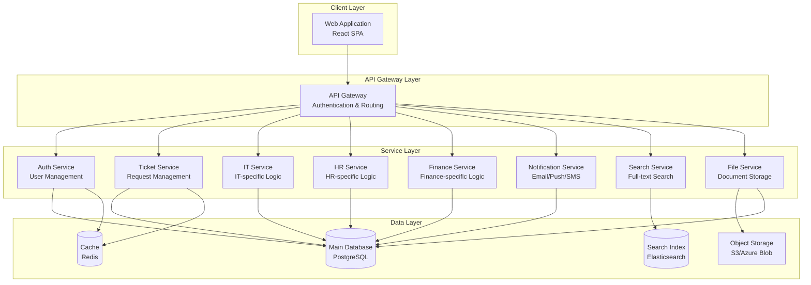

# Backend System Design for Enterprise Help Center

## Executive Summary

Based on the frontend analysis, this is an **Enterprise Help Center** application that provides a unified service management platform for IT Support, HR Services, and Group Finance departments. The system handles request ticketing, workflow management, secure communications, and multi-department service delivery.

---

## Frontend Analysis Summary

### Application Overview
- **Name**: Enterprise Help Center
- **Tech Stack**: React 19.2.3, TypeScript, Vite, React Router
- **Architecture**: Single Page Application (SPA) with hash-based routing

### Core Features Identified

#### 1. **Multi-Department Service Management**
- **IT Support**: Hardware requests, software installation, email management, system problem reporting
- **HR Services**: Leave requests, onboarding, payroll inquiries, HR issue reporting, personal details updates
- **Group Finance**: Expense reimbursement, purchase requisitions, vendor management, budget access

#### 2. **Request/Ticket Management System**
- Request creation with reference IDs (e.g., IT-4921, HR-1044, FIN-882)
- Status tracking with 8 states:
  - `SUBMITTED`, `IN_REVIEW`, `ACTION_REQUIRED`, `APPROVED`, `REJECTED`, `RESOLVED`, `IN_PROGRESS`, `WAITING`
- Request filtering (open/closed, by department, by creator)
- Request detail view with progress tracking

#### 3. **Communication & Collaboration**
- Secure messaging between users and specialists
- Activity/update timeline
- File attachments support (indicated in UI)
- Privacy-focused communications (especially for HR)

#### 4. **User Features**
- Dashboard with recent requests
- Search functionality across services and knowledge base
- Notifications system
- User profile management

---

## Proposed Backend Architecture

### Architecture Pattern: **Microservices with API Gateway**



---

## Database Design

### Core Database Schema (PostgreSQL)

#### **Users & Authentication**

```sql
-- Users table
CREATE TABLE users (
    id UUID PRIMARY KEY DEFAULT gen_random_uuid(),
    email VARCHAR(255) UNIQUE NOT NULL,
    password_hash VARCHAR(255) NOT NULL,
    first_name VARCHAR(100) NOT NULL,
    last_name VARCHAR(100) NOT NULL,
    phone VARCHAR(20),
    avatar_url TEXT,
    department VARCHAR(100),
    job_title VARCHAR(100),
    manager_id UUID REFERENCES users(id),
    is_active BOOLEAN DEFAULT true,
    created_at TIMESTAMP DEFAULT CURRENT_TIMESTAMP,
    updated_at TIMESTAMP DEFAULT CURRENT_TIMESTAMP,
    last_login_at TIMESTAMP
);

-- Roles & Permissions
CREATE TABLE roles (
    id UUID PRIMARY KEY DEFAULT gen_random_uuid(),
    name VARCHAR(50) UNIQUE NOT NULL,
    description TEXT,
    created_at TIMESTAMP DEFAULT CURRENT_TIMESTAMP
);

CREATE TABLE user_roles (
    user_id UUID REFERENCES users(id) ON DELETE CASCADE,
    role_id UUID REFERENCES roles(id) ON DELETE CASCADE,
    assigned_at TIMESTAMP DEFAULT CURRENT_TIMESTAMP,
    PRIMARY KEY (user_id, role_id)
);

CREATE TABLE permissions (
    id UUID PRIMARY KEY DEFAULT gen_random_uuid(),
    name VARCHAR(100) UNIQUE NOT NULL,
    resource VARCHAR(50) NOT NULL,
    action VARCHAR(50) NOT NULL,
    description TEXT
);

CREATE TABLE role_permissions (
    role_id UUID REFERENCES roles(id) ON DELETE CASCADE,
    permission_id UUID REFERENCES permissions(id) ON DELETE CASCADE,
    PRIMARY KEY (role_id, permission_id)
);

-- Sessions
CREATE TABLE sessions (
    id UUID PRIMARY KEY DEFAULT gen_random_uuid(),
    user_id UUID REFERENCES users(id) ON DELETE CASCADE,
    token VARCHAR(500) UNIQUE NOT NULL,
    ip_address INET,
    user_agent TEXT,
    expires_at TIMESTAMP NOT NULL,
    created_at TIMESTAMP DEFAULT CURRENT_TIMESTAMP
);

CREATE INDEX idx_sessions_token ON sessions(token);
CREATE INDEX idx_sessions_user_id ON sessions(user_id);
```

#### **Request/Ticket Management**

```sql
-- Service Desks
CREATE TABLE service_desks (
    id UUID PRIMARY KEY DEFAULT gen_random_uuid(),
    name VARCHAR(100) UNIQUE NOT NULL, -- 'IT Support', 'HR Services', 'Group Finance'
    code VARCHAR(20) UNIQUE NOT NULL, -- 'IT', 'HR', 'FINANCE'
    description TEXT,
    is_active BOOLEAN DEFAULT true,
    created_at TIMESTAMP DEFAULT CURRENT_TIMESTAMP
);

-- Service Categories
CREATE TABLE service_categories (
    id UUID PRIMARY KEY DEFAULT gen_random_uuid(),
    service_desk_id UUID REFERENCES service_desks(id) ON DELETE CASCADE,
    name VARCHAR(100) NOT NULL,
    description TEXT,
    icon VARCHAR(50),
    color_class VARCHAR(50),
    display_order INT DEFAULT 0,
    is_active BOOLEAN DEFAULT true,
    created_at TIMESTAMP DEFAULT CURRENT_TIMESTAMP
);

-- Request Types
CREATE TABLE request_types (
    id UUID PRIMARY KEY DEFAULT gen_random_uuid(),
    service_category_id UUID REFERENCES service_categories(id) ON DELETE CASCADE,
    name VARCHAR(150) NOT NULL,
    description TEXT,
    icon VARCHAR(50),
    requires_approval BOOLEAN DEFAULT false,
    sla_hours INT, -- Service Level Agreement in hours
    is_active BOOLEAN DEFAULT true,
    created_at TIMESTAMP DEFAULT CURRENT_TIMESTAMP
);

-- Requests (Main Ticket Table)
CREATE TYPE request_status AS ENUM (
    'SUBMITTED', 
    'IN_REVIEW', 
    'ACTION_REQUIRED', 
    'APPROVED', 
    'REJECTED', 
    'RESOLVED', 
    'IN_PROGRESS', 
    'WAITING'
);

CREATE TYPE request_priority AS ENUM ('LOW', 'MEDIUM', 'HIGH', 'CRITICAL');

CREATE TABLE requests (
    id UUID PRIMARY KEY DEFAULT gen_random_uuid(),
    reference_number VARCHAR(50) UNIQUE NOT NULL, -- IT-4921, HR-1044, etc.
    request_type_id UUID REFERENCES request_types(id),
    service_desk_id UUID REFERENCES service_desks(id),
    
    -- Requester Information
    requester_id UUID REFERENCES users(id) NOT NULL,
    requester_email VARCHAR(255) NOT NULL,
    requester_phone VARCHAR(20),
    
    -- Request Details
    summary VARCHAR(500) NOT NULL,
    description TEXT,
    priority request_priority DEFAULT 'MEDIUM',
    status request_status DEFAULT 'SUBMITTED',
    
    -- Assignment
    assigned_to_id UUID REFERENCES users(id),
    assigned_team VARCHAR(100),
    
    -- Metadata
    is_confidential BOOLEAN DEFAULT false,
    tags TEXT[], -- Array of tags for categorization
    custom_fields JSONB, -- Flexible storage for department-specific fields
    
    -- SLA Tracking
    sla_due_at TIMESTAMP,
    first_response_at TIMESTAMP,
    resolved_at TIMESTAMP,
    closed_at TIMESTAMP,
    
    -- Timestamps
    created_at TIMESTAMP DEFAULT CURRENT_TIMESTAMP,
    updated_at TIMESTAMP DEFAULT CURRENT_TIMESTAMP,
    
    -- Soft Delete
    deleted_at TIMESTAMP
);

CREATE INDEX idx_requests_reference ON requests(reference_number);
CREATE INDEX idx_requests_requester ON requests(requester_id);
CREATE INDEX idx_requests_status ON requests(status);
CREATE INDEX idx_requests_service_desk ON requests(service_desk_id);
CREATE INDEX idx_requests_assigned_to ON requests(assigned_to_id);
CREATE INDEX idx_requests_created_at ON requests(created_at DESC);
```

#### **Request Activities & Communication**

```sql
-- Request Activities (Timeline/Updates)
CREATE TYPE activity_type AS ENUM (
    'COMMENT', 
    'STATUS_CHANGE', 
    'ASSIGNMENT', 
    'ATTACHMENT', 
    'SYSTEM',
    'APPROVAL',
    'REJECTION'
);

CREATE TABLE request_activities (
    id UUID PRIMARY KEY DEFAULT gen_random_uuid(),
    request_id UUID REFERENCES requests(id) ON DELETE CASCADE,
    
    -- Author
    author_id UUID REFERENCES users(id),
    author_name VARCHAR(200) NOT NULL,
    author_role VARCHAR(100),
    author_avatar_url TEXT,
    
    -- Activity Details
    activity_type activity_type NOT NULL,
    message TEXT NOT NULL,
    is_system_generated BOOLEAN DEFAULT false,
    is_internal BOOLEAN DEFAULT false, -- Internal notes vs public updates
    
    -- Metadata
    metadata JSONB, -- Store additional context (old_status, new_status, etc.)
    
    created_at TIMESTAMP DEFAULT CURRENT_TIMESTAMP
);

CREATE INDEX idx_activities_request ON request_activities(request_id, created_at DESC);

-- Request Attachments
CREATE TABLE request_attachments (
    id UUID PRIMARY KEY DEFAULT gen_random_uuid(),
    request_id UUID REFERENCES requests(id) ON DELETE CASCADE,
    activity_id UUID REFERENCES request_activities(id) ON DELETE SET NULL,
    
    uploaded_by_id UUID REFERENCES users(id),
    
    file_name VARCHAR(255) NOT NULL,
    file_size BIGINT NOT NULL, -- in bytes
    file_type VARCHAR(100),
    mime_type VARCHAR(100),
    storage_path TEXT NOT NULL, -- S3/Azure path
    storage_url TEXT NOT NULL,
    
    is_scanned BOOLEAN DEFAULT false, -- Virus scan status
    scan_result VARCHAR(50),
    
    created_at TIMESTAMP DEFAULT CURRENT_TIMESTAMP,
    deleted_at TIMESTAMP
);

CREATE INDEX idx_attachments_request ON request_attachments(request_id);
```

#### **Department-Specific Tables**

```sql
-- IT Hardware Requests
CREATE TABLE it_hardware_requests (
    id UUID PRIMARY KEY DEFAULT gen_random_uuid(),
    request_id UUID REFERENCES requests(id) ON DELETE CASCADE,
    
    hardware_name VARCHAR(255) NOT NULL,
    hardware_model VARCHAR(255),
    estimated_price DECIMAL(10, 2),
    preferred_vendor VARCHAR(200),
    product_url TEXT,
    business_justification TEXT NOT NULL,
    
    manager_approval_required BOOLEAN DEFAULT true,
    manager_approved_at TIMESTAMP,
    manager_approved_by_id UUID REFERENCES users(id),
    
    procurement_status VARCHAR(50), -- 'PENDING', 'ORDERED', 'SHIPPED', 'DELIVERED'
    order_number VARCHAR(100),
    tracking_number VARCHAR(100),
    
    created_at TIMESTAMP DEFAULT CURRENT_TIMESTAMP,
    updated_at TIMESTAMP DEFAULT CURRENT_TIMESTAMP
);

-- HR Leave Requests
CREATE TABLE hr_leave_requests (
    id UUID PRIMARY KEY DEFAULT gen_random_uuid(),
    request_id UUID REFERENCES requests(id) ON DELETE CASCADE,
    
    leave_type VARCHAR(50) NOT NULL, -- 'ANNUAL', 'SICK', 'PARENTAL', 'UNPAID'
    start_date DATE NOT NULL,
    end_date DATE NOT NULL,
    total_days DECIMAL(4, 2) NOT NULL,
    
    reason TEXT,
    emergency_contact VARCHAR(200),
    emergency_phone VARCHAR(20),
    
    manager_approval_status VARCHAR(50),
    hr_approval_status VARCHAR(50),
    
    created_at TIMESTAMP DEFAULT CURRENT_TIMESTAMP,
    updated_at TIMESTAMP DEFAULT CURRENT_TIMESTAMP
);

-- Finance Expense Reimbursements
CREATE TABLE finance_expense_reimbursements (
    id UUID PRIMARY KEY DEFAULT gen_random_uuid(),
    request_id UUID REFERENCES requests(id) ON DELETE CASCADE,
    
    expense_date DATE NOT NULL,
    expense_category VARCHAR(100) NOT NULL, -- 'TRAVEL', 'MEALS', 'SUPPLIES', etc.
    total_amount DECIMAL(10, 2) NOT NULL,
    currency VARCHAR(3) DEFAULT 'USD',
    
    merchant_name VARCHAR(200),
    payment_method VARCHAR(50), -- 'PERSONAL_CARD', 'CASH'
    
    business_purpose TEXT NOT NULL,
    project_code VARCHAR(50),
    cost_center VARCHAR(50),
    
    approval_status VARCHAR(50),
    approved_amount DECIMAL(10, 2),
    payment_status VARCHAR(50), -- 'PENDING', 'PROCESSING', 'PAID'
    payment_date DATE,
    payment_reference VARCHAR(100),
    
    created_at TIMESTAMP DEFAULT CURRENT_TIMESTAMP,
    updated_at TIMESTAMP DEFAULT CURRENT_TIMESTAMP
);

-- Expense Line Items
CREATE TABLE expense_line_items (
    id UUID PRIMARY KEY DEFAULT gen_random_uuid(),
    expense_id UUID REFERENCES finance_expense_reimbursements(id) ON DELETE CASCADE,
    
    description VARCHAR(500) NOT NULL,
    amount DECIMAL(10, 2) NOT NULL,
    quantity INT DEFAULT 1,
    receipt_attachment_id UUID REFERENCES request_attachments(id),
    
    created_at TIMESTAMP DEFAULT CURRENT_TIMESTAMP
);
```

#### **Notifications & Alerts**

```sql
-- Notification Templates
CREATE TABLE notification_templates (
    id UUID PRIMARY KEY DEFAULT gen_random_uuid(),
    name VARCHAR(100) UNIQUE NOT NULL,
    event_type VARCHAR(100) NOT NULL, -- 'REQUEST_CREATED', 'STATUS_CHANGED', etc.
    
    email_subject TEXT,
    email_body TEXT,
    sms_body TEXT,
    push_title VARCHAR(200),
    push_body TEXT,
    
    is_active BOOLEAN DEFAULT true,
    created_at TIMESTAMP DEFAULT CURRENT_TIMESTAMP,
    updated_at TIMESTAMP DEFAULT CURRENT_TIMESTAMP
);

-- Notification Queue
CREATE TYPE notification_channel AS ENUM ('EMAIL', 'SMS', 'PUSH', 'IN_APP');
CREATE TYPE notification_status AS ENUM ('PENDING', 'SENT', 'FAILED', 'CANCELLED');

CREATE TABLE notifications (
    id UUID PRIMARY KEY DEFAULT gen_random_uuid(),
    user_id UUID REFERENCES users(id) ON DELETE CASCADE,
    
    channel notification_channel NOT NULL,
    status notification_status DEFAULT 'PENDING',
    
    subject VARCHAR(500),
    body TEXT NOT NULL,
    
    related_request_id UUID REFERENCES requests(id) ON DELETE SET NULL,
    
    sent_at TIMESTAMP,
    read_at TIMESTAMP,
    error_message TEXT,
    
    created_at TIMESTAMP DEFAULT CURRENT_TIMESTAMP
);

CREATE INDEX idx_notifications_user ON notifications(user_id, created_at DESC);
CREATE INDEX idx_notifications_status ON notifications(status);
```

#### **Knowledge Base**

```sql
-- Knowledge Base Articles
CREATE TABLE kb_articles (
    id UUID PRIMARY KEY DEFAULT gen_random_uuid(),
    service_desk_id UUID REFERENCES service_desks(id),
    
    title VARCHAR(500) NOT NULL,
    slug VARCHAR(500) UNIQUE NOT NULL,
    content TEXT NOT NULL,
    excerpt TEXT,
    
    author_id UUID REFERENCES users(id),
    
    category VARCHAR(100),
    tags TEXT[],
    
    view_count INT DEFAULT 0,
    helpful_count INT DEFAULT 0,
    not_helpful_count INT DEFAULT 0,
    
    is_published BOOLEAN DEFAULT false,
    published_at TIMESTAMP,
    
    created_at TIMESTAMP DEFAULT CURRENT_TIMESTAMP,
    updated_at TIMESTAMP DEFAULT CURRENT_TIMESTAMP,
    deleted_at TIMESTAMP
);

CREATE INDEX idx_kb_articles_slug ON kb_articles(slug);
CREATE INDEX idx_kb_articles_service_desk ON kb_articles(service_desk_id);
CREATE INDEX idx_kb_articles_published ON kb_articles(is_published, published_at DESC);
```

#### **Audit & Compliance**

```sql
-- Audit Logs
CREATE TABLE audit_logs (
    id UUID PRIMARY KEY DEFAULT gen_random_uuid(),
    
    user_id UUID REFERENCES users(id),
    user_email VARCHAR(255),
    
    action VARCHAR(100) NOT NULL, -- 'CREATE', 'UPDATE', 'DELETE', 'VIEW'
    resource_type VARCHAR(100) NOT NULL, -- 'REQUEST', 'USER', 'ATTACHMENT'
    resource_id UUID,
    
    ip_address INET,
    user_agent TEXT,
    
    old_values JSONB,
    new_values JSONB,
    
    created_at TIMESTAMP DEFAULT CURRENT_TIMESTAMP
);

CREATE INDEX idx_audit_logs_user ON audit_logs(user_id, created_at DESC);
CREATE INDEX idx_audit_logs_resource ON audit_logs(resource_type, resource_id);
CREATE INDEX idx_audit_logs_created_at ON audit_logs(created_at DESC);
```

---

## Database Recommendations

### Primary Database Options

#### **1. PostgreSQL (RECOMMENDED) ⭐**

**Why PostgreSQL?**
- ✅ **Excellent for relational data** with complex relationships (users, requests, activities)
- ✅ **JSONB support** for flexible custom fields per department
- ✅ **Full-text search** capabilities built-in
- ✅ **ACID compliance** for financial transactions
- ✅ **Array data types** for tags and multi-value fields
- ✅ **Advanced indexing** (B-tree, GiST, GIN) for performance
- ✅ **Row-level security** for confidential HR cases
- ✅ **Mature ecosystem** with excellent tooling
- ✅ **Horizontal scaling** options (Citus, partitioning)

**Best For:**
- Main transactional database
- User management
- Request/ticket management
- Audit logs
- Financial data

**Deployment Options:**
- Self-hosted (Docker, VM)
- AWS RDS PostgreSQL
- Azure Database for PostgreSQL
- Google Cloud SQL for PostgreSQL
- Supabase (PostgreSQL + Auth + Real-time)

---

#### **2. MySQL/MariaDB (Alternative)**

**Why MySQL?**
- ✅ Widely adopted, easy to find developers
- ✅ Good performance for read-heavy workloads
- ✅ JSON support (MySQL 5.7+)
- ✅ Lower resource footprint than PostgreSQL

**Limitations:**
- ❌ Less advanced JSON capabilities than PostgreSQL
- ❌ No array data types
- ❌ Weaker full-text search

**Best For:**
- Teams already familiar with MySQL
- Simpler deployments

---

### Complementary Databases

#### **3. Redis (REQUIRED for Caching) ⭐**

**Use Cases:**
- Session management
- Rate limiting
- Real-time notifications
- Caching frequently accessed data (user profiles, service desk configs)
- Job queues (Bull, BullMQ)

**Data to Cache:**
```javascript
// Session cache
sessions:{userId}:{sessionId} -> session data (TTL: 24h)

// User cache
users:{userId} -> user profile (TTL: 1h)

// Request cache
requests:{requestId} -> request details (TTL: 15min)

// Service desk configuration
config:service_desks -> all service desks (TTL: 1h)

// Rate limiting
ratelimit:{userId}:api -> request count (TTL: 1min)
```

---

#### **4. Elasticsearch (RECOMMENDED for Search) ⭐**

**Why Elasticsearch?**
- ✅ **Powerful full-text search** across requests, KB articles
- ✅ **Faceted search** (filter by status, department, date ranges)
- ✅ **Autocomplete** for search suggestions
- ✅ **Analytics** for reporting dashboards
- ✅ **Relevance scoring** for better search results

**Indexed Data:**
- Requests (title, description, reference number)
- Knowledge base articles
- User profiles (for admin search)
- Attachments metadata

**Alternatives:**
- **Algolia**: Managed search, easier setup, more expensive
- **Meilisearch**: Open-source, simpler than Elasticsearch
- **PostgreSQL Full-Text Search**: Good for smaller datasets

---

#### **5. Object Storage (REQUIRED for Files) ⭐**

**Options:**

| Service | Best For | Pricing |
|---------|----------|---------|
| **AWS S3** | Production, scalability | Pay per GB + requests |
| **Azure Blob Storage** | Azure ecosystem | Similar to S3 |
| **Google Cloud Storage** | GCP ecosystem | Similar to S3 |
| **MinIO** | Self-hosted, on-premise | Free (infrastructure costs) |
| **Cloudflare R2** | Zero egress fees | $0.015/GB storage |

**File Organization:**
```
/attachments/
  /{year}/
    /{month}/
      /{request_id}/
        /{filename}
```

---

### Database Comparison Matrix

| Database | Use Case | Pros | Cons | Complexity |
|----------|----------|------|------|------------|
| **PostgreSQL** | Main DB | Feature-rich, JSONB, arrays, full-text search | Higher resource usage | Medium |
| **MySQL** | Main DB (alt) | Familiar, good performance | Limited JSON, no arrays | Low |
| **Redis** | Cache, sessions | Fast, simple, pub/sub | In-memory only, data loss risk | Low |
| **Elasticsearch** | Search | Powerful search, analytics | Resource-intensive, complex | High |
| **MongoDB** | Document store | Flexible schema, easy scaling | No ACID for multi-doc | Medium |
| **S3/Blob** | File storage | Scalable, durable, cheap | Not a database | Low |

---

## Recommended Tech Stack

### Backend Framework Options

#### **Option 1: Node.js + Express/Fastify (Recommended for React team)**
```javascript
// Tech Stack
- Runtime: Node.js 20 LTS
- Framework: Express.js or Fastify
- ORM: Prisma or TypeORM
- Validation: Zod or Joi
- Authentication: Passport.js + JWT
- File Upload: Multer
- Email: Nodemailer
- Job Queue: Bull (Redis-based)
```

**Pros:**
- Same language as frontend (TypeScript)
- Large ecosystem
- Easy to find developers
- Fast development

---

#### **Option 2: Python + FastAPI (Best for data-heavy operations)**
```python
# Tech Stack
- Framework: FastAPI
- ORM: SQLAlchemy or Tortoise ORM
- Validation: Pydantic
- Authentication: FastAPI-Users or Authlib
- Task Queue: Celery (Redis/RabbitMQ)
- Email: FastAPI-Mail
```

**Pros:**
- Excellent for data processing
- Type safety with Pydantic
- Auto-generated API docs (Swagger)
- Great for ML/AI integration

---

#### **Option 3: Java/Kotlin + Spring Boot (Enterprise-grade)**
```java
// Tech Stack
- Framework: Spring Boot 3.x
- ORM: Hibernate/JPA
- Security: Spring Security
- Messaging: Spring AMQP
- Scheduler: Spring Scheduler
```

**Pros:**
- Enterprise-proven
- Strong typing
- Excellent for large teams
- Great tooling (IntelliJ)

**Cons:**
- Slower development
- More verbose
- Higher learning curve

---

## API Design

### RESTful API Endpoints

```
Authentication & Users
POST   /api/v1/auth/register
POST   /api/v1/auth/login
POST   /api/v1/auth/logout
POST   /api/v1/auth/refresh
GET    /api/v1/users/me
PUT    /api/v1/users/me
GET    /api/v1/users/:id

Requests
GET    /api/v1/requests                    # List requests (with filters)
POST   /api/v1/requests                    # Create request
GET    /api/v1/requests/:id                # Get request details
PUT    /api/v1/requests/:id                # Update request
DELETE /api/v1/requests/:id                # Delete request
GET    /api/v1/requests/:id/activities     # Get request timeline
POST   /api/v1/requests/:id/activities     # Add comment/update
POST   /api/v1/requests/:id/attachments    # Upload attachment
GET    /api/v1/requests/:id/attachments/:attachmentId  # Download

Service Desks
GET    /api/v1/service-desks               # List all service desks
GET    /api/v1/service-desks/:id/categories
GET    /api/v1/service-desks/:id/request-types

IT Services
POST   /api/v1/it/hardware-requests
GET    /api/v1/it/hardware-requests/:id
PUT    /api/v1/it/hardware-requests/:id

HR Services
POST   /api/v1/hr/leave-requests
GET    /api/v1/hr/leave-requests/:id
POST   /api/v1/hr/issue-reports

Finance Services
POST   /api/v1/finance/expense-reimbursements
GET    /api/v1/finance/expense-reimbursements/:id
POST   /api/v1/finance/purchase-requisitions

Knowledge Base
GET    /api/v1/kb/articles
GET    /api/v1/kb/articles/:slug
POST   /api/v1/kb/articles/:id/helpful

Search
GET    /api/v1/search?q={query}&type={type}

Notifications
GET    /api/v1/notifications
PUT    /api/v1/notifications/:id/read
```

---

## Security Considerations

### Authentication & Authorization
- **JWT tokens** with refresh token rotation
- **Role-based access control (RBAC)**
- **Row-level security** for confidential requests
- **Multi-factor authentication (MFA)** for sensitive operations

### Data Protection
- **Encryption at rest** for database (TDE)
- **Encryption in transit** (TLS 1.3)
- **Field-level encryption** for sensitive data (SSN, salary)
- **Data masking** for PII in logs

### Compliance
- **GDPR compliance** (right to be forgotten, data export)
- **SOC 2** audit trail requirements
- **Data retention policies**
- **Privacy by design** for HR cases

---

## Deployment Architecture

### Recommended: **Kubernetes on Cloud**

```yaml
# Production Setup
- Load Balancer (AWS ALB / Azure App Gateway)
- API Gateway (Kong / AWS API Gateway)
- Backend Services (3+ replicas per service)
- PostgreSQL (AWS RDS Multi-AZ)
- Redis Cluster (AWS ElastiCache)
- Elasticsearch (AWS OpenSearch / Elastic Cloud)
- S3 for file storage
- CloudFront CDN for static assets
```

### Alternative: **Serverless**
- **AWS Lambda** + API Gateway + RDS Proxy
- **Azure Functions** + Cosmos DB
- **Google Cloud Functions** + Cloud SQL

---

## Monitoring & Observability

### Required Tools
- **Application Monitoring**: New Relic, Datadog, or Prometheus + Grafana
- **Log Aggregation**: ELK Stack (Elasticsearch, Logstash, Kibana) or Splunk
- **Error Tracking**: Sentry
- **Uptime Monitoring**: Pingdom, UptimeRobot
- **APM**: Distributed tracing with Jaeger or Zipkin

---

## Summary & Recommendations

### **Recommended Database Stack**

| Component | Technology | Justification |
|-----------|------------|---------------|
| **Primary Database** | PostgreSQL 15+ | Best balance of features, performance, and flexibility |
| **Cache Layer** | Redis 7+ | Session management, real-time features, job queues |
| **Search Engine** | Elasticsearch 8+ | Powerful search across requests and KB articles |
| **File Storage** | AWS S3 / MinIO | Scalable, durable, cost-effective |
| **Message Queue** | RabbitMQ / Redis | Async processing, notifications |

### **Recommended Backend Stack**

```
Backend: Node.js 20 + TypeScript + Express.js
ORM: Prisma
Validation: Zod
Auth: JWT + Passport.js
File Upload: Multer + AWS SDK
Email: Nodemailer
Jobs: Bull + Redis
Testing: Jest + Supertest
```

### **Why This Stack?**
1. ✅ **Full TypeScript** across frontend and backend
2. ✅ **Rapid development** with Node.js ecosystem
3. ✅ **Type-safe** with Prisma + Zod
4. ✅ **Scalable** with microservices architecture
5. ✅ **Cost-effective** with open-source tools
6. ✅ **Easy to hire** developers for this stack

---

## Next Steps

1. **Set up development environment**
   - Docker Compose with PostgreSQL, Redis, Elasticsearch
   - Initialize Prisma schema
   - Set up API gateway

2. **Implement core services**
   - Authentication service
   - Request management service
   - Notification service

3. **Build department-specific modules**
   - IT service module
   - HR service module
   - Finance service module

4. **Integrate with frontend**
   - Replace mock data with real API calls
   - Implement WebSocket for real-time updates
   - Add file upload functionality

5. **Testing & deployment**
   - Unit tests (80%+ coverage)
   - Integration tests
   - Load testing
   - CI/CD pipeline setup
