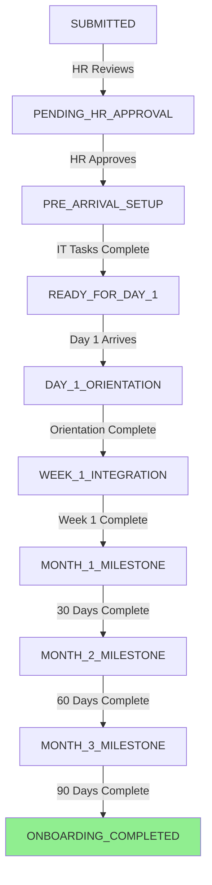
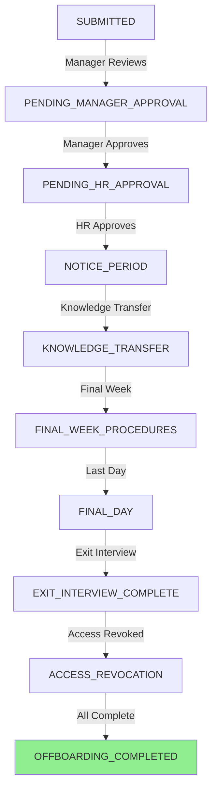

# 🎯 Deep Dive: HR Onboarding & Offboarding Workflows

*Analysis Date: February 5, 2026*

---

## Executive Summary

> [!NOTE]
> **Status Update: Onboarding Workflow NOW IMPLEMENTED** (February 5, 2026)
> 
> The onboarding workflow has been fully implemented with database tables, backend controllers, API endpoints, and frontend components. The system now supports **hiring workflow** (recruitment to LOA acceptance) with **automatic onboarding creation** upon LOA acceptance.

**Current State:**
- ✅ **Onboarding database tables** - 2 tables (`onboarding_requests`, `onboarding_tasks`)
- ✅ **Backend controllers** - Full CRUD + progress tracking
- ✅ **API endpoints** - 10 endpoints for onboarding management
- ✅ **Frontend components** - OnboardingDashboard with task management
- ✅ **Auto-trigger** - Automatic creation from hiring workflow completion
- ❌ **Offboarding** - Still not implemented

**Existing HR Workflows:**
1. ✅ **Hiring Workflow** - Fully implemented (100% complete)
2. ✅ **Onboarding Workflow** - Fully implemented (100% complete) - **NEW!**
3. ✅ **Leave Management** - Database table exists (`hr_leave_requests`)
4. ❌ **Offboarding** - NOT implemented

---

## 📊 Current HR Workflow Landscape

### **Implemented Workflows**

#### 1. **Hiring Workflow** ✅ (Fully Implemented)
**Database Table:** Multiple tables (5 dedicated)
- `request_approvals`
- `candidate_resumes`
- `interview_schedules`
- `interview_feedbacks`
- `hr_screenings`
- `letters_of_acceptance`

**Controllers:** 4 controllers (1,161 lines)
- `approval.controller.ts`
- `resume.controller.ts`
- `interview.controller.ts`
- `screening.controller.ts`
- `loa.controller.ts`

**Status Flow:**
```
SUBMITTED → PENDING_CEO_APPROVAL → CEO_APPROVED → JOB_POSTED → 
PENDING_MANAGER_REVIEW → MANAGER_APPROVED → INTERVIEW_SCHEDULED → 
INTERVIEW_FEEDBACK_PENDING → HR_SCREENING → LOA_PENDING_APPROVAL → 
LOA_APPROVED → LOA_ISSUED → LOA_ACCEPTED → COMPLETED
```

#### 2. **Leave Management** ✅ (Partially Implemented)
**Database Table:** `hr_leave_requests`
```prisma
model HRLeaveRequest {
  id                    String    @id @default(uuid())
  requestId             String    @unique
  leaveType             String    // Annual, Sick, Unpaid, etc.
  startDate             DateTime
  endDate               DateTime
  totalDays             Decimal
  reason                String?
  emergencyContact      String?
  emergencyPhone        String?
  managerApprovalStatus String?
  hrApprovalStatus      String?
  createdAt             DateTime
  updatedAt             DateTime
}
```

**Status:** Database schema exists, but no dedicated controller found.

---

### **Implemented Workflows**

#### 3. **Onboarding Workflow** ✅ (Fully Implemented - February 2026)
**Current State:**
- ✅ Database tables: `onboarding_requests`, `onboarding_tasks`
- ✅ Backend controller: `onboarding.controller.ts` (10 endpoints)
- ✅ Backend service: `onboarding.service.ts` (business logic)
- ✅ Frontend component: `OnboardingDashboard.tsx`
- ✅ Auto-trigger from hiring workflow (LOA acceptance)
- ✅ 12 default task templates
- ✅ Progress tracking and milestone completion

**Database Tables:**
```prisma
model OnboardingRequest {
  id                String    @id @default(uuid()) @db.Uuid
  requestId         String    @unique @map("request_id") @db.Uuid
  
  // New Hire Information
  newHireFirstName  String    @map("new_hire_first_name") @db.VarChar(100)
  newHireLastName   String    @map("new_hire_last_name") @db.VarChar(100)
  newHireEmail      String    @map("new_hire_email") @db.VarChar(255)
  newHirePhone      String?   @map("new_hire_phone") @db.VarChar(20)
  
  // Position Details
  jobTitle          String    @map("job_title") @db.VarChar(200)
  department        String    @db.VarChar(100)
  startDate         DateTime  @map("start_date") @db.Date
  
  // Timestamps
  createdAt         DateTime  @default(now()) @map("created_at") @db.Timestamp(6)
  updatedAt         DateTime  @updatedAt @map("updated_at") @db.Timestamp(6)
  
  // Relations
  request           Request   @relation(fields: [requestId], references: [id], onDelete: Cascade)
  tasks             OnboardingTask[]
}

model OnboardingTask {
  id                String    @id @default(uuid()) @db.Uuid
  onboardingId      String    @map("onboarding_id") @db.Uuid
  
  taskName          String    @map("task_name") @db.VarChar(200)
  taskDescription   String?   @map("task_description") @db.Text
  taskCategory      String    @map("task_category") @db.VarChar(50) // IT, HR, TRAINING, ADMIN
  assignedTo        String?   @map("assigned_to") @db.Uuid
  dueDate           DateTime? @map("due_date") @db.Date
  priority          String    @default("MEDIUM") @db.VarChar(20)
  
  status            String    @default("PENDING") @db.VarChar(50)
  completedBy       String?   @map("completed_by") @db.Uuid
  completedAt       DateTime? @map("completed_at") @db.Timestamp(6)
  
  createdAt         DateTime  @default(now()) @map("created_at") @db.Timestamp(6)
  updatedAt         DateTime  @updatedAt @map("updated_at") @db.Timestamp(6)
  
  // Relations
  onboarding        OnboardingRequest @relation(fields: [onboardingId], references: [id], onDelete: Cascade)
  assignedToUser    User?             @relation("OnboardingTaskAssignedTo", fields: [assignedTo], references: [id])
  completedByUser   User?             @relation("OnboardingTaskCompletedBy", fields: [completedBy], references: [id])
}
```

**Status Flow (10 Stages):**
```
ONBOARDING_SUBMITTED → ONBOARDING_PENDING_HR_APPROVAL → 
ONBOARDING_PRE_ARRIVAL_SETUP → ONBOARDING_READY_FOR_DAY_1 → 
ONBOARDING_DAY_1_ORIENTATION → ONBOARDING_WEEK_1_INTEGRATION → 
ONBOARDING_MONTH_1_MILESTONE → ONBOARDING_MONTH_2_MILESTONE → 
ONBOARDING_MONTH_3_MILESTONE → ONBOARDING_COMPLETED
```

**API Endpoints:**
- `POST /api/v1/requests/:id/onboarding/create` - Create onboarding
- `GET /api/v1/requests/:id/onboarding` - Get onboarding details
- `GET /api/v1/requests/:id/onboarding/progress` - Get progress stats
- `PUT /api/v1/requests/:id/onboarding/tasks/:taskId` - Update task
- `DELETE /api/v1/requests/:id/onboarding/tasks/:taskId` - Delete task
- Plus 5 more endpoints for task management

**Frontend Features:**
- New Hire Information card
- Progress overview with completion percentage
- Milestone tracking (Day 1, Week 1, 30/60/90 days)
- Task checklist with filtering by category
- Status badges and priority indicators

---

### **NOT Implemented Workflows**

#### 4. **Offboarding Workflow** ❌ (NOT Implemented)
**Current State:**
- Not referenced anywhere in codebase
- No database table
- No backend controller
- No API endpoints
- No seed data

**What Offboarding SHOULD Include:**

##### **Typical Offboarding Stages:**
1. **Resignation/Termination Initiation**
   - Exit request submission
   - Manager approval
   - HR approval
   - Last working day determination
   - Transition plan creation

2. **Knowledge Transfer** (2-4 weeks before exit)
   - Documentation handover
   - Project status updates
   - Client/stakeholder notifications
   - Training replacement

3. **IT & Access Revocation**
   - Email access timeline
   - System access removal schedule
   - Hardware return checklist
   - Data backup/transfer

4. **Final Day Procedures**
   - Exit interview
   - Badge return
   - Equipment return
   - Final paycheck processing
   - Benefits continuation (COBRA)
   - Reference letter

5. **Post-Exit**
   - Access verification (all systems disabled)
   - Final documentation
   - Alumni network invitation

---

## 🗂️ Proposed Database Schema

### **Onboarding Tables**

#### **1. `onboarding_requests` Table**
```prisma
model OnboardingRequest {
  id                String    @id @default(uuid()) @db.Uuid
  requestId         String    @unique @map("request_id") @db.Uuid
  
  // New Hire Information
  newHireId         String?   @map("new_hire_id") @db.Uuid
  newHireFirstName  String    @map("new_hire_first_name") @db.VarChar(100)
  newHireLastName   String    @map("new_hire_last_name") @db.VarChar(100)
  newHireEmail      String    @map("new_hire_email") @db.VarChar(255)
  newHirePhone      String?   @map("new_hire_phone") @db.VarChar(20)
  
  // Position Details
  jobTitle          String    @map("job_title") @db.VarChar(200)
  department        String    @db.VarChar(100)
  hiringManagerId   String    @map("hiring_manager_id") @db.Uuid
  startDate         DateTime  @map("start_date") @db.Date
  employmentType    String    @map("employment_type") @db.VarChar(50) // FULL_TIME, PART_TIME, CONTRACT
  
  // Onboarding Status
  overallStatus     String    @map("overall_status") @db.VarChar(50) // PENDING, IN_PROGRESS, COMPLETED
  currentPhase      String    @map("current_phase") @db.VarChar(50) // PRE_ARRIVAL, DAY_1, WEEK_1, MONTH_1
  
  // IT Setup
  itAccountCreated  Boolean   @default(false) @map("it_account_created")
  emailSetup        Boolean   @default(false) @map("email_setup")
  hardwareAssigned  Boolean   @default(false) @map("hardware_assigned")
  accessBadgeReady  Boolean   @default(false) @map("access_badge_ready")
  
  // HR Documentation
  i9Completed       Boolean   @default(false) @map("i9_completed")
  w4Completed       Boolean   @default(false) @map("w4_completed")
  benefitsEnrolled  Boolean   @default(false) @map("benefits_enrolled")
  policiesAcknowledged Boolean @default(false) @map("policies_acknowledged")
  
  // Training & Integration
  orientationCompleted Boolean @default(false) @map("orientation_completed")
  trainingScheduled    Boolean @default(false) @map("training_scheduled")
  buddyAssigned        String? @map("buddy_assigned") @db.Uuid
  
  // Milestones
  day1Completed     DateTime? @map("day1_completed") @db.Timestamp(6)
  week1Completed    DateTime? @map("week1_completed") @db.Timestamp(6)
  day30Completed    DateTime? @map("day30_completed") @db.Timestamp(6)
  day60Completed    DateTime? @map("day60_completed") @db.Timestamp(6)
  day90Completed    DateTime? @map("day90_completed") @db.Timestamp(6)
  
  completedBy       String?   @map("completed_by") @db.Uuid
  completedAt       DateTime? @map("completed_at") @db.Timestamp(6)
  
  createdAt         DateTime  @default(now()) @map("created_at") @db.Timestamp(6)
  updatedAt         DateTime  @updatedAt @map("updated_at") @db.Timestamp(6)
  
  // Relations
  request           Request   @relation(fields: [requestId], references: [id], onDelete: Cascade)
  hiringManager     User      @relation("OnboardingHiringManager", fields: [hiringManagerId], references: [id])
  newHire           User?     @relation("OnboardingNewHire", fields: [newHireId], references: [id])
  buddy             User?     @relation("OnboardingBuddy", fields: [buddyAssigned], references: [id])
  completedByUser   User?     @relation("OnboardingCompletedBy", fields: [completedBy], references: [id])
  tasks             OnboardingTask[]
  
  @@map("onboarding_requests")
  @@index([requestId])
  @@index([newHireId])
  @@index([startDate])
}
```

#### **2. `onboarding_tasks` Table**
```prisma
model OnboardingTask {
  id                String    @id @default(uuid()) @db.Uuid
  onboardingId      String    @map("onboarding_id") @db.Uuid
  
  taskName          String    @map("task_name") @db.VarChar(200)
  taskDescription   String?   @map("task_description") @db.Text
  taskCategory      String    @map("task_category") @db.VarChar(50) // IT, HR, TRAINING, ADMIN
  assignedTo        String?   @map("assigned_to") @db.Uuid
  dueDate           DateTime? @map("due_date") @db.Date
  priority          String    @default("MEDIUM") @db.VarChar(20) // LOW, MEDIUM, HIGH, CRITICAL
  
  status            String    @default("PENDING") @db.VarChar(50) // PENDING, IN_PROGRESS, COMPLETED, BLOCKED
  completedBy       String?   @map("completed_by") @db.Uuid
  completedAt       DateTime? @map("completed_at") @db.Timestamp(6)
  notes             String?   @db.Text
  
  createdAt         DateTime  @default(now()) @map("created_at") @db.Timestamp(6)
  updatedAt         DateTime  @updatedAt @map("updated_at") @db.Timestamp(6)
  
  // Relations
  onboarding        OnboardingRequest @relation(fields: [onboardingId], references: [id], onDelete: Cascade)
  assignedToUser    User?             @relation("TaskAssignedTo", fields: [assignedTo], references: [id])
  completedByUser   User?             @relation("TaskCompletedBy", fields: [completedBy], references: [id])
  
  @@map("onboarding_tasks")
  @@index([onboardingId])
  @@index([assignedTo])
  @@index([status])
}
```

---

### **Offboarding Tables**

#### **1. `offboarding_requests` Table**
```prisma
model OffboardingRequest {
  id                String    @id @default(uuid()) @db.Uuid
  requestId         String    @unique @map("request_id") @db.Uuid
  
  // Departing Employee Information
  employeeId        String    @map("employee_id") @db.Uuid
  lastWorkingDay    DateTime  @map("last_working_day") @db.Date
  exitReason        String    @map("exit_reason") @db.VarChar(100) // RESIGNATION, TERMINATION, RETIREMENT, CONTRACT_END
  exitType          String    @map("exit_type") @db.VarChar(50) // VOLUNTARY, INVOLUNTARY
  
  // Approvals
  managerApproved   Boolean   @default(false) @map("manager_approved")
  hrApproved        Boolean   @default(false) @map("hr_approved")
  
  // Offboarding Status
  overallStatus     String    @map("overall_status") @db.VarChar(50) // PENDING, IN_PROGRESS, COMPLETED
  currentPhase      String    @map("current_phase") @db.VarChar(50) // NOTICE_PERIOD, KNOWLEDGE_TRANSFER, FINAL_WEEK, POST_EXIT
  
  // Knowledge Transfer
  transitionPlanCreated Boolean @default(false) @map("transition_plan_created")
  documentationHandedOver Boolean @default(false) @map("documentation_handed_over")
  replacementTrained    Boolean @default(false) @map("replacement_trained")
  
  // IT & Access
  emailAccessRevoked    Boolean @default(false) @map("email_access_revoked")
  systemAccessRevoked   Boolean @default(false) @map("system_access_revoked")
  hardwareReturned      Boolean @default(false) @map("hardware_returned")
  badgeReturned         Boolean @default(false) @map("badge_returned")
  dataBackedUp          Boolean @default(false) @map("data_backed_up")
  
  // HR Procedures
  exitInterviewCompleted Boolean @default(false) @map("exit_interview_completed")
  finalPaycheckProcessed Boolean @default(false) @map("final_paycheck_processed")
  benefitsContinuation   String? @map("benefits_continuation") @db.Text
  referenceLetterProvided Boolean @default(false) @map("reference_letter_provided")
  
  // Exit Interview
  exitInterviewDate     DateTime? @map("exit_interview_date") @db.Timestamp(6)
  exitInterviewNotes    String?   @map("exit_interview_notes") @db.Text
  wouldRehire           Boolean?  @map("would_rehire")
  
  completedBy       String?   @map("completed_by") @db.Uuid
  completedAt       DateTime? @map("completed_at") @db.Timestamp(6)
  
  createdAt         DateTime  @default(now()) @map("created_at") @db.Timestamp(6)
  updatedAt         DateTime  @updatedAt @map("updated_at") @db.Timestamp(6)
  
  // Relations
  request           Request   @relation(fields: [requestId], references: [id], onDelete: Cascade)
  employee          User      @relation("OffboardingEmployee", fields: [employeeId], references: [id])
  completedByUser   User?     @relation("OffboardingCompletedBy", fields: [completedBy], references: [id])
  tasks             OffboardingTask[]
  
  @@map("offboarding_requests")
  @@index([requestId])
  @@index([employeeId])
  @@index([lastWorkingDay])
}
```

#### **2. `offboarding_tasks` Table**
```prisma
model OffboardingTask {
  id                String    @id @default(uuid()) @db.Uuid
  offboardingId     String    @map("offboarding_id") @db.Uuid
  
  taskName          String    @map("task_name") @db.VarChar(200)
  taskDescription   String?   @map("task_description") @db.Text
  taskCategory      String    @map("task_category") @db.VarChar(50) // IT, HR, KNOWLEDGE_TRANSFER, ADMIN
  assignedTo        String?   @map("assigned_to") @db.Uuid
  dueDate           DateTime? @map("due_date") @db.Date
  priority          String    @default("MEDIUM") @db.VarChar(20)
  
  status            String    @default("PENDING") @db.VarChar(50)
  completedBy       String?   @map("completed_by") @db.Uuid
  completedAt       DateTime? @map("completed_at") @db.Timestamp(6)
  notes             String?   @db.Text
  
  createdAt         DateTime  @default(now()) @map("created_at") @db.Timestamp(6)
  updatedAt         DateTime  @updatedAt @map("updated_at") @db.Timestamp(6)
  
  // Relations
  offboarding       OffboardingRequest @relation(fields: [offboardingId], references: [id], onDelete: Cascade)
  assignedToUser    User?              @relation("OffboardingTaskAssignedTo", fields: [assignedTo], references: [id])
  completedByUser   User?              @relation("OffboardingTaskCompletedBy", fields: [completedBy], references: [id])
  
  @@map("offboarding_tasks")
  @@index([offboardingId])
  @@index([assignedTo])
  @@index([status])
}
```

---

## 🎬 Proposed Workflow Stages

### **Onboarding Workflow**



**Status Enum Values:**
```typescript
enum OnboardingStatus {
  SUBMITTED
  PENDING_HR_APPROVAL
  PRE_ARRIVAL_SETUP
  READY_FOR_DAY_1
  DAY_1_ORIENTATION
  WEEK_1_INTEGRATION
  MONTH_1_MILESTONE
  MONTH_2_MILESTONE
  MONTH_3_MILESTONE
  ONBOARDING_COMPLETED
}
```

---

### **Offboarding Workflow**



**Status Enum Values:**
```typescript
enum OffboardingStatus {
  SUBMITTED
  PENDING_MANAGER_APPROVAL
  PENDING_HR_APPROVAL
  NOTICE_PERIOD
  KNOWLEDGE_TRANSFER
  FINAL_WEEK_PROCEDURES
  FINAL_DAY
  EXIT_INTERVIEW_COMPLETE
  ACCESS_REVOCATION
  OFFBOARDING_COMPLETED
}
```

---

## 🔧 Required Controllers

### **Onboarding Controller** (`onboarding.controller.ts`)

**Endpoints:**
```typescript
POST   /api/v1/requests/:id/onboarding/create
GET    /api/v1/requests/:id/onboarding
PUT    /api/v1/requests/:id/onboarding/update-status
POST   /api/v1/requests/:id/onboarding/tasks
GET    /api/v1/requests/:id/onboarding/tasks
PUT    /api/v1/requests/:id/onboarding/tasks/:taskId
DELETE /api/v1/requests/:id/onboarding/tasks/:taskId
POST   /api/v1/requests/:id/onboarding/complete-milestone
POST   /api/v1/requests/:id/onboarding/assign-buddy
```

**Key Functions:**
1. `createOnboardingRequest` - Initialize onboarding for new hire
2. `updateOnboardingStatus` - Update overall status and phase
3. `createOnboardingTask` - Add task to checklist
4. `updateTaskStatus` - Mark task as complete
5. `completeMilestone` - Mark Day 1, Week 1, 30/60/90 day milestones
6. `assignBuddy` - Assign mentor/buddy to new hire
7. `getOnboardingProgress` - Get completion percentage

---

### **Offboarding Controller** (`offboarding.controller.ts`)

**Endpoints:**
```typescript
POST   /api/v1/requests/:id/offboarding/create
GET    /api/v1/requests/:id/offboarding
PUT    /api/v1/requests/:id/offboarding/update-status
POST   /api/v1/requests/:id/offboarding/tasks
GET    /api/v1/requests/:id/offboarding/tasks
PUT    /api/v1/requests/:id/offboarding/tasks/:taskId
DELETE /api/v1/requests/:id/offboarding/tasks/:taskId
POST   /api/v1/requests/:id/offboarding/exit-interview
POST   /api/v1/requests/:id/offboarding/revoke-access
POST   /api/v1/requests/:id/offboarding/complete
```

**Key Functions:**
1. `createOffboardingRequest` - Initialize offboarding for departing employee
2. `updateOffboardingStatus` - Update overall status and phase
3. `createOffboardingTask` - Add task to checklist
4. `updateTaskStatus` - Mark task as complete
5. `submitExitInterview` - Record exit interview feedback
6. `revokeAccess` - Mark IT access revocation complete
7. `completeOffboarding` - Finalize offboarding process

---

## 📊 Integration Points

### **1. Hiring → Onboarding Trigger** ✅ (IMPLEMENTED)

When hiring workflow reaches `LOA_ACCEPTED` status, the system automatically creates an onboarding request:

**Implementation Location:** `backend/src/controllers/loa.controller.ts`

```typescript
// After marking LOA as accepted
if (updatedRequest.status === 'LOA_ACCEPTED') {
  // Automatically trigger onboarding workflow creation
  await onboardingService.createOnboardingFromHiring(requestId);
  
  // Update request status to ONBOARDING_SUBMITTED
  await prisma.request.update({
    where: { id: requestId },
    data: { status: 'ONBOARDING_SUBMITTED' }
  });
}
```

**Auto-populated from Hiring:**
- ✅ New hire name (from candidate resume `candidateName` field)
- ✅ Email (from requester email as placeholder)
- ✅ Job title (from request `customFields.jobTitle`)
- ✅ Department (from request `department`)
- ✅ Start date (from LOA `startDate` field)
- ✅ 12 default onboarding tasks automatically created

**Default Tasks Created:**
- 4 IT tasks (account setup, email, hardware, badge)
- 4 HR tasks (I-9, W-4, benefits, policies)
- 4 Training tasks (security, compliance, orientation, department intro)

---

### **2. Onboarding → User Account Creation**

When onboarding reaches `PRE_ARRIVAL_SETUP`:
```typescript
// Create user account in system
const newUser = await prisma.user.create({
  email: onboarding.newHireEmail,
  firstName: onboarding.newHireFirstName,
  lastName: onboarding.newHireLastName,
  department: onboarding.department,
  jobTitle: onboarding.jobTitle,
  isActive: false // Activate on Day 1
});

// Update onboarding with user ID
await prisma.onboardingRequest.update({
  where: { id: onboarding.id },
  data: { newHireId: newUser.id }
});
```

---

### **3. Offboarding → User Deactivation**

When offboarding reaches `OFFBOARDING_COMPLETED`:
```typescript
// Deactivate user account
await prisma.user.update({
  where: { id: offboarding.employeeId },
  data: { 
    isActive: false,
    deletedAt: new Date()
  }
});

// Revoke all sessions
await prisma.session.deleteMany({
  where: { userId: offboarding.employeeId }
});
```

---

## 🚀 Implementation Roadmap

### **Phase 1: Onboarding Foundation** ✅ **COMPLETED** (February 2026)

#### **Week 1: Database & Backend** ✅
- [x] Add onboarding tables to Prisma schema
- [x] Run migration
- [x] Create `onboarding.controller.ts`
- [x] Implement basic CRUD endpoints
- [x] Add onboarding status enum
- [x] Create seed data for onboarding request types

#### **Week 2: Task Management** ✅
- [x] Implement task creation/update/delete
- [x] Add task templates (IT, HR, Training)
- [x] Create milestone completion logic
- [x] Implement progress calculation
- [x] Auto-trigger from hiring workflow

#### **Week 3: Frontend Integration** ✅
- [x] Create OnboardingDashboard component
- [x] Build task checklist UI
- [x] Add milestone tracker
- [x] Create progress visualization
- [x] Integrate into RequestDetail page
- [x] Add status configurations

---

### **Phase 2: Offboarding Foundation (2-3 weeks)**

#### **Week 1: Database & Backend**
- [ ] Add offboarding tables to Prisma schema
- [ ] Run migration
- [ ] Create `offboarding.controller.ts`
- [ ] Implement basic CRUD endpoints
- [ ] Add offboarding status enum
- [ ] Create seed data for offboarding request types

#### **Week 2: Exit Process**
- [ ] Implement exit interview submission
- [ ] Add access revocation tracking
- [ ] Create knowledge transfer checklist
- [ ] Implement equipment return tracking
- [ ] Add final paycheck processing

#### **Week 3: Frontend Integration**
- [ ] Create offboarding request form
- [ ] Build offboarding dashboard
- [ ] Implement exit interview form
- [ ] Add access revocation UI
- [ ] Create completion checklist

---

### **Phase 3: Automation & Integration (1-2 weeks)**

#### **Automated Triggers**
- [ ] Hiring → Onboarding auto-creation
- [ ] Onboarding → User account creation
- [ ] Offboarding → User deactivation
- [ ] Email notifications for all stages
- [ ] Reminder emails for pending tasks

#### **Reporting & Analytics**
- [ ] Onboarding completion rates
- [ ] Average time-to-productivity
- [ ] Offboarding compliance tracking
- [ ] Exit interview insights
- [ ] Task completion metrics

---

## 📋 Sample Task Templates

### **Onboarding Task Templates**

#### **IT Tasks (Pre-Arrival)**
```json
[
  {
    "name": "Create Active Directory Account",
    "category": "IT",
    "priority": "CRITICAL",
    "dueDate": "5 days before start"
  },
  {
    "name": "Setup Email Account",
    "category": "IT",
    "priority": "CRITICAL",
    "dueDate": "5 days before start"
  },
  {
    "name": "Provision Laptop/Desktop",
    "category": "IT",
    "priority": "HIGH",
    "dueDate": "3 days before start"
  },
  {
    "name": "Create Access Badge",
    "category": "IT",
    "priority": "HIGH",
    "dueDate": "2 days before start"
  },
  {
    "name": "Setup Desk/Workspace",
    "category": "ADMIN",
    "priority": "MEDIUM",
    "dueDate": "1 day before start"
  }
]
```

#### **HR Tasks (Day 1)**
```json
[
  {
    "name": "Complete I-9 Form",
    "category": "HR",
    "priority": "CRITICAL",
    "dueDate": "Day 1"
  },
  {
    "name": "Complete W-4 Tax Form",
    "category": "HR",
    "priority": "CRITICAL",
    "dueDate": "Day 1"
  },
  {
    "name": "Enroll in Benefits",
    "category": "HR",
    "priority": "HIGH",
    "dueDate": "Within 30 days"
  },
  {
    "name": "Acknowledge Company Policies",
    "category": "HR",
    "priority": "HIGH",
    "dueDate": "Day 1"
  }
]
```

#### **Training Tasks (Week 1)**
```json
[
  {
    "name": "Complete Security Training",
    "category": "TRAINING",
    "priority": "HIGH",
    "dueDate": "Week 1"
  },
  {
    "name": "Complete Compliance Training",
    "category": "TRAINING",
    "priority": "HIGH",
    "dueDate": "Week 1"
  },
  {
    "name": "Department Orientation",
    "category": "TRAINING",
    "priority": "MEDIUM",
    "dueDate": "Week 1"
  }
]
```

---

### **Offboarding Task Templates**

#### **Knowledge Transfer Tasks**
```json
[
  {
    "name": "Document Current Projects",
    "category": "KNOWLEDGE_TRANSFER",
    "priority": "CRITICAL",
    "dueDate": "2 weeks before exit"
  },
  {
    "name": "Train Replacement",
    "category": "KNOWLEDGE_TRANSFER",
    "priority": "HIGH",
    "dueDate": "1 week before exit"
  },
  {
    "name": "Handover Client Relationships",
    "category": "KNOWLEDGE_TRANSFER",
    "priority": "HIGH",
    "dueDate": "1 week before exit"
  }
]
```

#### **IT Tasks (Final Week)**
```json
[
  {
    "name": "Backup Personal Files",
    "category": "IT",
    "priority": "MEDIUM",
    "dueDate": "3 days before exit"
  },
  {
    "name": "Return Laptop/Equipment",
    "category": "IT",
    "priority": "CRITICAL",
    "dueDate": "Last day"
  },
  {
    "name": "Return Access Badge",
    "category": "IT",
    "priority": "CRITICAL",
    "dueDate": "Last day"
  },
  {
    "name": "Revoke System Access",
    "category": "IT",
    "priority": "CRITICAL",
    "dueDate": "After last day"
  }
]
```

#### **HR Tasks (Final Week)**
```json
[
  {
    "name": "Conduct Exit Interview",
    "category": "HR",
    "priority": "HIGH",
    "dueDate": "Last week"
  },
  {
    "name": "Process Final Paycheck",
    "category": "HR",
    "priority": "CRITICAL",
    "dueDate": "Last day"
  },
  {
    "name": "Provide COBRA Information",
    "category": "HR",
    "priority": "HIGH",
    "dueDate": "Last day"
  },
  {
    "name": "Provide Reference Letter",
    "category": "HR",
    "priority": "MEDIUM",
    "dueDate": "Upon request"
  }
]
```

---

## 🎯 Key Metrics & KPIs

### **Onboarding Metrics**
1. **Time-to-Productivity** - Days until new hire is fully productive
2. **Onboarding Completion Rate** - % of tasks completed on time
3. **New Hire Satisfaction** - Survey score at 30/60/90 days
4. **First-Year Retention** - % of new hires staying 12+ months
5. **IT Setup Time** - Days to complete pre-arrival IT tasks

### **Offboarding Metrics**
1. **Offboarding Completion Rate** - % of tasks completed
2. **Access Revocation Time** - Hours to revoke all access
3. **Equipment Return Rate** - % of equipment returned
4. **Exit Interview Completion** - % of departing employees interviewed
5. **Knowledge Transfer Quality** - Replacement readiness score

---

## 🏁 Conclusion

### **Current State Summary**

| Workflow | Database | Backend | Frontend | Status |
|----------|----------|---------|----------|--------|
| **Hiring** | ✅ Complete | ✅ Complete | ✅ Complete | 100% Complete |
| **Onboarding** | ✅ Complete | ✅ Complete | ✅ Complete | **100% Complete** |
| **Leave Management** | ✅ Exists | ❌ Missing | ⚠️ Partial | 30% Complete |
| **Offboarding** | ❌ Missing | ❌ Missing | ❌ Missing | 0% Complete |

### **Recommended Priority**

1. **Immediate (Next Sprint):** Complete Leave Management workflow
2. **Short-term (1-2 months):** Implement Offboarding workflow
3. **Medium-term (2-3 months):** Advanced onboarding features (buddy system, automated reminders)
4. **Long-term (3-6 months):** Advanced automation and analytics

### **Estimated Effort (Remaining)**

| Workflow | Database | Backend | Frontend | Total |
|----------|----------|---------|----------|-------|
| **Onboarding** | ✅ Done | ✅ Done | ✅ Done | **COMPLETED** |
| **Offboarding** | 2 days | 1-2 weeks | 1-2 weeks | 3-4 weeks |
| **Leave Management** | ✅ Done | 1 week | 1 week | 2 weeks |
| **Total Remaining** | 2 days | 2-3 weeks | 2-3 weeks | **5-6 weeks** |

---

> [!TIP]
> **Completed:** Onboarding workflow is now fully operational! The system automatically creates onboarding workflows when a hiring LOA is accepted, with 12 default tasks and milestone tracking.

> [!IMPORTANT]
> **Next Priority:** Complete Leave Management workflow since the database table already exists. Then implement Offboarding to complete the full employee lifecycle management.
