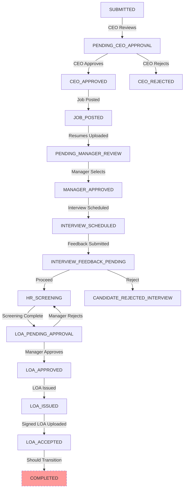

# 🎯 Deep Dive: Complete HR Hiring Workflow

*Analysis Date: February 5, 2026*

---

## Executive Summary

The HR Hiring Workflow is a **sophisticated, multi-stage recruitment process** spanning from initial job requisition to final candidate acceptance. The implementation includes **5 dedicated database tables**, **3 specialized controllers** (1,161 lines of code), and **15 distinct status transitions** across 6 major stages.

> [!IMPORTANT]
> **Current Status: 90% Complete**
> 
> The workflow is functionally complete but has one critical gap: the final transition from `LOA_ACCEPTED` to `COMPLETED` status is missing, leaving hiring tickets in a "resolved" state rather than properly closed.

---

## 📊 Workflow Overview

### **Complete Hiring Journey**



---

## 🗂️ Database Schema

### **5 HR-Specific Tables**

#### 1. **`request_approvals`** - Approval Tracking
```sql
Fields:
- id (UUID)
- requestId (UUID) → requests.id
- approverType (VARCHAR) - 'CEO', 'HIRING_MANAGER'
- approverId (UUID) → users.id
- status (ENUM) - PENDING, APPROVED, REJECTED
- comments (TEXT)
- createdAt, updatedAt

Purpose: Track CEO and hiring manager approvals
```

#### 2. **`candidate_resumes`** - Resume Management
```sql
Fields:
- id (UUID)
- requestId (UUID) → requests.id
- fileName, fileUrl, fileSize, mimeType
- uploadedById (UUID) → users.id
- candidateName (VARCHAR)
- notes (TEXT)
- createdAt

Purpose: Store candidate resumes for review
Relation: One request → Many resumes
```

#### 3. **`interview_schedules`** - Interview Coordination
```sql
Fields:
- id (UUID)
- requestId (UUID) → requests.id (UNIQUE)
- candidateId (UUID) → candidate_resumes.id
- interviewDate (DATE)
- interviewTime (VARCHAR)
- location, meetingLink
- interviewers (TEXT) - JSON array
- notes (TEXT)
- scheduledBy (UUID) → users.id
- createdAt, updatedAt

Purpose: Schedule and track interviews
Relation: One request → One interview schedule
```

#### 4. **`interview_feedbacks`** - Interview Results
```sql
Fields:
- id (UUID)
- requestId (UUID) → requests.id (UNIQUE)
- decision (VARCHAR) - 'PROCEED', 'REJECT'
- overallRating, technicalSkills, culturalFit, communication (INT)
- feedback (TEXT)
- concerns (TEXT)
- submittedBy (UUID) → users.id
- createdAt, updatedAt

Purpose: Capture hiring manager's interview assessment
Relation: One request → One feedback
```

#### 5. **`hr_screenings`** - Background Checks
```sql
Fields:
- id (UUID)
- requestId (UUID) → requests.id (UNIQUE)
- backgroundCheckStatus (VARCHAR) - PENDING, PASSED, FAILED, COMPLETED
- backgroundCheckNotes (TEXT)
- referencesCheckStatus (VARCHAR) - PENDING, PASSED, FAILED, COMPLETED
- referencesCheckNotes (TEXT)
- referencesContacted (TEXT) - JSON array
- overallStatus (VARCHAR) - IN_PROGRESS, COMPLETED, ISSUES_FOUND, REJECTED
- completedBy (UUID) → users.id
- createdAt, updatedAt

Purpose: Track background and reference checks
Relation: One request → One screening
```

#### 6. **`letters_of_acceptance`** - LOA Management
```sql
Fields:
- id (UUID)
- requestId (UUID) → requests.id (UNIQUE)
- loaFileUrl, loaFileName, loaFileSize
- signedLoaFileUrl, signedLoaFileName, signedLoaFileSize
- uploadedBy (UUID) → users.id
- approvedBy (UUID) → users.id
- approvalDate, approvalComments
- issuedDate, acceptedDate
- createdAt, updatedAt

Purpose: Manage LOA lifecycle from creation to acceptance
Relation: One request → One LOA
```

---

## 🎬 Workflow Stages (Detailed)

### **Stage 1: Initial Approval (CEO Level)**

**Statuses:** `SUBMITTED` → `PENDING_CEO_APPROVAL` → `CEO_APPROVED` / `CEO_REJECTED`

**Controllers:** `approval.controller.ts`

**Flow:**
1. Hiring manager submits new hiring request
2. Request automatically routed to CEO for approval
3. CEO reviews and approves/rejects
4. If approved → `CEO_APPROVED`, else → `CEO_REJECTED`

**Database Updates:**
- `request_approvals` record created with `approverType='CEO'`
- `requests.status` updated based on decision

**API Endpoints:**
```typescript
POST /api/v1/requests/:id/approvals/ceo/approve
POST /api/v1/requests/:id/approvals/ceo/reject
GET  /api/v1/requests/:id/approvals
```

---

### **Stage 2: Job Posting & Resume Collection**

**Statuses:** `CEO_APPROVED` → `JOB_POSTED` → `PENDING_MANAGER_REVIEW`

**Controllers:** `resume.controller.ts`

**Flow:**
1. HR agent marks job as posted
2. HR agent uploads candidate resumes
3. Once resumes uploaded → `PENDING_MANAGER_REVIEW`

**Database Updates:**
- `candidate_resumes` records created for each resume
- `requests.status` updated to `JOB_POSTED` then `PENDING_MANAGER_REVIEW`

**API Endpoints:**
```typescript
POST /api/v1/requests/:id/mark-job-posted
POST /api/v1/requests/:id/upload-resume (multiple calls)
GET  /api/v1/requests/:id/resumes
```

---

### **Stage 3: Manager Review & Selection**

**Statuses:** `PENDING_MANAGER_REVIEW` → `MANAGER_APPROVED`

**Controllers:** `approval.controller.ts`

**Flow:**
1. Hiring manager reviews uploaded resumes
2. Manager approves to proceed with selected candidate
3. Status → `MANAGER_APPROVED`

**Database Updates:**
- `request_approvals` record created with `approverType='HIRING_MANAGER'`
- `requests.status` updated to `MANAGER_APPROVED`

**API Endpoints:**
```typescript
POST /api/v1/requests/:id/approvals/manager/approve
```

---

### **Stage 4: Interview Scheduling & Feedback**

**Statuses:** `MANAGER_APPROVED` → `INTERVIEW_SCHEDULED` → `INTERVIEW_FEEDBACK_PENDING` → `CANDIDATE_REJECTED_INTERVIEW` / `HR_SCREENING`

**Controllers:** `interview.controller.ts` (335 lines)

**Flow:**
1. HR agent schedules interview with candidate
   - Creates `interview_schedules` record
   - Status → `INTERVIEW_SCHEDULED`
2. Hiring manager submits interview feedback
   - Creates `interview_feedbacks` record
   - Decision: PROCEED or REJECT
3. If PROCEED → `INTERVIEW_FEEDBACK_PENDING` (then HR screening)
4. If REJECT → `CANDIDATE_REJECTED_INTERVIEW` (workflow ends)

**Database Updates:**
- `interview_schedules` record created (UNIQUE per request)
- `interview_feedbacks` record created (UNIQUE per request)
- `requests.status` updated based on decision

**API Endpoints:**
```typescript
POST /api/v1/requests/:id/schedule-interview
POST /api/v1/requests/:id/interview-feedback
GET  /api/v1/requests/:id/interview
```

**Key Validations:**
- Only hiring manager can submit feedback
- Interview must be scheduled before feedback
- Decision must be 'PROCEED' or 'REJECT'

---

### **Stage 5: HR Screening (Background & References)**

**Statuses:** `INTERVIEW_FEEDBACK_PENDING` → `HR_SCREENING` → `LOA_PENDING_APPROVAL` / `REJECTED`

**Controllers:** `screening.controller.ts` (269 lines)

**Flow:**
1. HR agent starts screening process
   - Creates `hr_screenings` record
   - Both checks start as `PENDING`
   - Status → `HR_SCREENING`
2. HR agent updates background check status
3. HR agent updates reference check status
4. When both checks are PASSED/COMPLETED:
   - `overallStatus` → `COMPLETED`
   - Request status → `LOA_PENDING_APPROVAL`
5. If any check FAILED:
   - `overallStatus` → `ISSUES_FOUND` or `REJECTED`
   - Request status → `REJECTED`

**Database Updates:**
- `hr_screenings` record created
- `backgroundCheckStatus` and `referencesCheckStatus` updated
- `overallStatus` calculated automatically
- `requests.status` updated when screening complete

**API Endpoints:**
```typescript
POST /api/v1/requests/:id/start-screening
PUT  /api/v1/requests/:id/screening
GET  /api/v1/requests/:id/screening
```

**Automatic Status Calculation:**
```typescript
if (bgPassed && refPassed) {
    overallStatus = 'COMPLETED'
    requestStatus = 'LOA_PENDING_APPROVAL'
} else if (bgFailed || refFailed) {
    overallStatus = 'ISSUES_FOUND'
}
```

---

### **Stage 6: Letter of Acceptance (LOA) Lifecycle**

**Statuses:** `LOA_PENDING_APPROVAL` → `LOA_APPROVED` → `LOA_ISSUED` → `LOA_ACCEPTED` → ❌ **`COMPLETED`**

**Controllers:** `loa.controller.ts` (557 lines)

**Flow:**

#### **6.1 LOA Upload & Routing**
```typescript
POST /api/v1/requests/:id/loa/upload
POST /api/v1/requests/:id/loa/route-for-approval
```
1. HR agent uploads LOA document
   - Creates `letters_of_acceptance` record
   - Stores file URL, name, size
2. HR agent routes LOA to hiring manager
   - Status → `LOA_PENDING_APPROVAL`

**Validations:**
- HR screening must be `COMPLETED`
- Request must be in `HR_SCREENING` or `LOA_PENDING_APPROVAL` status

#### **6.2 Manager Approval**
```typescript
POST /api/v1/requests/:id/loa/manager-approve
```
1. Hiring manager reviews LOA
2. Manager approves or rejects
   - **APPROVE**: Status → `LOA_APPROVED`
   - **REJECT**: Status → `HR_SCREENING` (back to screening)

**Validations:**
- Only hiring manager (requester) can approve
- LOA must be uploaded first

#### **6.3 LOA Issuance**
```typescript
POST /api/v1/requests/:id/loa/mark-issued
```
1. HR agent marks LOA as issued to candidate
   - Sets `issuedDate`
   - Status → `LOA_ISSUED`

**Validations:**
- LOA must be approved by manager
- Request must be in `LOA_APPROVED` status

#### **6.4 Signed LOA Upload**
```typescript
POST /api/v1/requests/:id/loa/upload-signed
```
1. HR agent uploads signed LOA from candidate
   - Stores signed file URL, name, size
   - No status change yet

**Validations:**
- Request must be in `LOA_ISSUED` status

#### **6.5 LOA Acceptance (FINAL STEP)**
```typescript
POST /api/v1/requests/:id/loa/mark-accepted
```
1. HR agent marks LOA as accepted
   - Sets `acceptedDate`
   - Status → `RESOLVED` ❌ **SHOULD BE `COMPLETED`**
   - Sets `resolvedAt` timestamp

**Current Issue:**
```typescript
// Line 478-483 in loa.controller.ts
const updatedRequest = await prisma.request.update({
    where: { id },
    data: {
        status: 'RESOLVED',  // ❌ Should be 'COMPLETED'
        resolvedAt: new Date()
    }
});
```

**Validations:**
- Signed LOA must be uploaded
- Request must be in `LOA_ISSUED` status

---

## 🔴 Critical Gap: Missing COMPLETED Status

### **The Problem**

**Current Behavior:**
```typescript
LOA_ACCEPTED → RESOLVED (status)
```

**Expected Behavior:**
```typescript
LOA_ACCEPTED → COMPLETED (status)
```

### **Why This Matters**

1. **Semantic Clarity**: `RESOLVED` typically means "issue fixed" not "hiring complete"
2. **Workflow Completion**: No clear indicator that hiring process is 100% done
3. **Reporting**: Analytics can't distinguish between resolved tickets and completed hires
4. **Onboarding Trigger**: No automated trigger for onboarding tasks

### **The Fix**

#### **Step 1: Add COMPLETED to Status Enum**

**Backend:** `backend/prisma/schema.prisma`
```prisma
enum RequestStatus {
  // ... existing statuses
  LOA_ACCEPTED
  COMPLETED  // ← Add this
}
```

**Frontend:** `frontend/types.ts`
```typescript
export enum RequestStatus {
  // ... existing statuses
  LOA_ACCEPTED = 'LOA_ACCEPTED',
  COMPLETED = 'COMPLETED'  // ← Add this
}
```

#### **Step 2: Update LOA Controller**

**File:** `backend/src/controllers/loa.controller.ts`
```typescript
// Line 478-483
const updatedRequest = await prisma.request.update({
    where: { id },
    data: {
        status: 'COMPLETED',  // ✅ Changed from 'RESOLVED'
        resolvedAt: new Date(),
        closedAt: new Date()  // ✅ Also set closedAt
    }
});
```

#### **Step 3: Update Frontend Status Display**

**File:** `frontend/constants.tsx` (likely)
```typescript
export const REQUEST_STATUS_CONFIG = {
  // ... existing statuses
  COMPLETED: {
    label: 'Completed',
    color: 'green',
    icon: 'check-circle',
    description: 'Hiring process completed successfully'
  }
};
```

#### **Step 4: Run Migration**

```bash
cd backend
npx prisma migrate dev --name add_completed_status
npx prisma generate
```

---

## 📈 Workflow Statistics

| Metric | Count |
|--------|-------|
| **Total Status Transitions** | 15 |
| **Database Tables** | 5 HR-specific + 1 shared (requests) |
| **Controllers** | 3 (LOA, Interview, Screening) |
| **Total Lines of Code** | 1,161 lines |
| **API Endpoints** | 18 endpoints |
| **Approval Stages** | 3 (CEO, Manager x2) |
| **File Uploads** | 3 types (Resume, LOA, Signed LOA) |

---

## 🎯 Workflow Strengths

### ✅ **1. Comprehensive Approval Chain**
- CEO approval for budget/headcount
- Manager approval for candidate selection
- Manager approval for LOA terms
- Multi-level governance ensures proper oversight

### ✅ **2. Detailed Interview Process**
- Structured feedback with ratings (1-10 scale)
- Technical skills, cultural fit, communication assessment
- Concerns tracking for risk management
- Clear PROCEED/REJECT decision points

### ✅ **3. Robust HR Screening**
- Separate background and reference checks
- Automatic overall status calculation
- Detailed notes for audit trail
- References contacted tracking

### ✅ **4. Complete LOA Lifecycle**
- Upload → Approval → Issuance → Acceptance
- Dual file tracking (original + signed)
- Approval comments for transparency
- Date tracking for all milestones

### ✅ **5. Strong Data Model**
- Proper foreign key relationships
- UNIQUE constraints prevent duplicates
- Timestamps for audit trail
- Soft delete support (deletedAt)

---

## 🟡 Workflow Weaknesses

### **1. Missing COMPLETED Status** ⭐ **CRITICAL**
- **Impact**: HIGH
- **Effort**: 2-3 hours
- **Fix**: Add enum value + update controller

### **2. No Automated Onboarding Trigger**
- **Impact**: MEDIUM
- **Effort**: 1-2 days
- **Fix**: Add webhook/event when status → COMPLETED
- **Benefit**: Automatically create onboarding tasks

### **3. No Email Notifications**
- **Impact**: HIGH
- **Effort**: 3-4 days
- **Fix**: Implement email service for all status changes
- **Missing Notifications:**
  - CEO approval request
  - Manager resume review request
  - Interview scheduled confirmation
  - LOA approval request
  - LOA issued to candidate
  - Hiring complete confirmation

### **4. No Candidate Communication Portal**
- **Impact**: MEDIUM
- **Effort**: 5-7 days
- **Fix**: Build candidate-facing portal for:
  - Interview schedule viewing
  - LOA download
  - Signed LOA upload (self-service)

### **5. No Rejection Reason Tracking**
- **Impact**: LOW
- **Effort**: 1 day
- **Fix**: Add rejection reason fields to:
  - CEO rejection
  - Interview rejection
  - Screening rejection

### **6. Limited Analytics**
- **Impact**: MEDIUM
- **Effort**: 3-5 days
- **Fix**: Add reporting for:
  - Time-to-hire metrics
  - Approval bottlenecks
  - Candidate funnel conversion
  - Rejection reasons analysis

### **7. No Bulk Operations**
- **Impact**: LOW
- **Effort**: 2-3 days
- **Fix**: Support bulk resume upload
- **Benefit**: Faster processing for high-volume hiring

### **8. Hardcoded File Storage**
- **Impact**: MEDIUM
- **Effort**: 3-5 days
- **Fix**: Implement S3/MinIO integration
- **Current**: Files stored locally (`file.path`)
- **Needed**: Cloud storage with CDN

---

## 🚀 Recommended Improvements

### **Phase 1: Critical Fixes (1 week)**

#### 1. **Add COMPLETED Status** ⭐
```typescript
Priority: CRITICAL | Effort: 2-3 hours

Tasks:
- [ ] Add COMPLETED to Prisma enum
- [ ] Add COMPLETED to frontend types
- [ ] Update loa.controller.ts line 481
- [ ] Update frontend status config
- [ ] Run migration
- [ ] Test end-to-end workflow
```

#### 2. **Implement Email Notifications**
```typescript
Priority: HIGH | Effort: 3-4 days

Tasks:
- [ ] Configure Nodemailer
- [ ] Create email templates (Handlebars)
- [ ] Add notification triggers to all controllers
- [ ] Test with Mailhog
- [ ] Add unsubscribe functionality
```

#### 3. **Integrate File Storage (S3/MinIO)**
```typescript
Priority: HIGH | Effort: 3-5 days

Tasks:
- [ ] Configure AWS SDK or MinIO client
- [ ] Update resume upload endpoint
- [ ] Update LOA upload endpoints
- [ ] Migrate existing files (if any)
- [ ] Add file download endpoints with signed URLs
```

---

### **Phase 2: Enhanced Features (2-3 weeks)**

#### 4. **Automated Onboarding Trigger**
```typescript
Priority: MEDIUM | Effort: 1-2 days

Implementation:
- Listen for status change to COMPLETED
- Create onboarding checklist tasks
- Assign to HR and hiring manager
- Send welcome email to new hire
```

#### 5. **Candidate Self-Service Portal**
```typescript
Priority: MEDIUM | Effort: 5-7 days

Features:
- View interview schedule
- Download LOA
- Upload signed LOA
- Track application status
- Secure access with unique token
```

#### 6. **Analytics Dashboard**
```typescript
Priority: MEDIUM | Effort: 3-5 days

Metrics:
- Average time-to-hire
- Funnel conversion rates
- Approval bottlenecks
- Rejection reasons breakdown
- Active hiring requests by stage
```

---

### **Phase 3: Advanced Features (3-4 weeks)**

#### 7. **Interview Scheduling Integration**
```typescript
Priority: LOW | Effort: 5-7 days

Integration:
- Google Calendar API
- Microsoft Outlook API
- Automatic calendar invites
- Reminder notifications
```

#### 8. **Candidate Scoring System**
```typescript
Priority: LOW | Effort: 3-5 days

Features:
- Weighted scoring algorithm
- Automatic ranking
- Comparison matrix
- Recommendation engine
```

#### 9. **Compliance & Audit Reports**
```typescript
Priority: LOW | Effort: 3-5 days

Reports:
- EEOC compliance tracking
- Hiring timeline audit
- Approval chain verification
- Document retention compliance
```

---

## 📋 Complete API Reference

### **Approval Endpoints**
```
POST   /api/v1/requests/:id/approvals/ceo/approve
POST   /api/v1/requests/:id/approvals/ceo/reject
POST   /api/v1/requests/:id/approvals/manager/approve
GET    /api/v1/requests/:id/approvals
```

### **Resume Endpoints**
```
POST   /api/v1/requests/:id/mark-job-posted
POST   /api/v1/requests/:id/upload-resume
GET    /api/v1/requests/:id/resumes
DELETE /api/v1/requests/:id/resumes/:resumeId
```

### **Interview Endpoints**
```
POST   /api/v1/requests/:id/schedule-interview
POST   /api/v1/requests/:id/interview-feedback
GET    /api/v1/requests/:id/interview
```

### **Screening Endpoints**
```
POST   /api/v1/requests/:id/start-screening
PUT    /api/v1/requests/:id/screening
GET    /api/v1/requests/:id/screening
```

### **LOA Endpoints**
```
POST   /api/v1/requests/:id/loa/upload
POST   /api/v1/requests/:id/loa/route-for-approval
POST   /api/v1/requests/:id/loa/manager-approve
POST   /api/v1/requests/:id/loa/mark-issued
POST   /api/v1/requests/:id/loa/upload-signed
POST   /api/v1/requests/:id/loa/mark-accepted
GET    /api/v1/requests/:id/loa
```

---

## 🏁 Conclusion

The HR Hiring Workflow is a **well-architected, comprehensive system** that handles the entire recruitment lifecycle from CEO approval to candidate acceptance. With **1,161 lines of controller code**, **5 specialized database tables**, and **18 API endpoints**, it represents a significant investment in hiring process automation.

### **Current State: 90% Complete**

**What's Working:**
- ✅ Complete approval chain (CEO → Manager)
- ✅ Resume management and review
- ✅ Interview scheduling and feedback
- ✅ HR screening (background + references)
- ✅ LOA lifecycle management
- ✅ Comprehensive audit trail

**What's Missing:**
- ❌ COMPLETED status (2-3 hours to fix)
- ❌ Email notifications (3-4 days)
- ❌ File storage integration (3-5 days)
- ❌ Automated onboarding trigger (1-2 days)

### **Recommended Timeline**

| Phase | Duration | Deliverables |
|-------|----------|--------------|
| **Phase 1** | 1 week | COMPLETED status, Email notifications, File storage |
| **Phase 2** | 2-3 weeks | Onboarding trigger, Candidate portal, Analytics |
| **Phase 3** | 3-4 weeks | Calendar integration, Scoring system, Compliance reports |

**Total to Production-Ready:** 6-8 weeks with all enhancements.

---

> [!TIP]
> **Quick Win:** Implementing the COMPLETED status takes only 2-3 hours and immediately improves workflow clarity and enables future automation.
